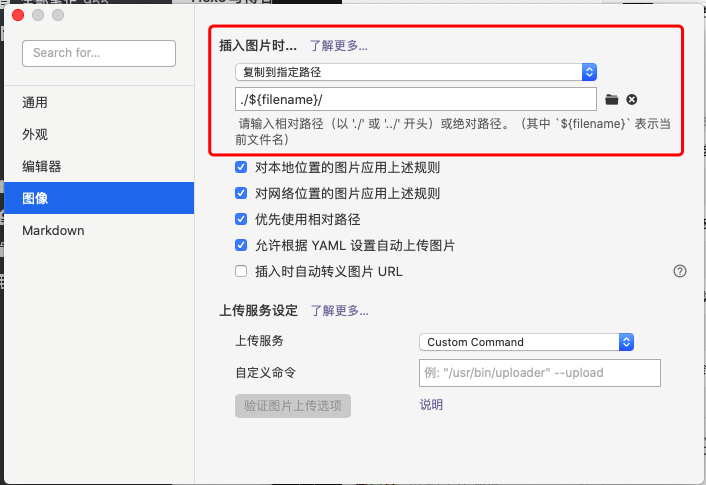
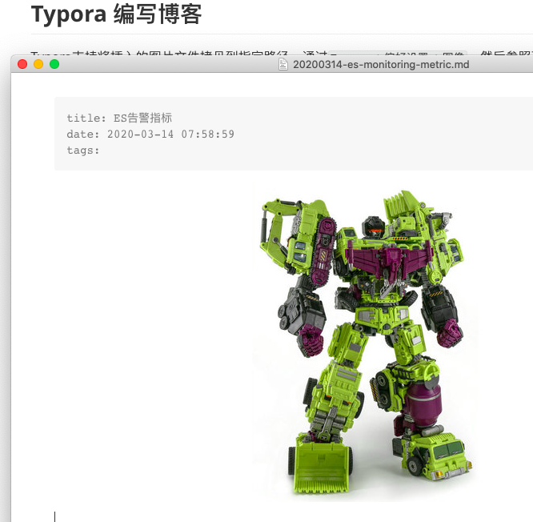
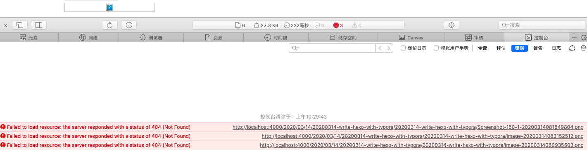
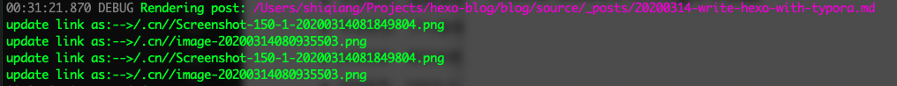

Hexo是一款非常优秀的开源博客管理工具，所有的博客文档都通过Markdown格式编写，Markdown编辑器有很多，原来的时候我经常用Evernote编写，但是Evernote写Markdown经常会出现输入法响应缓慢的情况。最近我从Evernote转到了Typora，想到哪里就能够敲字写到哪里，而且输入后马上就能够转换为友好的显示样式，体验非常好。

<!-- more -->

[TOC]

> 本文使用的Typora版本为0.9.9.32.1(4191)，Hexo版本为4.2.0。

本文介绍了如何处理博客博客编写过程中插入图片，上传图片等一些问题，希望我的经验能够对大家有帮助。

## 目标

我的目标是使用Typora编写博客，编写过程中可能通过拷贝、粘贴插入图片，也可能从网络上下载图片。希望能够达到以下效果：

* 使用Typora编写的时候能够实时看到图片
* 本地使用`hexo server`浏览效果时，也能够看到图片
* 图片和Markdown文件放一起都上传到GitHub pages。

> 我没有选择图床作为图片的保存方式，一方面免费的图床很不稳定，另一方面使用图床在没有网络的情况下可能浏览器来还是不太方便。我还是习惯将所有笔记最终都归档保存在Evernote中。

## Typora 编写博客

Typora支持将插入的图片文件拷贝到指定路径，通过`Typora->偏好设置->图像`，然后参照下图选择`复制到指定路径`将图片拷贝到与Markdown文件同名目录下。



这样我们在编辑博客的时候，就可以实时看到插入的图片。可以截图插入，也可以从网页上直接拖拽插入，非常方便。



查看Markdown源代码，看到图片是以Markdown的图片格式插入的。

```yaml

```


## Hexo配置

首先修改 hexo 全局配置文件 `_config.yml` 中的配置：

```yaml
post_asset_folder: true
```
这样在我们每次新建Markdown文件的时候，都会创建一个与文件同名的文件夹用于存放图片。
```sh
$ hexo new 20200314-es-monitoring-metric
$ ls source/_posts/
total 8
drwxr-xr-x   4 shiqiang  staff   128B  3 14 07:58 ./
drwx------+ 32 shiqiang  staff   1.0K  3 14 07:52 ../
drwxr-xr-x   2 shiqiang  staff    64B  3 14 07:58 20200314-es-monitoring-metric/
-rw-r--r--   1 shiqiang  staff    77B  3 14 07:58 20200314-es-monitoring-metric.md
```

使用`hexo generate`生成静态文件后，可以观察到图片已经拷贝到了对应的目录下。

```sh
$ ls public/2020/03/14/20200314-write-hexo-with-typora/
total 424
drwxr-xr-x  6 shiqiang  staff   192B  3 14 10:26 ./
drwxr-xr-x  4 shiqiang  staff   128B  3 14 10:26 ../
-rw-r--r--  1 shiqiang  staff    14K  3 14 10:26 Screenshot-150-1-20200314081849804.png
-rw-r--r--  1 shiqiang  staff    79K  3 14 10:26 image-20200314080935503.png
-rw-r--r--  1 shiqiang  staff   106K  3 14 10:26 image-20200314083152512.png
-rw-r--r--  1 shiqiang  staff   5.3K  3 14 10:26 index.html
```

但是现在浏览的时候还不能够看到图片，可以看到是因为我们插入的时候用的是包含了一个与Markdown文件同名文件夹的相对路径，而生成的静态文件夹下没有那个同名文件夹所以造成了访问404。




这时首先通过搜索引擎查到了有两个解决方案：`hexo-asset-image` 和 `hexo-simple-image`。

## hexo-asset-image 的问题

这个插件在处理图片路径时，看到更新的路径有问题，导致通过`hexo server` 还是不能够正确显示图片。



## hexo-simple-image 的问题

在 Hexo 官网上看到这个插件的描述也是解决图片路径问题的，但是安装尝试之后遇到如下报错。

```sh
07:19:06.993 FATAL Something's wrong. Maybe you can find the solution here: https://hexo.io/docs/troubleshooting.html
TypeError: Cannot read property '1' of null
    at /Users/shiqiang/Projects/hexo-blog/blog/node_modules/hexo-simple-image/lib/index.js:9:20
    at String.replace (<anonymous>)
    at Hexo.module.exports (/Users/shiqiang/Projects/hexo-blog/blog/node_modules/hexo-simple-image/lib/index.js:2:31)
```

## 解决方案

参考`hexo-asset-image`和`hexo-simple-image`的源码，发现一个思路是在`after_post_render`之后将html中图片链接替换为绝对路径，一个是在`before_post_render`阶段将markdown文件中图片的路径转换为`asset_img`函数。

经过分析，觉得还是 `hex-simple-image` 的处理方式比较简单，因此对插件内容做了修改，现在可以用我这个新的插件来解决图片显示的问题。

具体可以按照下面的步骤操作。

* 修改`post_asset_folder: true`
* 生成一篇新的博客 `hexo new blog-name`
* 通过typora向博客中插入一张图片，此时可以到`source/_posts`目录下看图片是否拷贝到了对应的目录
* `npm install hexo-image-link --save`安装插件
* `hexo server -debug` 预览图片是否能正常显示


## 参考资料

1. [Hexo与typora结合](https://www.jianshu.com/p/81a40a2c6514)
2. [Front-matter 说明](https://hexo.io/zh-cn/docs/front-matter.html)
3. [用 Typora 写 Hexo 博客](https://zhangnew.com/Typora-Hexo.html)
4. [Hexo 插件](https://hexo.io/zh-cn/docs/plugins.html)
5. [hexo-simple-image](https://github.com/Aragakiiii/hexo-simple-image)
6. [hexo-asset-image](https://github.com/xcodebuild/hexo-asset-image)
7. [Node.js](https://nodejs.org/en/)
8. [JavaScript 1.3 Overview, Part II: Replace Method's Lambda Expression - Doc JavaScript](http://webreference.com/js/column26/lambda.html)

