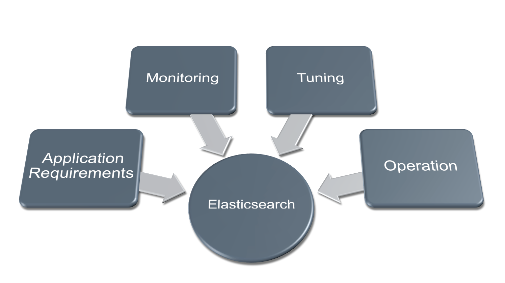
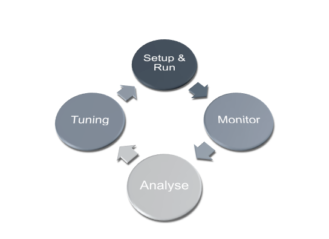
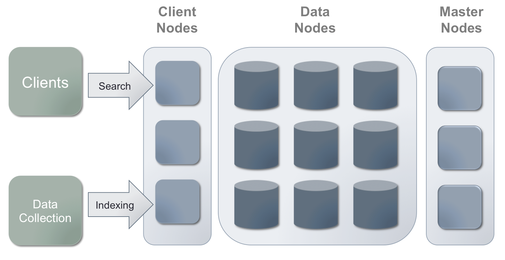
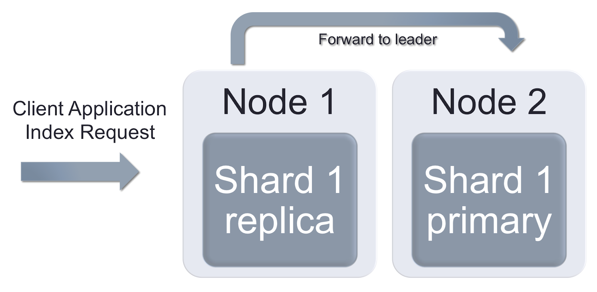
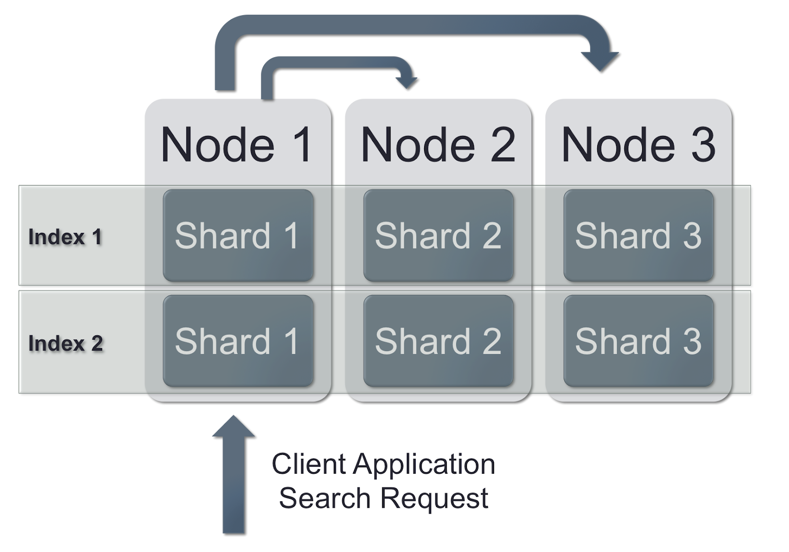

在当今的软件应用和互联网应用中，搜索与分析能力都是是非常重要的功能，几乎所有的移动APP中都提供了包括输入提示、搜索建议、位置搜索等常见的应用功能。这种场景下，后台的搜索和分析服务能力要具备实时响应、快速扩展、海量数据存储等等能力，Elasticsearch的出现很好的提供了这些能力，非常方便、快速的满足了用户场景的需求。

<!-- more -->

[TOC]

> 本文对Elasticsearch进行了简单的介绍，并总结了集群运行中监控所需注意的事项，总结出来与大家分享。

## 1. Elasticsearch介绍

Elasticsearch是一款基于Lucene的构建的开源、分布式文本搜索引擎，还可以作为一个分布式文档数据库使用，由Shay Bannon于2010年创建。从使用角度来讲，ES提供了优秀的全文索引和查询性能；从运维和开发角度来讲，ES部署简单，水平扩展非常简单，同时还提供了灵活Rest API调用方式，因此相比其他复杂的分布式系统，ES的应用越来越广泛。



但是随着ES集群越来越大，对ES的运维管理就变得复杂起来，想要获得较好的性能就需要一些专业知识才能实现。要想做好ES集群的性能调优，监控就是必不可少的条件。本文关注Elasticsearch的监控和调优，同时也介绍了Elasticsearch的工作原理、系统设置以及常见的一些监控指标。

## 2. 监控方法论

任何事情都要讲究方法，在软件开发领域有开发->质量保证->运维的循环，通过不断的迭代来提高软件的质量。最近也有通过DevOps不断提高研发、投产效率的潮流。而在ES集群运维领域，要想做好Elasticsearch的安装、使用、调优，也需要经过监控->分析->调优不断迭代循环的过程。在每个环节，都要有针对性的判断标准，这样才能不断提高Elasticsearch运维的水平。



### 2.1 需要关注监控的场景

* 开发和POC阶段。通过用户案例和具体开发实现过程来观察系统性能的表现，分析对系统性能有影响的因素，可以针对性采取更优化的算法或者不同的应用架构来提高系统的性能。
* QA测试和压力测试阶段。观察系统在压力下的表现，寻找更好的配置参数，寻找基础设施上的优化措施。
* 生产环境的运维阶段。观察系统的稳定性，寻找系统瓶颈，做好问题的根源分析并准备生产扩容。增加监控指标并对告警进行及时处理，避免影响业务运行的系统故障发生。

### 2.2 供参考的监控原则

2.1 中提到的这些事项可能会被大家忽略，毕竟在一个项目中完成业务功能、赶工期可能是大多数人眼中更重要的事情。如果你对于产品的体验比较关注，包括对于系统性能的表现和日常监控，不妨看看下面这些原则，相信在我们日常开发、运维过程中坚持的话，一定能够取得很好的效果。

* 保证生产集群的监控和日志完整。一个关键业务系统会持续快速的产生大量的监控指标和日志数据，当集群状态发生故障时，日志的量可能还会发生快速的增长。一方面我们要确保各产品的监控没有遗漏，日志收集都比较全面，另一方面还要做好海量日志管理的准备。
* 关注操作系统事件、日志和异常指标。指标异常往往会导致问题发生，日志或系统事件中出现错误都会导致集群问题。
* 对上下游的组件都进行监控。ES通常是作为数据存储和查询服务的组件，我们将监控范围扩大到业务的全流程时，往往能够更快的发现问题。
* 在团队内部分享。包括测试报告、每日健康检查的结果或图表、补充文档等等。
* 使用异常检测或智能告警技术。固定阈值的告警方法不适合随业务上线波动的指标，这时考虑采用机器学习等人工智能方法或算法来减少误告警的干扰。
* 将告警和工作流程整合起来。典型的做法是告警后触发事件单，并由服务台分配到对应的支持团队去分析问题。

## 3. Elasticsearch监控

### 3.1 Elasticsearch 工作原理

安装、调优、故障排查ES集群需要了解一些ES集群的基本工作原理，以及对于一些重要函数和设置的深入理解。`Shared Nothing`是ES最基本的架构原则。

> `Shared Nothing Architecture (SN)` 是一种分布式计算架构，其中的每个节点都是独立且自足的，整个系统不存在单点故障。

换句话说，不同的节点保有各自独立的数据和运算，这也构成了ES集群易于弹性扩展的基础，在集群中我们只需要加进去一个节点就可以。ES采用了倒排索引的数据结构，这实际上是一个关键词到文档列表的映射，能够帮我们快速的找到所希望的文档内容。

> 实际生产的情况并没有这么简单，我们还需要考虑新加入的节点对集群中其他节点的影响，这些可以在后面的文章中了解到。

索引信息保存在一个或多个分区（也称为Shard）上。ES具有在集群范围内动态分配、调整每个节点上Shard的能力，这个机制使ES集群在数据分配上具有很多灵活性。通过将主分区（Primary Shards）的副本拷贝到其他节点来保证集群数据的冗余。索引动作操作主分区 Primary Shard，搜索动作则涉及主分区 Primary Shard和分区副本。增加节点和分区副本的数量能够提高集群的查询性能。ES提供了静态配置文件、动态HTTP API的方式来灵活调整集群的配置。

### 3.2 Elasticsearch基本术语

为了便于理解后续章节内容，我们先来了解一些名词。

| 名词                       | 说明                                                         |
| -------------------------- | ------------------------------------------------------------ |
| JVM                        | Java Virtual Machine 跨平台的Java执行引擎                    |
| Index                      | 索引是具有相似特征的文档集合，可以类比MongoDB或CouchDB的集合，一个索引可以支持一种数据类型，通过Mapping映射的方式定义数据的schema，一个索引由1-N个主分区 Primary Shards组成，包括0-N个副本 Replica shards。 |
| Shard                      | 一个Shard是一个单独的Lucene索引实例，由ES进行维护。Shard有两种类型，包括主分区Primary Shard和副本分区Replica Shards。 |
| Mapping                    | Mapping 映射是定义在Index 索引上的数据结构定义（Schema）。Schema只能在空索引的情况下被修改，增加新字段和子字段则是随时可以的，但是修改字段的类型则会涉及到比较复杂的数据re-indexing操作 |
| automatic Mapping 自动映射 | 如果没有定义映射规则，ES将自动探测字段类型（字符串、数字、IP、地理坐标）并创建自动映射、设置默认的字符串分析器、增加关键词字段。默认情况下，一个字符串即会被映射为一个text和keyword。这样你就既可以做全文检索，也可以做关键词搜索、排序和聚合。如果映射定义的有问题，那么在后续的查询阶段将会出现问题，或者由于自动识别的字段类型不正确如只包含数字的字符串识别为数字后，后续有其他字符时会造成插入错误。 |
| Segments                   | 一个分区 Shard的片段（Lucene Index）                         |
| Document                   | Document 文档是Elasticsearch的主要实体，是可以被索引的信息的基本单位，文档以JSON格式存储和索引，原始的内容保存在`_source`字段中，其他的内容被解析映射成不同的字段，只能对映射过的字段进行查询。 |
| Node                       | 一个Node 节点是一个运行的Elasticsearch实例，是集群的一部分，Node通过Cluster Name查找集群中的其他节点，可以配置采用多播multicast或单播的方法来发现其他节点。多个节点可以运行在同一台物理机、虚拟机或容器中。 |
| Cluster                    | 集群由一个或多个节点组成，每个集群拥有一个自动选择出来的主节点。 |

### 3.3 ES集群扩展

ES一般有以下几种典型的需求：

* 索引速度要快。
* 查询耗时要短。
* 存储容量要大。

在大多数情况下，这三个需求往往是同时存在的。要同时满足为满足这样的需求，按照默认配置搭建的ES集群可能无法胜任，需要对ES集群做一下扩展，将节点的角色进行区分：`Master nodes 主节点`、`Clident Node 查询节点`、 `Data node 数据节点`。三个Master节点用于集群管理，减少可能造成集群不稳定的影响因素（如数据同步、查询等导致的脑裂）。然后还要对集群进行细致的调优，这样才能获得满足需求的索引速度、查询响应和容量。



- 不同的节点类型。通过配置文件指定节点的类型
- 查询节点/负载均衡节点：这种节点可以作为处理客户端HTTP查询请求的节点，不保留任何数据，也不作为主节点。
  - ```node.data: false```
  - ```node.master: false```
- 主节点 Master Node：作为集群的主节点，不保存数据。
  - ```node.master: true```
  - ```node.data: false```
- 数据节点 Data node：作为数据的存储节点，也响应查询请求。
  - ```node.master: false```
  - ```node.data: true```

### 3.4 Elasticsearch 和 Java

Elasticsearch由Java语言编写，运行在JVM之上，支持在不同的操作系统间迁移。每个Java程序都有Heap上限，可以通过启动命令来配置。与C/C++中需要自己管理内存不同，Java程序通过Garbage Collector 垃圾回收器管理内存，不需要手工释放内存。垃圾回收器追踪了没有被使用的对象，并且根据不同的垃圾回收策略进行垃圾回收。在不同的Java运行环境中，不同的垃圾回收策略的表现会有较大的差别。

Elasticsearch运行在JVM之上，因此对于JVM的内存使用、垃圾回收的监控以及JVM的优化设置对于ES的稳定运行都很重要。我们总结了以下事项要给予关注：

- 避免JVM进行SWAP入磁盘
- 定义Elasticsearch的Heap内存大小
- 监控内存指标，ES服务器索引合并耗时。Heap Size设置过大可能会导致索引合并和垃圾回收时间增长。


### 3.5 索引如何工作

通过HTTP POST发送包含JSON内容的请求来创建ES中的文档 Document。在请求的URL中明确了索引的名称和类型名称，文档ID是可选参数。通过```curl```命令来进行操作。

```sh
$ curl -XPOST -H "Content-Type: application/json" 'localhost:9200/customer/_doc/1?pretty?' -d
'
{
	"name": "John Doe"
}'
```

响应信息

```json
{
  "_index" : "customer",
  "_type" : "_doc",
  "_id" : "1",
  "_version" : 1,
  "result" : "created",
  "_shards" : {
    "total" : 2,
    "successful" : 1,
    "failed" : 0
  },
  "_seq_no" : 0,
  "_primary_term" : 1
}
```

**集群中发生了什么**

用户发出请求后，Elasticsearch找到拥有主分区的节点进行索引文档的操作，该节点先接收数据并把数据写入 write-ahead 日志（也叫 transaction日志）中，然后再写入Lucene的段文件，参数```refresh interval```决定了写入段文件后支持查询的时间。主分区写入之后，副分区会进行更新。如果一个文档是更新操作，ES会先把原来的文档标记为删除，然后重新写入一个文档。ES会将比较小的段合并为大段，在这个过程中，会将标记为删除的文档彻底清除。由此可见，文档更新操作是非常消耗资源的操作。

为了避免产生磁盘IO问题，ES集群中合并的流量会进行自动限制。如果需要，合并调度器可以多线程运行，可以通过参数控制通知合并的并发数量。




每个文档都是通过一个单独的HTTP请求创建的，当请求量增大时，会造成大量的交易，ES在不断的打开、写入、关闭文件。

这就是为什么批量索引```_bulk```接口拥有相对而言更好的性能，通过这个接口可以在一次请求中操作多个文档。注意，默认的HTTP POST请求被限制在100MB，如果超过的话客户端请求会发生失败。

提高索引速度的最佳实践就是增加```refresh interval```，它的默认值是```1秒钟```，也就是新增文档的请求在1秒中内会被处理并且能够被搜索到。在批量索引的场景下，这么短的刷新间隔会造成底层的Lucene索引每秒钟都被重新打开一次。增加```refresh_interval```的效果可以参考下面的值：

- ```refresh_interval: 1s``` - 2.0K docs/s
- ```refresh_interval: 5s``` - 2.5 docs/s
- ```refres_interval: 30s``` - 3.4 docs/s

另外一个**至关重要**的问题就是分区和副本的数量。副本分区在索引期间会被更新，从而降低了索引的吞吐量。但是拥有多个副本能够提高查询的响应速度。副本的数量可以动态改变。虽然ES集群中可以做到索引的拆分和合并，但是这项操作非常消耗资源。

只要分区不是特别大，那么减少副本的数量能够提高响应的速度。

> 有人会提到一种理想的```refesh```API，如在一次性的导入期间暂停索引的更新，等导入完成后再进行索引的更新。但实际上，后续的更新操作特别消耗资源，而且实际应用中我们的总是收到持续不断的插入请求。

### 3.6 查询操作

客户端发送的请求到某个节点后，该节点会将请求转发到其他节点，收集到其他节点的返回结果并聚合后返回给客户端。ES提供了控制查询路由来提高查询效率的特性。



从运维的角度，以下几项与查询性能最为相关：

- Request Cache 和 Query Cache 的大小。监控你集群中的这两个值的情况。
- Maximus shard size 和 Shard的数量。如前所述，这项设置需要权衡并且必须在索引创建前确定。使用基于时间的索引和索引别名可以增加灵活性，根据情况动态调整索引的参数。```Curator```是这样一个工具。
- 副本数量。只有副本能提高分布式查询的效率但是会降低索引的效率。与主分区不同，副本数量```number_of_replicas```可以在任何时间修改。
- 客户端负载均衡。使用独立的负载均衡Nodes，既不要作为Master，也不要作为数据节点。

## 参考资料

1. [Elasticsearch Monitoring Guide](https://sematext.com/blog/elasticsearch-guide/)
2. [什么是倒排索引？](https://blog.csdn.net/starzhou/article/details/87519973)
3. [Elasticsearch介绍和基本概念](https://www.jianshu.com/p/2b6f5eb5ac59)
4. [[运维] 第七篇：数据中心监控体系建设方法论](https://blog.51cto.com/031028/1836875)