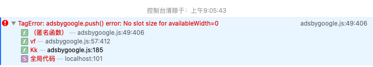

互联网从业人员相比对于Google Adsense应该非常熟悉，它就像我们生活中常见的楼宇电梯电视广告一样，是互联网上的一种广告类型。每个网站通过安装一块`电视`，定期的向用户播放广告。只不过Google的这块电视，能够根据网站的内容、用户的访问行为等一系列`大数据`为每个用户投放最感兴趣的内容。

<!-- more -->

## 响应式广告单元

Google Adsense 提供了很多广告类型、种类、主题，这样我们就能够根据自己网站的内容来选择最合适的广告进行投放。在做决定时，最重要的就是广告的尺寸，因为合适的广告尺寸对用户来说更有吸引力，也能通过展示获得更多的点击。

对于布局尺寸固定的网站，确定一个最好的尺寸比较容易。对于一些响应式网站，如何确定最佳的广告尺寸非常困难。因此Google提供了响应式的广告单元。

## 工作原理

页面加载后，响应式广告单元 Responsive Ad Units 读取父容器的尺寸（高*宽），基于此来决定广告的最佳尺寸。这就让我们在为网站选择广告时变得非常简单，广告的尺寸不需要再固定，它会基于父容器的尺寸而完美的适配展示广告内容。

## 问题现象

如果有需求要求在PC版上显示广告，而在移动版上隐藏广告内容，这就会与Google Adsense的要求冲突，因为在服务条例中不允许对广告单元使用`display:none`或者使用其他的HTML元素。

这时会报出以下错误。

> Uncaught TagError: adsbygoogle.push() error: No slot size for availableWidth=0

这个错误在容器没有可计算出的`width`属性时发生，例如将元素隐藏、元素使用了绝对或者浮动布局。

最近我更换了博客模板，在向自己的博客添加Google Adsense时，也不小心触发了这个错误。

## 官方方案

为满足上面的需求，Google Adsense允许通过CSS3的`media queries`来对广告单元做特定的修改，具体要求如下：

1. 不能使用响应式广告控制的特性，例如需要移除广告代码中的`data-ad-format`。
2. 为`ins`标签增加一个`class`名称，例如`right_side_ad`。
3. 在CSS Media query中指定什么情况展示广告，什么情况不展示。如果广告父容器是`absolute`布局，则需要指定高度和宽度。

## 参考资料

- [Official document on modifying responsive AD unit code](https://support.google.com/adsense/answer/6307124?hl=en)
- [Guide to ad sizes](https://support.google.com/adsense/answer/6002621?hl=en)
- [Google Adsense Error - No Slot size for availablewidth](https://davidsekar.com/website-monetization/google-adsense-error-no-slot-size-for-availablewidth)

