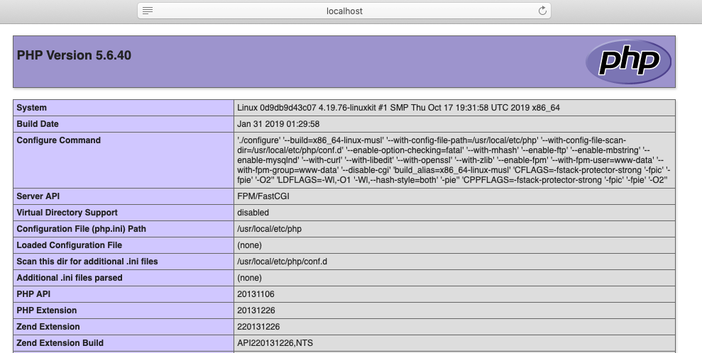

最近有个同事找过来，希望我对在很早之前写的一个PHP网站上增加一些功能，当时开发使用`xampp`构建的本地开发环境，但是现在我的笔记本电脑已经更新，没有当时的开发环境。本着尽量不往电脑上装无用软件的原则，想到能不能用Docker来构建本地开发环境，因此本文介绍了如何基于Docker来快速构建本地`PHP`开发环境，供有需要的同学参考使用。

[TOC]

> 本文基于 `5.6-fpm-alpine3.8` 以及 `nginx` 搭建Mac 下的PHP开发环境。

## 前期准备

首先下载所需要的镜像文件

```sh
$ docker pull php:5.6-fpm-alpine3.8
$ docker pull nginx
$ docker pull mysql:5.6
```

> 用户需要到[hub.docker.com](https://hub.docker.com)，搜索PHP并通过tags找到自己希望安装的版本，我的项目因为开发时间比较久了，不能够支持最新的PHP，所以安装的是5.6版本。

我们需要准备一个工作目录，例如`lnmp`，在工作目录下准备网站根目录、Nginx配置文件目录、Nginx日志目录。

```sh
$ mkdir lnmp
$ cd lnmp
$ mkdir -p nginx/www nginx/logs nginx/conf.d
```

在新建的 www 目录中新建 index.php 文件，用来检测 php 环境是否搭建成功。

```php
<?php
  phpinfo();
?>
```

在`nginx/conf`目录下准备`nginx`的配置文件php.conf。

```
server {
	listen	80;
	server_name	localhost;

	location / {
		root	/usr/share/nginx/html;
		index	index.html index.htm index.php;
	}

	error_page	500 502 503 504	/50x.html;
	location = /50x.html {
		root	/usr/share/nginx/html;
	}

	location ~ \.php$ {
		fastcgi_pass	php:9000;
		fastcgi_index	index.php;
		fastcgi_param	SCRIPT_FILENAME	/www/$fastcgi_script_name;
		include		fastcgi_params;
	}
}
```

## 编排文件

在工作目录下创建`docker-compose.yml`编排文件。

>  关于`docker-compose`的详细介绍可以参考我之前的文章[docker-compose 使用介绍](http://www.edulinks.cn/2020/04/15/20200415-docker-compose/)。

```yaml
version: "2.1"
services:
    nginx:
        image: nginx
        ports:
            - "80:80"
        volumes: 
            - ~/Projects/sh-valley/docker-conf/lnmp/nginx/www:/usr/share/nginx/html
            - ~/Projects/sh-valley/docker-conf/lnmp/nginx/conf.d:/etc/nginx/conf.d
            - ~/Projects/sh-valley/docker-conf/lnmp/nginx/logs:/var/log/nginx
        networks:
            lnmp-network:
                ipv4_address: 172.23.0.5
    php:
        image: php:5.6-fpm-alpine3.8
        volumes:
            - ~/Projects/sh-valley/docker-conf/lnmp/nginx/www:/www
        networks:
            - lnmp-network
    mysql:
        image: mysql:5.6
        ports:
            - "3306:3306"
        environment:
            - MYSQL_ROOT_PASSWORD=123456
        networks:
            lnmp-network:
                ipv4_address: 172.23.0.3
networks: 
    lnmp-network:
        ipam:
            config:
            - subnet: 172.23.0.0/16
              gateway: 172.23.0.1
```

至此，我们完成了所有的准备工作，马上可以启动查看效果。

在这个编排文件中，我对Mysql使用了固定的IP地址，这样在后续重启环境的过程中，我就不用修改PHP的数据库配置文件了。关于固定容器IP地址的更详细的方法，可以参考[如何让容器具有固定IP](http://www.edulinks.cn/2019/04/17/2019-04-17-run_container_with_static_ip/)

## 运行效果

```sh
$ docker-compose up -d
Creating network "lnmp_php-network" with the default driver
Creating lnmp_nginx_1 ... done
Creating lnmp_php_1   ... done
```

马上就能看到熟悉的`phpinfo`界面了。



## 安装扩展

默认`php`镜像中提供的扩展比较少，缺少诸如`mysql、gd2`等常用的扩展，这样我们就需要自己安装并启用扩展。

首先进入到`php`容器，用`php -m`命令查看本地有什么扩展。

可以使用`docker-php-ext-install`命令来安装扩展。

```sh
$ docker-php-ext-install mysql
```

扩展安装好之后就可以在`php.ini`中启用。我们从`phpinfo`中可以看到，容器环境下默认的`php.ini`没有启用，可以从`/usr/local/etc/php`下将`php.ini-development`拷贝为`php.ini`。通过修改`php.ini`中配置，启用自己需要的扩展。下面是几个扩展安装的命令，供大家参考。

* `docker-php-ext-source` 在容器中创建一个`/usr/src/php`目录
* `docker-php-ext-enable`启用PHP扩展，省去我们手工编辑`php.ini`的过程
* `docker-php-ext-install` 安装并启用PHP扩展。这种方式还是有一定的局限性，例如支持的范围有限、不能自己添加个性化的模块等
* `docker-php-ext-configure`经常与`docker-php-ext-install`搭配，在需要自定义扩展的配置时使用

## 启用 PATH_INFO

有些PHP的框架，在进行路由处理时会用到`PATH_INFO`参数，这需要通过下面的配置来实现。

```
location ~ \.php(.*)$ {
    root           /var/www/nginx/html;
    fastcgi_pass  127.0.0.1:9000;
    fastcgi_index  index.php;
    fastcgi_split_path_info  ^(.+\.php)(.*)$;
    fastcgi_param  SCRIPT_FILENAME $document_root$fastcgi_script_name;
    fastcgi_param  PATH_INFO $fastcgi_path_info;
    include fastcgi_params;
}
```

## 单独运行命令行

如果仅需要在命令行下运行 php 命令，可以使用如下方式

```sh
# 将当前目录挂载到 /tmp 目录，执行 php 命令，结束后退出
$ docker run -it --rm -v $PWD:/tmp -w /tmp php:7.4.28-fpm-alpine3.15 php test.php
```

## 参考资料

1. [Docker秒搭建Php7开发环境](https://www.jianshu.com/p/43037ce40b00)
2. [docker-compose 使用介绍](http://www.edulinks.cn/2020/04/15/20200415-docker-compose/index.html)
3. [Docker PHP](https://www.jianshu.com/p/f58740a885a9)
4. [docker完整配置nginx+php+mysql](https://www.cnblogs.com/saysmy/p/10389902.html)
5. [Docker php安装扩展步骤详解](https://www.cnblogs.com/yinguohai/p/11329273.html)
6. [配置nginx支持path_info](https://www.cnblogs.com/yuzhoushenqi/p/11349930.html)
6. [基于 docker 的 php 命令行](https://xiejindou.com/2018/06/24/%E5%9F%BA%E4%BA%8Edocker%E7%9A%84php%E5%91%BD%E4%BB%A4%E8%A1%8C/)

