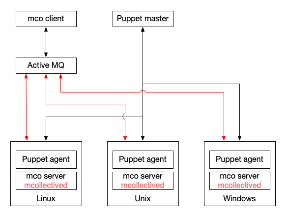
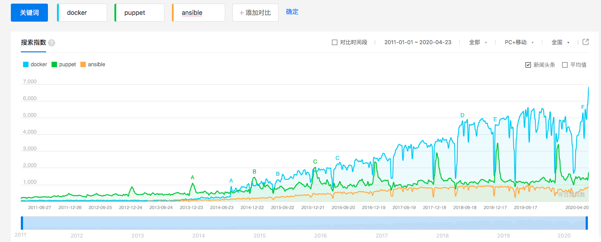

puppet是一款著名的自动化运维管理工具，我们目前使用的比较老的Puppet版本，正在考虑是否升级，因此对各个版本的发布情况做了一个简单的总结。

<!-- more -->

[TOC]

> 本文写于2020年4月23日，文中内容随着时间推移可能会逐渐过期，请读者自行判断。

## 1. puppet各版本介绍

puppet是一款著名的自动化运维管理工具，本文写成时Open Source Puppet最新版本是6.14，Puppet Enterprise最新版本是2019.5。因为我们目前使用的还是比较老的Puppet版本，因此对各个版本的发布情况做了一个简单的总结。

* Puppet 6 于2018年9月19日发布。最新版Puppet 6.14.0 于2020年3月10日发布。
* Puppet 5于2017年6月30日发布。这个版本将 Puppet Agent、PuppetDB和Puppet Server版本都统一为5，成为构建Puppet Platform的基础。将Agent的Ruby版本升级到2.4，并实现了大约30%的性能提升。Puppet 5.5.19 于2020年3月10日发布。
* Puppet 4 于2015年4月15日发布。最新的Puppet 4.10.12 于2018年6月7日发布。这个版本的Puppet Master使用`clojure`语言进行了重写，同时puppet agent也开始在JVM上运行。
* Puppet 3.8.7 于2016年4月26日发布。基于`ruby`编写及运行。

整理一个软件各个版本的发布情况和每个版本的特性，对于自身公司做选择还是很有帮助的。每个不同类型的公司都有不同的版本选择策略和偏好，对于新起步开始使用自动化运维工具的小团队，可以使用最新版本；如果团队规模稍大并且追求稳定性，那么可以选择最新版本的上一个大版本或上两个大版本。对于已经在使用puppet的团队，了解每个版本的特性是决定何时升级、升级到那个版本重要工作。

## 2. MCollective

Marionette Collective 简称 MCollective，是Puppet的一个插件，提供了一个服务调度或并行任务执行的框架，为用户提供在被管机上执行管理任务的能力。从Puppet 5.5.4 版本开始 MCollective 不再推荐使用，如果使用Puppet Enterprise，可以使用 Puppet orchestrator 替换。如果使用开源版本的Puppet，则可以使用Bolt和PuppetDB替换。

MCollective的第一个版本 0.2.0 于2009年12月2日发布。最后一个版本于2018年4月17日发布。

## 3. puppet架构

## 4. 写在最后

我们知道Docker搭配Kubernetes可以让我们具备管理大规模集群的能力，近几年Docker发展的趋势非常迅猛，通过百度指数我们能够看到，Docker的搜索量远远超过了Puppet。

那么是否Puppet就没有存在的必要了呢？

总的趋势上来说，Docker的走势更向上一些，结合微服务应用开发技术，容器平台的应用范围会越来越广。但是Puppet仍有它适用的场景，并且长期来看不太可能被Docker替代。

对于大型企业来说，如何组合使用好这两个工具，应该还要依靠各个企业根据自身的情况选择定制化的解决方案。希望本文对于Puppet各个版本特性的介绍，能够为大家的决策提供一些依据。

## 5. 参考资料

1. [puppet.com](https://puppet.com/)
2. [Introducing Puppet 6 Platform](https://puppet.com/blog/introducing-puppet-6/)
3. [Puppet 5 Platform is released](https://puppet.com/blog/puppet-5-platform-released/)
4. [自动化运维工具——puppet详解（一）](https://www.cnblogs.com/keerya/p/8040071.html)
5. [企业级自动化运维工具---puppet详解](https://www.cnblogs.com/along21/p/10369858.html)
6. [puppet系列（一）之puppet的部署、配置文件以及命令详解](http://www.51niux.com/?id=105)
7. [漫谈Puppet4](https://www.cnblogs.com/yuxc/p/5945944.html)