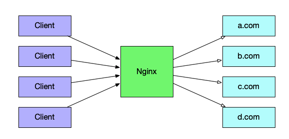
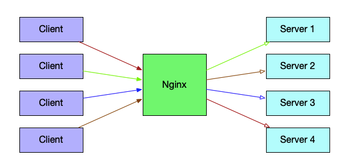
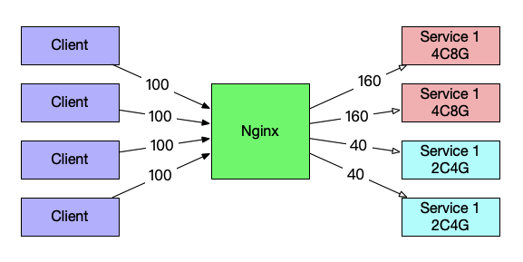

## Nginx介绍

Nginx是一款轻量级的Web服务器，由于它占有系统资源少、处理并发能力强，因此Nginx的使用率越来越高，甚至超过了传统老牌的Web服务器Apache httpd。

## Nginx几种工作模式

### Web服务器

Nginx最简单的用法就是作为静态网站的服务端，通过HTTP或HTTPS为用户提供HTML、JS、图像等静态资源的服务。



### 反向代理

多个客户端给服务器发送请求，Nginx收到请求后，按照一定的规则将请求转发给后端负责处理具体业务的服务器，此时Nginx扮演了反向代理的角色。



### 负载均衡

我认为负载均衡可以理解为在反向代理基础上的功能增强。当我们后端有多个提供同样业务功能的服务端时，我们希望Nginx能够按照一定的规则将请求流量分发到后端，通常来讲我们希望后端每个服务器上的负载保持在同样的水平线上。这就要求Nginx能够提供不同的负载均衡算法以及对后端服务状态的检查，以便在后端服务出现故障时，及时从转发列表中去掉，避免对客户端请求造成更大的影响。

如下图所示，如果用户对于后端Service的请求速度是400tps，因为后端服务器配置不同，根据配置我们希望达到下图中请求数量的分配就可以用到Nginx的负载均衡能力。



## 配置文件介绍

Nginx 最主要的配置文件为 nginx.conf ，在启动时可以通过命令`nginx -c`指定要采用的配置文件，默认使用的配置文件时nginx安装路径下的`/config/nginx.conf`。Nginx配置文件以`指令 参数;`的形式，初次之外还有一些多行参数组合起来的代码块，包括了 `events、http、mail、stream`。为了方便管理各种不同的配置，Nginx还支持通过 `include`语法来引用多个不同的配置文件，如下所示：

```sh
include conf.d/http;
include conf.d/stream;
include conf.d/exchange-enhanced;
```

典型的Nginx配置文件如下：

```nginx
user nobody; # 'main' 部分的参数行

events {
    # 连接处理的相关配置
}

http {
    # HTTP相关的配置，影响所有的虚拟主机配置

    server {
        # HTTP虚拟主机 Server 1的配置
        location /one {
            # 针对URI '/one' 的具体配置
        }
        location /two {
            # 针对URI '/two' 的具体配置
        }
    } 
    
    server {
        # HTTP虚拟主机 Server 2的配置
    }
}

stream {
    # 针对 TCP/UDP 流量的配置，影响所有的虚拟主机
    server {
        # 虚拟主机 Server 1 的配置
    }
}
```

## 参考资料

1. [[Nginx 服务器安装及配置文件详解](https://www.cnblogs.com/bluestorm/p/4574688.html)](https://www.cnblogs.com/bluestorm/p/4574688.html)
2. [nginx docs](https://docs.nginx.com/nginx/admin-guide/basic-functionality/runtime-control/)

