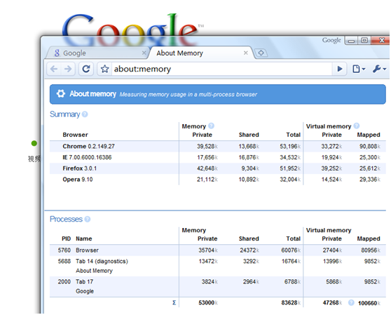
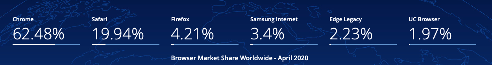

## 登上历史舞台

我在2008年的时候，Google 刚刚发布 Chrome，就写了一片简短的文章介绍 [Chrome](https://www.cnblogs.com/cocowool/archive/2008/09/03/1282653.html)。

这是当时的简短感受

>  第一感觉是简洁，简单使用一下后感觉是使用很简单，界面甚至可以用简陋来形容。不过整个界面的风格和细节把握的比较好，符合Google家的一贯风格，其他的功能不说，单单对任务管理器的一个统计做了一个比较，分别打开IE7\FF3\Opera\Chrome，在任务管理器里查看各自的内存占用情况，每个浏览器只打开一个google的首页，看到了什么：
> 
> 不知为何Chrome的Total Memory是最高的，稳定性还未知，试用一段时间估计能体会出来。

## 最新版 Chrome 83

最近，Google 发布了 **Chrome 83.0.4103.61** 稳定版本，对于版本的主要内容我的公众号也转发了一篇介绍文章供大家参考，[Chrome 83 发布，支持直接读写本地文件！新的跨域策略!](https://mp.weixin.qq.com/s/AKLvTYUz_4HmZ_hQQgJaIA)。

本文不想介绍太多的新特性，只是想说一下，为什么Chrome从出生到现在，经历了10多年的发展之后，Chrome变成了世界上最流行的浏览器，根据StatCounter四月份的最新统计，Chrome一枝独秀占据了百分之62.48的市场份额。

## 参考资料

1. [statcounter Global Stats](http://gsa.statcounter.com)
2. [知乎 Chrome这个浏览器是怎么流行起来的](https://www.zhihu.com/question/369189359)

