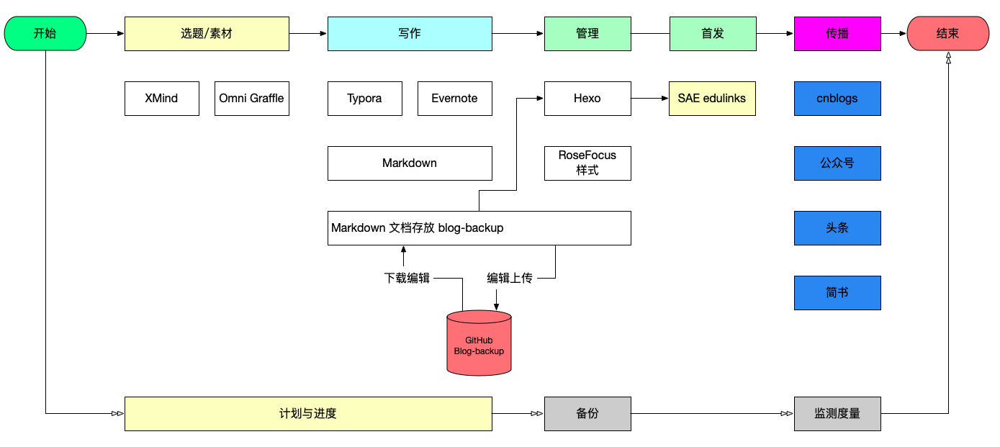

[TOC]

> 从2008年开始写博客，到2020年断断续续的坚持了有十多年了。回过头来看，这十多年虽有积累但和其他同行比起来，积累的成果就差了许多。思来想去，觉得自己在工作方法、工作流程和工具链上没有形成可持续优化的模式，造成实际写作过程中要么三天打鱼两天晒网，要么预定的目标没有办法实现，因此在今年，计划用半年左右的时间不断总结优化自己写作的工作模式，希望能够形成固定的模式，提高自己的效率。

## 目标与指导思想

2020年9月28日，对自己的目标做一些修正：

* 内容集中在泛技术领域，粗分为 `开发` 、`运维` 、`Mac生产力` 、`工作经验分享`。
* 每周有一篇文章原创文章的输出，输出要有持续性，这个一定要坚持！
* 不断优化自己的敏捷写作流程，规范各个环节的动作。

~~2020年4月26日，首先记录下自己的目标。~~

* 构建完整的题目选择、素材收集、文章编写、文章发布、后续追踪优化的工作模式
* 每个月能有4篇高质量的原创文章输出
* 内容集中在某几个领域（如Node、Docker、ELK）

在行动过程中，要应用以下思维模式：

* 闭环思维。利用PDCA，要有计划、有行动、有检查、有改进。
* 逻辑链思维。写作过程中题目立意要有经过三个以上的因果环节。
* 矩阵思维。合理安排工作和时间，合理安排选题。
* 数字化思维。希望所有的工作都能够有度量和效果的检验。

## v20.04.1 初步构建工作模式

### 1. 编辑发布流程

参考[riboseyim](https://riboseyim.com)大神的经验，梳理了一下自己的编辑发布流程。

### 2. 写作的过程

之前看过津津乐道主播朱峰老师的文章，他觉得写博客是一件非常费时费力的事情，因此选择了通过博客的形式进行内容创作并向外界传播。这从侧面说明，写作对于大多数人来说确实是一件困难的事情。一方面困难在没有那么多的时间，收集材料、整理思路到用文字写下来，一篇文章几乎要用去三四天的时间；另一方面写出来后，读者能够正确领会自己想表达的意思也是非常需要功底的，`一千个人眼中有一千个哈姆雷特`表达的就是这个意思。

但是我想，对于IT工作者来说，很多IT经验方面的信息是一种客观过程的描述，如果描述的有问题，大家可能没有办法照着做，因此我还是决定继续用文字的形式记录自己所学习的技术以及生活中的一些经验。

我想可通过以下三个方面来提高自己写作的速度：

* 提前整理提纲：梳理自己写作的思路和各个章节的重要内容。
* 明确文章的范围：一篇文章篇幅有限，不可能面面俱到，目标是写一些通过5-10分钟可以通读的文章。
* 可以写一些系列文章：一篇的深度不够，可以通过系列的形式将一项技术讲透。

以上是这两天我对于如何继续自己写作的一些想法和目标，写在公号里与大家分享，希望大家也能够监督帮助我把这个计划坚持下来。如果你有更好的经验和建议，欢迎随时与我交流。

## 提供传播效率的工具

* Python 发布到公众号
* 

## 参考资料

1. [麦肯锡咨询的十大底层逻辑](https://www.sohu.com/a/361292169_170568)
2. [我的写作工具链](https://riboseyim.github.io/2017/06/03/Writing-WriterToolChain/)