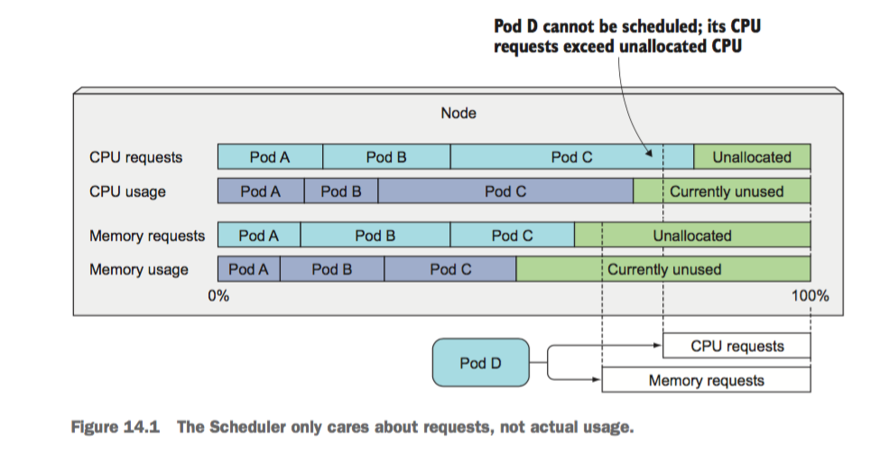
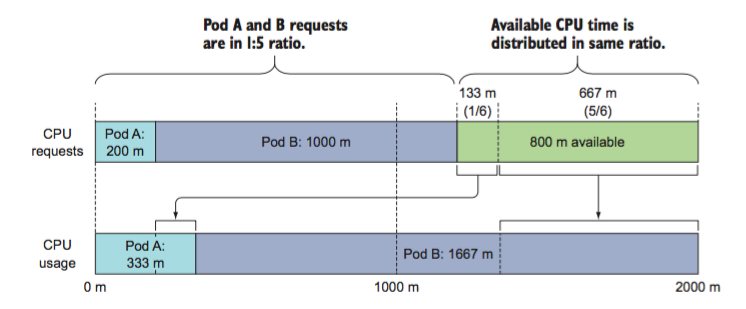
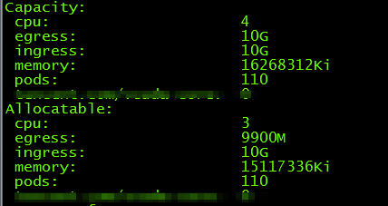
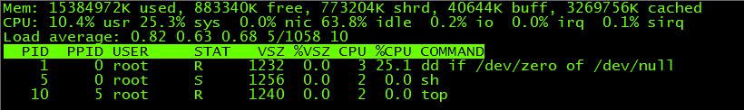
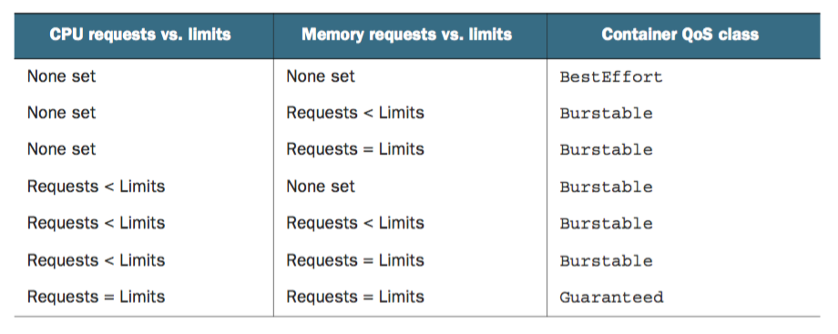
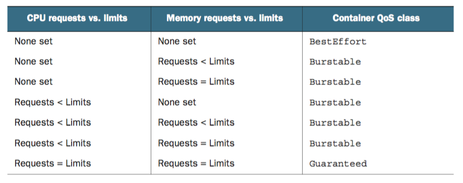
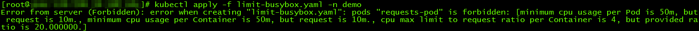
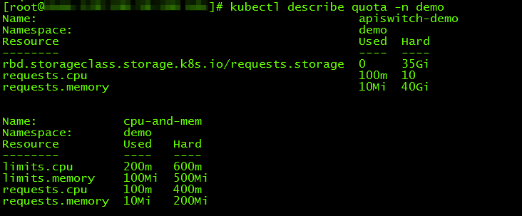

### 设置资源请求数量

创建Pod的时候，可以为每个容器指定资源消耗的限制。Pod的资源请求限制则是Pod中所有容器请求资源的总和。
```yaml
apiVersion: v1
kind: Pod
metadata:
  name: requests-pod
spec:
  containers:
  - image: busybox
    command: ["dd", "if=/dev/zero", "of=/dev/null"]
    name: main
    resources:
      requests:
        cpu: 200m
        memory: 10Mi
```
如果不指定CPU请求资源，表示不关心容器会分到多少CPU资源，有可能会一直分不到而处于等待状态。指定资源请求表示Pod对资源的最小需求，因此在调度的时候会如果Node剩余的资源不能满足Pod的需求，则不会调度到对应的Node上。Scheduler调度的时候并不关注在调度时具体的资源使用情况，而是根据现存Pod的资源请求情况来进行调度。这就会有问题，特别是当允许Pod使用超过请求的资源时。下面的图一看就能理解。

调度判断首先将不符合请求的Node排除在外，然后将符合要求的Node进行排序。节点排序根据资源请求数量的不同分为两个策略，```LeastRequestPolicy```和```MostRequestPolicy```。从字面上我们可以看到，一个是优先分派到资源请求少的节点，一个是优先分派到资源请求多的节点。一般在生产环境，建议使用```LeastRequestPolicy```，便于将负载平均的分配到各个机器上。在公有云的环境中建议使用```MostRequestPolicy```，提高资源的利用率，减少成本。
在没有设置资源使用限制的情况下，Pod可能使用超过请求的资源数量。对于CPU资源来说，如果同时有两个Pod请求剩余的资源，在分配剩余资源时，调度器会根据请求数量的比例在不同的Pod间分配资源。例如Pod A请求100m的CPU，Pod B请求20m的CPU，在两个Pod中CPU使用超过请求时，会根据5:1的比例分配。

使用```kubectl describe nodes```命令可以查看Node资源使用的情况。

如果Kubernetes找不到满足资源请求的Node，则Pod创建会停留在Pending状态。

### 设置资源使用上限
Pod创建的时候，可以设置每个容器使用资源的上限，可以限制的资源包括CPU、内存等。如果不设置上限，则理论上可以使用Node的全部资源。如果要防止Node上的各个容器互相影响，最好为Pod指定上限。
CPU是一种可以压榨的资源，可以用满并且Pod之间不会互相影响。内存则不一样，Pod之间分配的内存不能互相使用。requests的资源数量必须与Node容量一样或者更小，limits资源数量的总和可以超过Node的容量。当节点的资源被全部使用完后，一些容器可能会被杀掉。特别是使用内存超限后，会被Kubernetes进行OOMKilled。如果这个Pod的重启策略是Always，很可能你都没注意到Pod被重启了，但是随着发生次数的增多，每次重启delay的时间就会增加。

```yaml
apiVersion: v1
kind: Pod
metadata:
  name: limit-pod
spec:
  containers:
  - image: busybox
    command: ["dd", "if=/dev/zero", "of=/dev/null"]
    name: main
    resources:
      requests:
        cpu: 200m
        memory: 10Mi
      limits:
        cpu: 1
        memory: 20Mi
```
容器中运行top命令你会发现，容器中能看到的CPU、内存总量是Node的总量。这样就会造成一些应用能够探测到的容量和Limits的限制不一样，从而造成使用超出请求的情况。


> 对于CPU、内存来说，可以利用[Metadata获取的三种方式](https://www.cnblogs.com/cocowool/p/kubernetes_get_metadata.html)中提到的办法通过API来获取限制的大小，也可以在```/sys/fs/cgroup/cpu/cpu.cfs_quota_us```、```/sys/fs/cgroup/cpu/cpu.cfs_period_us```来查看。

### QoS：Pod Kill的策略

在Pod使用的资源超过Node容量时，Kubernetes为了保障Node的运行，会选择其中的一些Pod并杀掉，那么如何确定杀掉哪个Pod呢，这里就需要引入一个QoS的概念。
QoS是 Quality of Service，有三种Quality of Service 策略，Kubernetes依次选择三种策略的Pod进行Kill。如果两个的QoS一样，则选择资源利用率高的Kill。

* BestEffort 应用到没有资源限制的Pod上，可以使用尽可能多的资源，也可能第一个被杀死
* Burstable limits超过requests的Pod类型
* Guaranteed 适用于请求和上限一致的Pod（limits默认与requests相同），这种Pod不能使用超额的资源，但是会保证存活
对于单容器的Pod，遵循以下原则

对于多个容器的Pod，如果两个容器的策略不一致，就使用Burstable策略，一致则使用容器的策略。


### 设置Pod／Container的默认请求和限制 LimitRange
通过创建LimitRange对象，在一个命名空间内，可以为所有创建的Pod设置一个磨人的requests和limits的限制。
```yaml
apiVersion: v1
kind: LimitRange
metadata:
  name: limitrange-demo
spec:
  limits:
  - type: Pod
    min:
      cpu: 50m
      meomery: 5Mi
    max:
      cpu: 1
      meomery: 1Gi
  - type: Container
    defaultRequest:
      cpu: 100m
      memory: 10Mi
    default:
      cpu: 200m
      memory: 100Mi
    min:
      cpu: 50m
      memory: 5Mi
    max:
      cpu: 1
      memory: 1Gi
    maxLimitRequestRatio:
      cpu: 4
      memory: 10
  - type: PersistentVolumeClaim
    min:
      storage: 1Gi
    max:
      storage: 10Gi
```
创建一个不符合LimitRange要求的Pod，则会出现以下报错。


### 设置集群的资源Quota
除了设置每个Pod的默认上限外，还可以通过ResourceQuota设置集群的可用资源上限。ResourceQuota可以设置一个集群可用的最大计算资源的数量，也可以设置用户可以创建的各种对象的数量。
```yaml
apiVersion: v1
kind: ResourceQuota
metadata:
  name: cpu-and-mem
spec:
  hard:
    requests.cpu: 400m
    requests.memory: 200Mi
    limits.cpu: 600m
    limits.memory: 500Mi
```
查看当前的资源限制

还可以限制存储及各种对象的数量，具体参考下面的yaml。

```yaml
apiVersion: v1
kind: ResourceQuota
metadata:
  name: storage-object
spec:
  hard:
    pods: 10
    replicationcontrollers: 5
    secrets: 10
    configmaps: 10
    persistentvolumeclaims: 4
    services: 5
    services.loadbalancers: 1
    services.nodeports: 2
    ssd.storageclass.storage.k8s.io/persistentvolumeclaims: 2
```
设置的Quota默认在命名空间内生效，也可以根据QoS来设定不同的生效范围。
```yaml
apiVersion: v1
kind: ResourceQuota
metadata:
  name: quota-qos
spec:
  scopes:
  - BestEffort
  - NotTerminating
  hard:
    pods: 4
```
一共有四种策略：BestEffort、NotBestEffort、Terminating、NotTerminating。前两个根据QoS来选择Pod，后两个根据Pod是否设置了```activeDeadlineSeconds```属性来选择。看下图就能够明白了。


### 监控
Kubernetes本身包含了cAdvisor来监控容器和节点的运行情况，如果想要从整体上看资源的使用情况需要安装Heapster组件。但是这两个
```bash
kubectl top node
kubectl top pod
kubectl top pod --container
```
使用这两个命令可以查看短时间内的Pod、Node资源使用的情况，也可以查看每个容器资源使用的情况。如果想要将性能数据保存下来，需要安装heapster\influxdb\grafana。具体不在这篇文章中讲解了。
参考资料：

1. [cAdvisor](https://github.com/google/cadvisor)
2. [InfluxDB](https://www.influxdata.com)
3. [Grafana](http://docs.grafana.org)
4. [influxdb yaml](http://github.com/kubernetes/heapster/tree/master/deploy/kube-config/influxdb)


