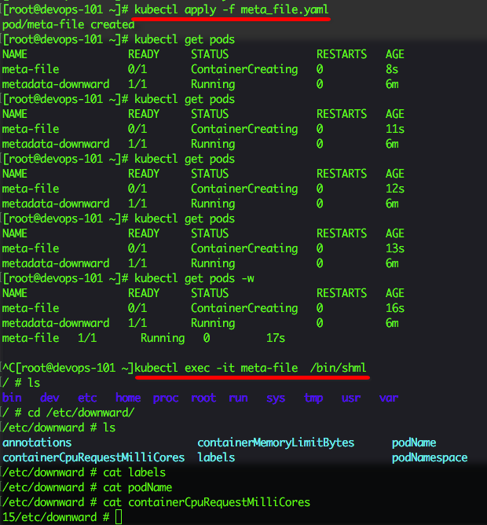
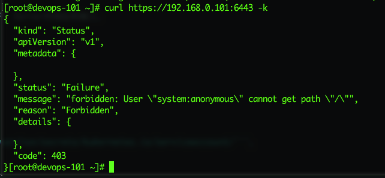
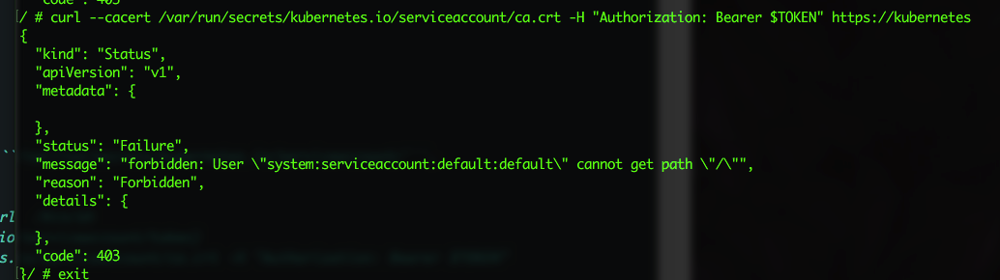
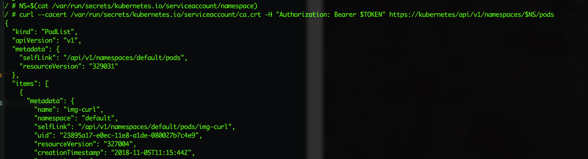

> 本文的试验环境为CentOS 7.3，Kubernetes集群为1.11.2，安装步骤参见[kubeadm安装kubernetes V1.11.1 集群](https://www.edulinks.cn/2018/07/24/20180724-kubeadm-install-kubernetes/)

## 0. Metadata

每个Pod都有一些信息，包括但不限于以下的内容：

* Pod 名称
* Pod IP
* Pod 所属的命名空间
* Pod 所在的 Node
* Pod 对应的 service account
* 每个容器的CPU、内存请求
* 每个容器的CPU、内存上限
* Pod 的标签
* Pod 的 annotations
这些信息都可以通过kubectl命令获取，但是有的情况下，我们需要从应用内获取，例如获取当前Pod的地址、主机名等一些信息，这就要求我们必须知道如何在应用内获取Pod的metadata，本文介绍三种应用内获取Pod的metadata的方式，供大家参考。

## 1. 通过环境变量暴露Metadata
```yaml
apiVersion: v1
kind: Pod
metadata:
  name: downward
spec:
  containers:
  - name: main
    image: docker.io/busybox
    command: ["sleep", "99999"]
    resources:
      requests:
        cpu: 15m
        memory: 100Ki
      limits:
        cpu: 100m
        memory: 4Mi
    env:
    - name: POD_NAME
      valueFrom:
        fieldRef:
          fieldPath: metadata.name
    - name: POD_NAMESPACE
      valueFrom:
        fieldRef:
          fieldPath: metadata.namespace
    - name: POD_IP
      valueFrom:
        fieldRef:
          fieldPath: status.podIP
    - name: NODE_NAME
      valueFrom:
        fieldRef:
          fieldPath: spec.nodeName
    - name: SERVICE_ACCOUNT
      valueFrom:
        fieldRef:
          fieldPath: spec.serviceAccountName
    - name: CONTAINER_CPU_REQUEST_MILLICORES
      valueFrom:
        resourceFieldRef:
          resource: requests.cpu
          divisor: 1m
    - name: CONTAINER_MEMORY_LIMIT_KIBIBYTES
      valueFrom:
        resourceFieldRef:
          resource: limits.memory
          divisor: 1Ki
```
在设置资源请求情况的变量时，会设置一个除数，所以环境变量最后显示计算后的结果。CPU的除数可以是1或者1m，内存的除数可以是1、1k、1Ki、1M、1Mi。
可以看到实际执行的情况


## 2. 以文件的形式传递参数
通过定义```downwardAPI```卷，可以将环境变量以配置文件的方式暴露给容器的应用。
```yaml
apiVersion: v1
kind: Pod
metadata:
  name: downward
  labels:
    foo: bar
  annotations:
    key1: value1
    key2: |
      multi
      line
      value
spec:
  containers:
  - name: main
    image: busybox
    command: ["sleep", "9999999"]
    resources:
      requests:
        cpu: 15m
        memory: 100Ki
      limits:
cpu: 100m
        memory: 4Mi
    volumeMounts:
    - name: downward
      mountPath: /etc/downward
  volumes:
  - name: downward
  downwardAPI:
      items:
      - path: "podName"
        fieldRef:
          fieldPath: metadata.name
      - path: "podNamespace"
        fieldRef:
          fieldPath: metadata.namespace
      - path: "labels"
        fieldRef:
          fieldPath: metadata.labels
      - path: "annotations"
        fieldRef:
          fieldPath: metadata.annotations
      - path: "containerCpuRequestMilliCores"
        resourceFieldRef:
          containerName: main
          resource: requests.cpu
          divisor: 1m
      - path: "containerMemoryLimitBytes"
        resourceFieldRef:
          containerName: main
          resource: limits.memory
          divisor: 1
```
创建Pod后可以查看挂载的文件。
```bash
$ kubectl exec downward ls -lL /etc/downward
```
利用环境变量的方式无法将labels和annotations导入为环境变量，使用挂载文件的方式就可以，我们因此可以查看Pod具有的labels和annotations。当labels和annotations在Pod运行期间被修改后，修改也可以反映到文件上。这也就是为什么不能用作环境变量的原因。
```bash
$ kubectl exec downward cat /etc/downward/labels
$ kubectl exec downward cat /etc/downward/annotations
```

在获取容器的资源请求数据时，我们必须指定容器的名称。不管一个Pod中有一个还是多个容器，我们都需要明确指定容器的名称。利用这种方式，如果一个Pod含有多个容器，我们可以将其他容器的资源使用情况传递到另外一个容器中。

## 3. 容器外通过API server获取metadata
上面介绍的两种方法可以获取Pod的相关信息，但是这些信息并不是完整的，如果我们需要更多的信息，就需要用到API server。
```bash
$ kubectl cluster-info #查看API Server的位置
$ curl http://ip:port/ #查看API列表，如果是https就不行了
[root@devops-101 ~]# kubectl cluster-info
Kubernetes master is running at https://192.168.0.101:6443
KubeDNS is running at https://192.168.0.101:6443/api/v1/namespaces/kube-system/services/kube-dns:dns/proxy
```

对于https的情况，可以设置代理，通过代理来访问，具体如下：

```bash
[root@devops-101 ~]#kubectl proxyk
Starting to serve on 127.0.0.1:8001
# 换一个终端窗口
[root@devops-101 ~]# curl http://localhost:8001
{
  "paths": [
    "/api",
    "/api/v1",
    "/apis",
    "/apis/",
    "/apis/admissionregistration.k8s.io",
    "/apis/admissionregistration.k8s.io/v1beta1",
    "/apis/apiextensions.k8s.io",
    "/apis/apiextensions.k8s.io/v1beta1",
    ...
```
能够看到一个列表，通过API的路径，可以访问我们想要找到的任何资源。例如查找一个deployment。
```bash
[root@devops-101 ~]# curl http://localhost:8001/apis/apps/v1/deployments
{
  "kind": "DeploymentList",
  "apiVersion": "apps/v1",
  "metadata": {
    "selfLink": "/apis/apps/v1/deployments",
    "resourceVersion": "326381"
  },
...
```

## 4. 容器内访问 API Server
容器内访问API server需要认证，并且需要通过环境变量获取API Server的地址和端口。
地址的获取方式如下：
```bash
root@curl:/# env | grep KUBERNETES_SERVICE
KUBERNETES_SERVICE_PORT=443
KUBERNETES_SERVICE_HOST=10.0.0.1
KUBERNETES_SERVICE_PORT_HTTPS=443
```
认证主要通过ca.cert及用户名，ca.cert文件默认挂载在```/var/run/secrets/kubernetes.io/serviceaccount/```。
具体方法：
```bash
[root@devops-101 ~]# kubectl exec -it img-curl  /bin/sh 
/ # TOKEN=$(cat /var/run/secrets/kubernetes.io/serviceaccount/token)
/ # curl --cacert /var/run/secrets/kubernetes.io/serviceaccount/ca.crt -H "Authorization: Bearer $TOKEN" https://kubernetes
{
  "paths": [
    "/api",
    "/api/v1",
    "/apis",
    "/apis/",
    "/apis/admissionregistration.k8s.io",
    "/apis/admissionregistration.k8s.io/v1beta1",
    "/apis/apiextensions.k8s.io",
```
如果遇到了下图中的错误，需要创建RBAC的角色绑定并且重新执行一下上面的命令。

接下来就可以在Pod的容器中查看metadata的信息，如下查看当前命名空间所有运行的Pods

有了访问API server的能力，就为我们定义容器内应用的行为提供了无限的想象力，我们可以通过curl来访问API server，同时也有很多语言的客户端库，让我们方便的在自己的应用中调用API server

* [Java client](https://github.com/fabric8io/kubernetes-client)
* [Node.js](https://github.com/tenxcloud/node-kubernetes-client)
* [PHP](https://github.com/devstub/kubernetes-api-php-client)


