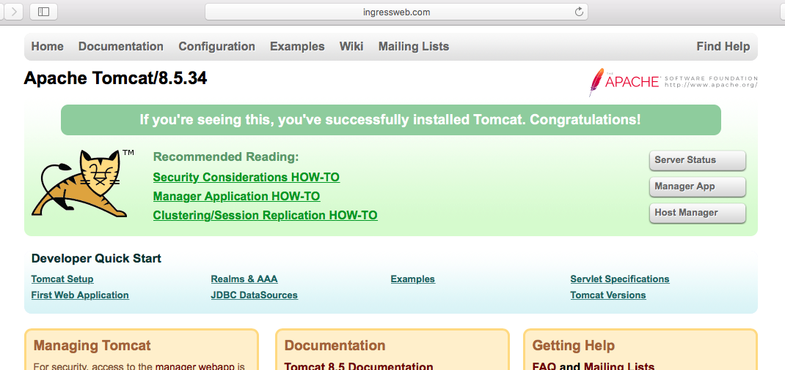
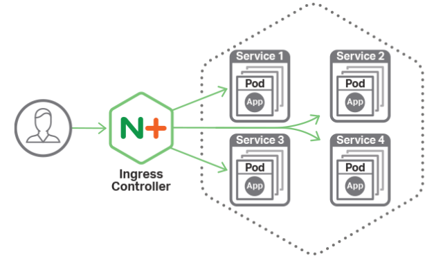

>  本文的演练环境为基于 Virtualbox 搭建的 Kubernetes 集群，具体搭建步骤可以参考 [kubeadm安装kubernetes V1.11.1 集群](https://www.edulinks.cn/2018/07/24/20180724-kubeadm-install-kubernetes/) 。想要了解更多 Kubernetes 相关知识，可以阅读 [Kubernetes 系列学习文章](http://www.edulinks.cn/2020/10/16/20201016-kubernetes-articles/)。

Kubernetes 中暴露服务的方式有三种

* Loadbalancer 这种方式往往需要云供应商支持，或者本地F5等设备支持
* NodePort 这种方式调用方通过NodeIP:NodePort 的方式访问服务，无法应对Pod发生迁移时的场景
* Ingress Ingress是Kubernetes中的一种资源，通过这种资源提供了外部访问内部服务的通路，实现上是通过一个Pod加NodePort来实现的。通过Ingress，方便我们自己定义负载均衡。现在有很多种的Ingress支持，本文主要介绍Nginx的方案。
> Kubernetes社区和Nginx公司都发布了一款叫做Nginx-ingress的Controller，它们之间的不同可以参考[Difference between two nginx-ingress](https://github.com/nginxinc/kubernetes-ingress/blob/master/docs/nginx-ingress-controllers.md)本文基于 Nginx-ingress Controller 做的实验。版本为 1.3.0。

## Kubernetes 社区方案

### 安装
```bash
[root@devops-101 ~]# kubectl apply -f  https://raw.githubusercontent.com/kubernetes/ingress-nginx/master/deploy/mandatory.yaml
namespace/ingress-nginx created
configmap/nginx-configuration created
serviceaccount/nginx-ingress-serviceaccount created
clusterrole.rbac.authorization.k8s.io/nginx-ingress-clusterrole created
role.rbac.authorization.k8s.io/nginx-ingress-role created
rolebinding.rbac.authorization.k8s.io/nginx-ingress-role-nisa-binding created
clusterrolebinding.rbac.authorization.k8s.io/nginx-ingress-clusterrole-nisa-binding created
deployment.extensions/nginx-ingress-controller created
[root@devops-101 ~]# kubectl get pods --all-namespaces -l app.kubernetes.io/name=ingress-nginx --watch
NAMESPACE       NAME                                        READY     STATUS              RESTARTS   AGE
ingress-nginx   nginx-ingress-controller-664f488479-pr87w   0/1       ContainerCreating   0          5s
ingress-nginx   nginx-ingress-controller-664f488479-pr87w   0/1       Running   0         11s
ingress-nginx   nginx-ingress-controller-664f488479-pr87w   1/1       Running   0         16s
[root@devops-101 ~]# kubectl get all -n ingress-nginx
NAME                                            READY     STATUS    RESTARTS   AGE
pod/nginx-ingress-controller-664f488479-pr87w   1/1       Running   0          2m

NAME                                       DESIRED   CURRENT   UP-TO-DATE   AVAILABLE   AGE
deployment.apps/nginx-ingress-controller   1         1         1            1           2m

NAME                                                  DESIRED   CURRENT   READY     AGE
replicaset.apps/nginx-ingress-controller-664f488479   1         1         1         2m
```
安装文件mandatory，需要增加hostNetwork属性，否则访问的时候总是有问题。

### 配置tomcat和httpd
从我的[Github](https://github.com/cocowool/k8s-go/tree/master/service/ingress)上下载tomcat-deploy\httpd-deploy\tomcat-service\httpd-service几个文件，并分别部署。
再下载tomcat-ingress.yaml文件，进行部署。
```yaml
apiVersion: extensions/v1beta1
kind: Ingress
metadata:
  name: tomcat-ingress
#  namespace: nginx-ingress
  annotations:
    nginx.ingress.kubernetes.io/rewrite-target: /
spec:
  rules:
  - host: ingressweb.com
    http:
      paths:
      - path: /
        backend:
          serviceName: tomcat-service
          servicePort: 8080
      - path: /httpd
        backend:
          serviceName: httpd-service
          servicePort: 80
```

### 验证
上面的例子中，我配置的域名为 ingressweb.com ，在本地修改host，指向ingress-controller运行的节点，通过浏览器访问[http://ingressweb.com](http://ingressweb.com)可以看到 tomcat 的界面，通过[http://ingressweb.com/httpd](http://ingressweb.com/httpd)可以看到httpd的It Works！界面。


## Nginxinc 的方案
看一下Nginx Ingress Controller的示意图

Nginx Ingress Controller 支持的功能

* 暴露服务，一般有两种方式，通过不同的主机名（如 serviceA.com，serviceB.com）或者通过不同的URL（如 /serviceA 和 /serviceB）。
* 配置SSL支持
* TCP负载均衡
* Url 重写

### 安装
首先需要有一个可以正常运行的Kubernetes环境，如果还没有，可以参考我的安装步骤[kubeadm安装kubernetes V1.11.1 集群](https://www.cnblogs.com/cocowool/p/kubeadm_install_kubernetes.html)
```bash
[root@devops-101 ~]# kubectl apply -f ingress-install.yaml 
namespace/nginx-ingress created
serviceaccount/nginx-ingress created
secret/default-server-secret created
configmap/nginx-config created
clusterrole.rbac.authorization.k8s.io/nginx-ingress configured
clusterrolebinding.rbac.authorization.k8s.io/nginx-ingress configured
deployment.extensions/nginx-ingress created
[root@devops-101 ~]# kubectl get pods -n nginx-ingress
NAME                             READY     STATUS    RESTARTS   AGE
nginx-ingress-767cc6477f-flj2f   1/1       Running   5          4m
```

### 实例
> 没有规则配置的时候，对于所有的请求默认都返回404状态。

```bash
[root@devops-101 ~]# kubectl apply -f cafe-example.yaml 
deployment.extensions/coffee created
service/coffee-svc created
deployment.extensions/tea created
service/tea-svc created
secret/cafe-secret created
ingress.extensions/cafe-ingress created
[root@devops-101 ~]# IC_IP=192.168.0.102
[root@devops-101 ~]# IC_HTTPS_PORT=31586
[root@devops-101 ~]# curl --resolve cafe.example.com:$IC_HTTPS_PORT:$IC_IP https://cafe.example.com:$IC_HTTPS_PORT/tea --insecure
Server address: 172.16.1.138:80
Server name: tea-7d57856c44-jxpvt
Date: 22/Oct/2018:11:37:47 +0000
URI: /tea
Request ID: 796e79e0280a27743cb682b8e893d6e9
```


### 参考资料

1. [Kubernetes ingress controller](https://www.nginx.com/products/nginx/kubernetes-ingress-controller)
2. [Github nginx ingress](https://github.com/nginxinc/kubernetes-ingress)
3. [Difference between two nginx-ingress](https://github.com/nginxinc/kubernetes-ingress/blob/master/docs/nginx-ingress-controllers.md)
4. [Kubernetes的负载均衡问题](https://www.cnblogs.com/ericnie/p/6965091.html)
5. [初试Kubernetes暴露服务类型之Nginx Ingress](https://blog.csdn.net/aixiaoyang168/article/details/78485581?locationNum=5&fps=1)
6. [Kubernetes Nginx Ingress](https://kubernetes.github.io/ingress-nginx/)
7. [Kubernetes Nginx Ingress教程](https://mritd.me/2017/03/04/how-to-use-nginx-ingress/)


