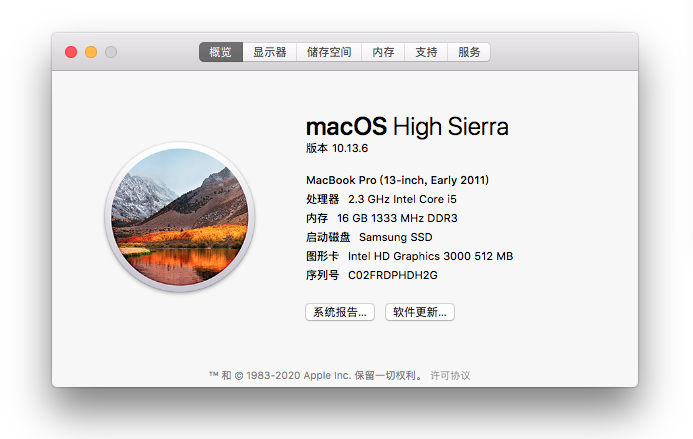
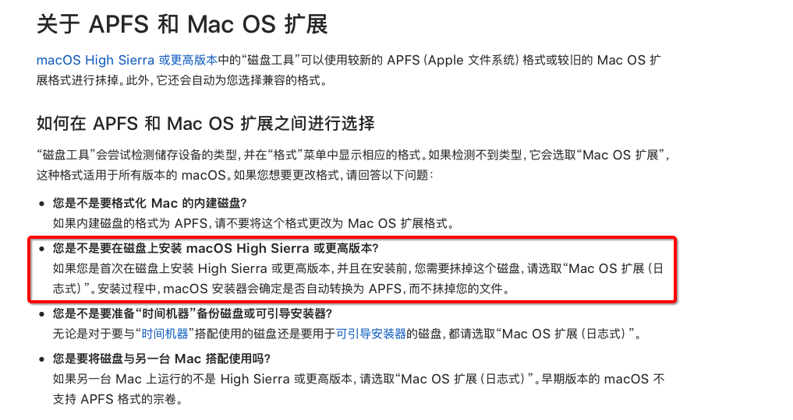

上周一的时候，对为我服务了9年的Macbook Pro做了一次重启（因为想刷新一下路由，关于双网卡路由配置可以参考我的[这篇文章](https://www.edulinks.cn/2020/05/19/20200519-macos-route/)），然后悲剧来了，当出现小苹果和进度条后，进度条走的一直很慢，等进度条都走完了也一直没有办法启动系统。

这时我的第一感觉是SSD硬盘坏了，现在的MBP有两块硬盘，一块1T的普通机械硬盘安装在硬盘位，一块256G的SSD硬盘安装在光驱位。前不久我老婆的联想电脑也是因为SSD硬盘的故障导致操作系统启动停留在Windows图标那里。

怀疑磁盘故障，那么第一反应就是更换一块磁盘，火速的从某东上购买了一块240G金士顿SSD硬盘，然后一顿折腾将就硬盘换下来、新硬盘换上去，使用`Command + Option + R`重启操作系统进入恢复工具后，首先对磁盘进行分区操作，**重点在这个地方**，当时我将磁盘分区方式选择为`Mac OS 扩展（日志式）`，然后分好区后重新安装操作系统提示我`**将安装器信息下载到目标宗卷失败**`，不管是用新的SSD还是旧的SSD，都是同样的报错。

这时就有点蒙圈了，不知道问题出在哪里，一度打了两个Apple Care的支持电话，客服的小姑娘很热情、耐心的知道了我如何抹盘及重装，但是对于仍然出现的报错信息也并没有提供很好的办法。在快要灰心失望准备掏腰包更换新的MBP的时候，无意间通过`macOS实用工具`中的`获得在线帮助`点了进去，发现在某一个页面介绍重装操作系统时（忘记页面的具体标题了），选择的分区类型是`**APFS**`。这时好像印象中某次操作系统版本升级，苹果把文件系统都换成了APFS，于是重新抹盘格式化为APFS，然后重新安装`macOS High Sierra`等待了半个小时左右，操作系统重新安装完成了。

此时此刻，心情非常激动（其实有点难过换机器的时间又被推迟了，期望这台电脑能够服务满10年吧）。将整个过程记录下来，希望对同样遇到这个问题的朋友有所帮助。

> 后来又查阅了一下苹果官方的文档，文档描述中说对于macOS High Sierra，应该是支持扩展模式的分区格式的，但我始终无法安装成功，不知道是否与哪里有关系。个人猜测可能是Recovery分区中的操作系统版本比较低导致的。
>
> 

## 参考资料

1. [如何抹掉 Mac 磁盘](https://support.apple.com/zh-cn/HT208496)
2. [如何创建可引导的 macOS 安装器](https://support.apple.com/zh-cn/HT201372)