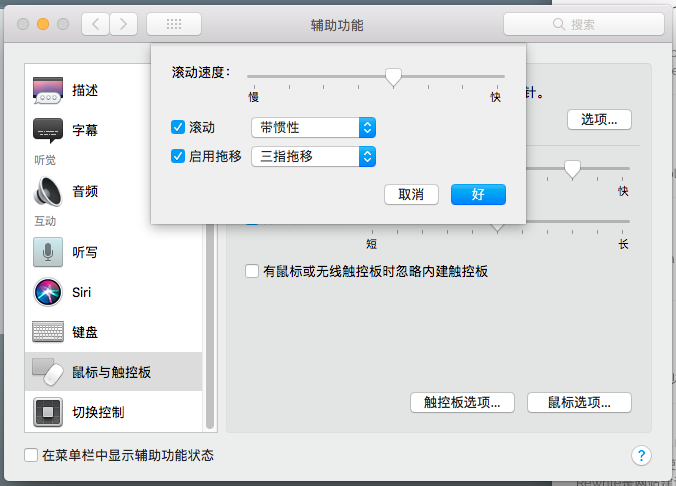

> 最早开始使用Mac电脑是从2011年开始，从Leopard一直到现在的Catalina，macOS系统经历了非常重大的变化，但是自己的一些使用习惯一直延续下来。从2011年到今天，大概发生了三四次系统故障不得不重新安装或者因为跟换硬盘造成的系统重装，为了方便每次系统安装后的配置工作，整理了一份自己系统配置的清单，一方面便于自己回顾查看，另一方面也送给有需要的朋友。

## 系统配置

* 快捷键的调整：互换了Spotlight和输入法切换的快捷键

* 手势的调整：单指双按手势、三指拖拽的支持。其中三指拖拽的配置据我所知从EI Caption开始就转移到了辅助功能里面，如下图

  

* 设置桌面图片定时随机切换，曾经从Bing上下载了很多美丽的图片，因此习惯了背景图片定时的切换一下

* 安装`Command Line Tools`，一般打开Termianl，然后在命令行中输入一些诸如`git`之类的命令，就会弹出安装的提示框，或者也可以安装Xcode后在菜单中选择安装

## 浏览器配置

* 打开开发菜单，在`偏好设置`的`高级`标签中，最下方那个复选框钩上就可以了

## Termianl 配置

对于Linux和Unix系统来说，用户配置文件一般有以下几个：

* /etc/profile 全局profile文件，对所有用户生效

* ~/.bash_profile 或 ~/.profile。.bash_profile 是Linux下的，.profile是Unix中有的。

* ~/.bashrc 。这个文件保存用户的一些个性化配置。

Bash登陆的时候，首先加载全局的 profile，接着判断用户目录下的 .bash_profile，最后可以在 .bash_profile 中调用 .bashrc。根据这个关系，我选在在自己的用户目录下创建`.bash_profile`用来保存自己常用的配置信息。

```sh
#设置历史命令记录数
export HISTSIZE=1000

#记录历史文件大小
export HISTFILESIZE=450

#设置终端颜色
export PS1="\[\033[36m\]\u\[\033[m\]@\[\033[32m\]\h:\[\033[33;1m\]\w\[\033[m\]\$ "
export CLICOLOR=1
export LSCOLORS=ExFxBxDxCxegedabagacad

#为ls命令定制别名
alias ls='ls -lGFh'
```

我一般使用Homebrew主题，然后再调整一个等宽字体和字号基本上就可以开工了。

## 必备软件

* `brew.sh`类似于Linux中的apt-get或者yum，提供了macOS下的包管理功能，方便我们安装各类开源软件
* 微信 WeChat，国民级的软件，不装不行呀
* 印象笔记，之前用的是Evernote，因为国内版本支持Markdown切换过来了，还是用Evernote账号登陆
* WPS Office，这次远程办公期间，发现WPS Office已经足够满足日常的办公需要，关键还是免费的
* Docker
* The Unarchiver，在App Store中解压缩的软件非常多，不知道是不是因为这类工具开发容易的原因，但是最好用、最好看的我觉得非The Unarchiver莫属了，关键还免费
* Google Chrome，虽然Safari已经足够好用了，但某些时候还是要看齐下Chrome
* Visaulstudio Code，最近几年比较流行的轻量级IDE，超过了Sublime

> 啰啰嗦嗦写了这么多，不知道你有没有自己喜欢的Mac设置和软件，欢迎通过我的公众号分享给我，非常感谢。

## 参考资料

1. [mac 中 history 命令使用与配置](https://blog.csdn.net/testcs_dn/article/details/79970635)
2. [Simple Tricks to Improve the Terminal Appearance in Mac OS X](http://osxdaily.com/2013/02/05/improve-terminal-appearance-mac-os-x/)
3. [~/.profile ~/.bashrc和~./bash_profile的理解以及zsh的使用](https://www.jianshu.com/p/b39fd35e2360)
4. [MY MAC OSX BASH PROFILE](https://natelandau.com/my-mac-osx-bash_profile/)
5. [Shortcuts to move faster in Bash command line](http://teohm.com/blog/shortcuts-to-move-faster-in-bash-command-line/)
6. [10 个 Terminal 主题，让你的 macOS 终端更好看](https://sspai.com/post/53008)
7. [brew.sh](https://brew.sh/index_zh-cn)

