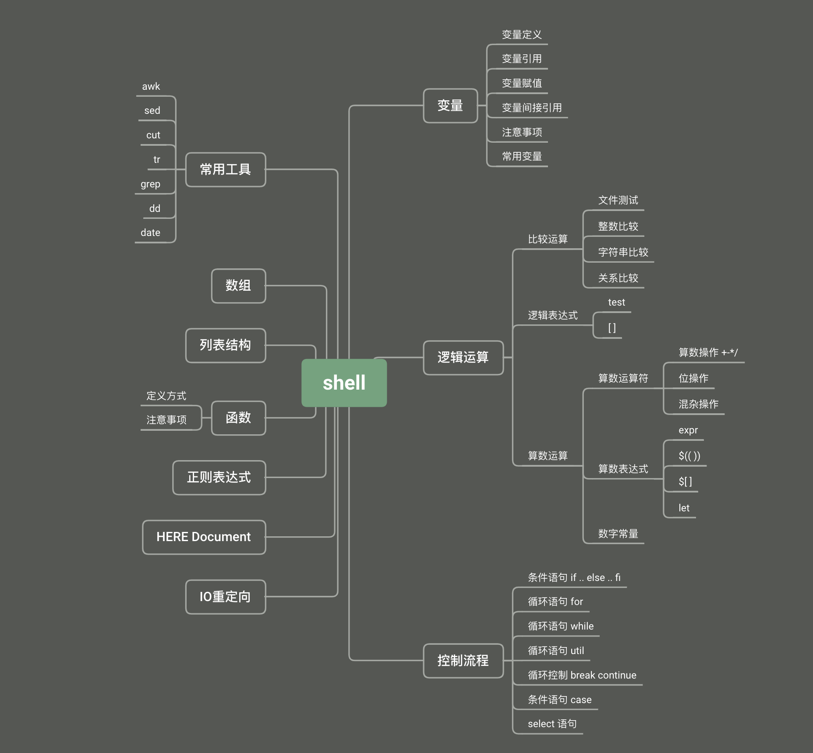
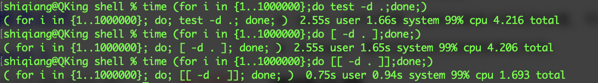
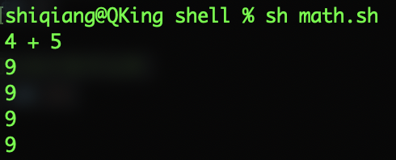

[TOC]

> 其实这篇文章最早想起名《30分钟学会shell》但是仔细梳理了shell的相关知识后，发现如果想把所有的细节都掌握的，真的不可能30分钟学完。但是通过30分钟的时间，过一遍相关的知识点还是可能的，整理了一份相关知识点的思维导图，想要真的学好，还要静下心来花点功夫哦。



## Shell 简介

shell是一种特殊的程序，是 `用户与Linux系统内核间的接口`，它解释运行由命令行或文件输入的命令，从而实现用户与内核间的交互。

## 内部命令

内部命令是shell命令的一部分，驻留在系统内存中，不需要创建子进程，例如 `cd exit echo history` 这些命令。使用 `man builtins` 可以看到 shell 中自带的内部命令。

> 以 `/` 开头的命令都不会触发内部命令，例如 `echo` 会调用内部命令，`/bin/echo` 或 `./echo` 则不会调用内部命令。

本文简要列了一些：`alias、bg、bind、break、builtin、case、cd、chdir、command、continue、do、done        echo、elif、else、esac、eval、exit、export、false、fc、fg、fi、for、getopts、hash、if、jobid、jobs、local、pwd、read、readonly、return、set、setvar、shift、test、then、times、trap、true、type、ulimit、umask、unalias、unset、until、wait、while`

> 判断一个命令是否内部命令，可以使用 `type` 命令。
>
> ```sh
> % type echo
> echo is a shell builtin
> ```
>
> 如果是外部命令，则 `type` 会给出该命令的执行路径。
>
> ```sh
> % type node
> node is /usr/local/bin/node
> ```
>
> 

## 外部命令

外部命令其实并不是 shell 的内容，它们往往都是脚本文件或者二进制文件，需要的时候会加载到内存并创建对应的子进程，通常位于 `/bin` 或者 `/usr/bin` 等目录下。


## 变量

在 shell 中定义变量有两种方式，一种可以直接使用 `var_name="AAAA"` 的方式在定义变量的同时就为变量赋值，也可以使用 `declare -i number_var` 定义变量，然后稍后再给变量赋值。

> 注意变量赋值语句前后一定不要有空格！

使用变量要通过 `$` ，例如打印变量 `echo $var_name` 。还以加上花括号来引用变量，例如 `echo ${var_name}` 这种方式能够给出明确的变量边界，推荐在实际工作中都使用这种方式。

**一些常用的变量**：

* 命令行参数：`$0、$1......${10}`
* 命令行或者位置参数的个数：`$#`
* `$*`：所有位置参数，被作为一个单词。必须被""引用
* $@	：同$*，但每个参数都是一个独立的""引用。必须被引用
* `$!`	：在后台运行的最后的工作的 PID(进程ID)
* `$_`	：保存之前执行的命令的最后一个参数
* `$?`	：命令、函数或者脚本本身的退出状态，用来判断脚本是否正常退出，正常退出返回为0。
* `$$`	：脚本自身进程ID，常用来构造一个"unique"的临时文件名
* `$BASH`	：指向 Bash 的二进制执行文件的位置
* `FUNCNAME`：当前函数的名字
* `LINENO`：当前行号
* `HOME`：用户的 home 目录
* `PWD`：所在的当前目录
* `OLDPWD`：所在的之前的目录
* `PATH`：PATH参数，指向外部命令所在的位置，可以是多个位置
* `SECONDS`：脚本已经运行的时间(单位为秒)

## 逻辑运算

shell 提供了丰富的逻辑运算符来满足我们常见的文件、数字、字符串等逻辑运算需求。shell提供了`test`内置命令来检测某个条件是否成立，通常和 `if` 配合使用，可以进行文件、数值、字符串三方面的比较。

`test` 的语法如下，如果表达式成立返回 0 ，如果表达式不成立返回 1，返回大于 1 的值表示发生了错误。

```sh
test expression
[ expression ]
```

> `test` 命令可以简写为 [ ] ，注意 [ ] 与 expression 之间的空格是必须的。[ ] 的写法更加简洁，[[ ]] 是 [ ] 的扩充，能支持 `<、>` 运算，不需要转义，内支持逻辑运算符，是性能最高的表达式。



### 文件测试操作

* `-e` : 检测文件（包括目录）是否存在
* `-b` : 检测文件是否为块设备文件
* `-c` : 检测文件是否是字符设备文件
* `-d` : 检测文件是否为目录
* `-f` : 检测文件是否为普通文件（既不是目录，也不是块设备）
* `-s` : 检测文件是否为空，即文件的大小是否大于0
* `-p` : 检测文件是否为有名管道
* `-r` : 检测文件是否有读权限
* `-w` : 检测文件是否有写权限
* `-x` : 检测文件是否有执行权限
* `-g` : 检测文件是否设置了SGID位
* `-k` : 检测文件是否设置了粘着位（Sticky Bit）
* `-u` : 检测文件是否设置了SUID位
* `-L` : 判断是否为符号链接
* `-S` : 判读是否为socket文件
* `-nt` : 判断file1是否比file2新
* `-ot` : 判断file1是否比file2旧

关于文件测试的具体代码示例，可以参考我的[Github](https://github.com/cocowool/sh-valley/blob/master/shell/file_compare.sh)。

### 整数比较

* `-eq` : 是否相等
* `-ne` : 是否不相等
* `-gt` : 是否大于
* `-ge` : 是否大于等于
* `-lt` : 是否小于
* `-le` : 是否小于等于

### 字符串比较

* `=:` : 等于
* `!=:` : 不等于
* `<:` ： 小于
* `>:` : 大于
* `-z` : 字符串长度为0
* `-n` : 字符串长度不为0

> 注意shell中的字符串比较和其他语言中可以用来做数字比较，而shell中只能用来做字符串比较，这点一定要习惯。另外 shell 中不支持 `>=` 、`<=` 运算符，请大家牢记。

### 关系比较

* `-a` : 逻辑与
* `-o` : 逻辑或
* `&&` : 逻辑与
* `||` : 逻辑或

## 算术运算

Shell 支持的算术运算类型很丰富，能够满足日常的需求。

* 算术操作：`+` 加法、`-` 减法、`*` 乘法、`/` 除法、`**` 幂运算、`%` 取模、`+=` 加等于、`-=` 减等于、`*=` 乘等于、`/=` 除等于、`%=` 取模等于。
* 位操作符：`<<` 左移1位、`<<=n` 左移n位、`>>` 右移1位、 `>>=n` 右移n位、`&` 按位与、`&=` 按位与赋值、`|` 按位或、`|=` 按位或赋值、`~` 按位非、`!` 按位否、`^` 按位异或、`^=` 按位异或赋值。
* 逗号运算符：逗号操作符可以连接2个或多个算术运算，所有的操作都会被执行，但只有最后一个操作作为结果。

具体算术运算的例子如下：

```sh
#!/bin/bash

# 测试一些算术表达式的使用
A=4
B=5

# 直接使用+号会将数字作为字符串拼接起来
echo $A + $B

# 使用expr命令能够执行数学运算
echo `expr $A + $B`

# 使用$[]也可以执行数字运算
echo $[ $A + $B ]

# 使用$(())也可以执行数字运算
echo $(( $A + $B ))

# 使用let
let "r=$A+$B"
echo $r
```

执行结果




> 到这里基本上把shell变量、运算符介绍完了，下一篇计划把控制语句介绍一下，这样两篇结合起来就能够实现基本的shell脚本编写了。

## 参考资料

1. [shell脚本-文件测试](https://www.cnblogs.com/-beyond/p/8253836.html)
2. [shell test命令详解](https://www.cnblogs.com/qiangyuzhou/p/10806667.html)
3. [shell 详解：检测某个条件是否成立](http://c.biancheng.net/view/2751.html)


