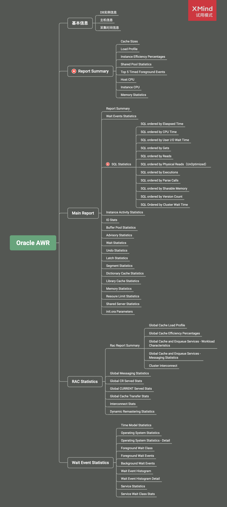
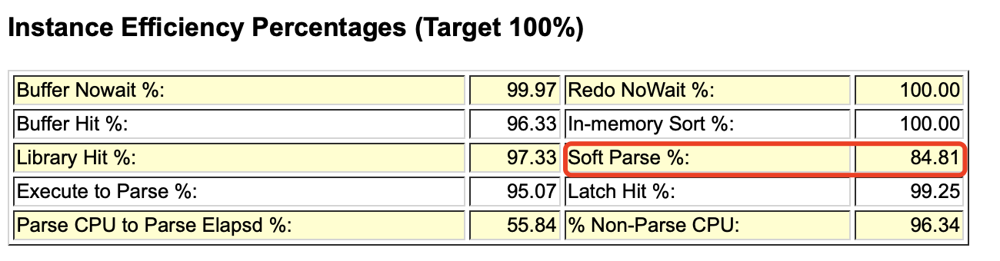

[TOC]

> 本文面向没有太多 Oracle 基础知识，但是需要通过 AWR 报告来分析数据库性能或排查问题人员，通过对 AWR 报告的简介，了解其包含的主要信息，然后对一些能够帮助我们分析定位问题的章节做一点稍微详细的介绍。通过阅读本文，期望使读者能够快速抓住阅读 AWR 报告的重点，为分析判断数据库性能是否有问题提供帮助。
>
> 本文示例报告基于 Oracle 11.2.0.3.0 版本生成。

## AWR报告简介

AWR是Oracle 10g版本推出的特性，全称叫做 `Automatic Workload Repository 全自动负载信息库` 。Oracle启动后，会有后台进程定时采集并保存系统快照信息，也可以手工创建快照。AWR通过对比两个时间点的快照信息，生成该时间段的AWR报告，帮助DBA或开发人员了解 Oracle 数据库的运行情况。Oracle 还提供了 ASH、ADDM等工具，本文不进行探讨。

## AWR报告结构

AWR报告基本分为四部分：

* 基本信息部分，包括了DB实例、主机的信息以及报告采集时间段的信息。
* Main Report部分，第一部分Report Summary被单独放在了基本信息后面，其他的信息则放在整个报告较后的位置，个人觉得最重要的部分是SQL Statistcs。
* RAC statistics部分，包括RAC相关的统计信息。
* Wait Event Statistics部分。

## 基本信息

报告一开始部分为基本信息，显示了DB实例、主机信息。DB Time 指标可以用来判断数据库是否繁忙，如果 Elapsed 时间乘以CPU个数小于DB Time 表示数据库比较繁忙。

## Report Summary

Report Summary 分为8个部分，最主要的是 Load Profile。

Load Profile 主要用来显示当前系统的一些指示性能的总体参数，部分介绍如下：

* Redo Size ：用来显示平均每秒的日志大小和平均每个事务的日志大小，有时候可以结合 Transactions 每秒事务数，**分析当前事务的繁忙程度**。
* Logical Read：逻辑读耗CPU，主频和CPU核数都很重要，逻辑读高则DB CPU往往高，也往往可以看到 `latch: cache buffer chains` 等待。
* Physical Read：物理读消耗IO读，体现在IOPS和吞吐量等不同纬度上。但减少物理读可能意味着消耗更多CPU。
* Parses：解析次数，包括软解析 + 硬解析，软解析优化得不好几乎等于每秒SQL执行次数， 即执行解析比1:1。理想状态是解析一次到处运行。
* Hard Parses：硬解析次数，最好少于每秒20次。

> 注意 Load Profile 中的指标提供了 Per second 和 Per transaction 两个维度。Per second 主要是把快照抓到的值除以两个快照之间的秒数。这是我们用来判断性能的主要维度。Per transaction 是基于事务的维度，主要是把快照抓到的值除以两个快照之间的事务数。

Instance Efficiency Percentages 是一些命中率指标。Buffer Hit、Library Hit 等表示SGA ( System global area )的命中率。Soft Parse 指标表示共享池的软解析率，如果小于90%，就说明存在未绑定变量的情况。这些指标应当尽可能接近100%，如果过低一定是发生了性能问题。

* **Buffer Nowait ** 表示在内存获得数据的未等待比例。在缓冲区中获取Buffer的未等待比率。**Buffer Nowait的这个值一般需要大于99%**。否则可能存在争用，可以在后面的等待事件中进一步确认。
* **Buffer Hit** 表示进程从内存中找到数据块的比率，监视这个值是否发生重大变化比这个值本身更重要。对于一般的OLTP系统，如果此值低于80%，应该给数据库分配更多的内存。数据块在数据缓冲区中的命中率，通常应在95%以上。
* **Redo NoWait** 表示在Log 缓冲区获得Buffer的未等待比例。如果太低可考虑增加Log Buffer。当redo buffer达到1M时就需要写到redo log文件，所以一般当redo buffer设置超过1M，不太可能存在等待buffer空间分配的情况。当前，一般设置为2M的redo buffer，对于内存总量来说，应该不是一个太大的值。
* **Library Hit** 表示Oracle从Library Cache中检索到一个解析过的SQL或PL/SQL语句的比率，当应用程序调用SQL或存储过程时，Oracle检查Library Cache确定是否存在解析过的版本，如果存在Oracle立即执行语句；如果不存在Oracle解析此语句，并在Library Cache中为它分配共享SQL区。低的Library Hit Ratio会导致过多的解析，增加CPU消耗，降低性能。如果Library Hit Ratio低于90%，可能需要调大Shared pool区。
* **Latch Hit：**Latch是一种保护内存结构的锁，可以认为是Server进程获取访问内存数据结构的许可。要确保Latch Hit>99%，否则意味着Shared Pool latch争用，可能由于未共享的SQL，或者Library Cache太小，可使用绑定变更或调大Shared Pool解决。要确保>99%，否则存在严重的性能问题。当该值出现问题的时候，我们可以借助后面的等待时间和latch分析来查找解决问题。
* **Parse CPU to Parse Elapsd：**解析实际运行时间/(解析实际运行时间+解析中等待资源时间)，越高越好。如果该比率为100%，意味着CPU等待时间为0，没有任何等待。
* **Non-Parse CPU ：**SQL实际运行时间/(SQL实际运行时间+SQL解析时间)，太低表示解析消耗时间过多。如果这个值比较小，表示解析消耗的CPU时间过多。
* **Execute to Parse：**是语句执行与分析的比例，如果要SQL重用率高，则这个比例会很高。该值越高表示一次解析后被重复执行的次数越多。
* **In-memory Sort：**在内存中排序的比率，如果过低说明有大量的排序在临时表空间中进行。考虑调大PGA(10g)。如果低于95%，可以通过适当调大初始化参数PGA_AGGREGATE_TARGET或者SORT_AREA_SIZE来解决，注意这两个参数设置作用的范围时不同的，SORT_AREA_SIZE是针对每个session设置的，PGA_AGGREGATE_TARGET则时针对所有的sesion的。
* **Soft Parse：**软解析的百分比(Softs/Softs+Hards)，近似当作sql在共享区的命中率，太低则需要调整应用使用绑定变量。sql在共享区的命中率，小于<95%,需要考虑绑定，如果低于80%，那么就可以认为sql基本没有被重用。

## Main Report

* Report Summary 在上面一节已经说过，不再赘述。
* SQL Statistics 从 `11` 个维度对SQL进行排序并给出了Top SQL的详细内容，可以点击查看具体的SQL内容，进一步分析调优方案。
  * SQL ordered by Elapsed Time。记录了执行总和时间的 TOP SQL(请注意是监控范围内该SQL的执行时间总和，而不是单次SQL执行时间 Elapsed Time = CPU Time + Wait Time)。
  * SQL ordered by CPU Time。记录了执行占CPU时间总和时间最长的TOP SQL(请注意是监控范围内该SQL的执行占CPU时间总和，而不是单次SQL执行时间)。
  * SQL ordered by Gets。记录了执行占总 buffer gets (逻辑IO)的TOP SQL(请注意是监控范围内该SQL的执行占Gets总和，而不是单次SQL执行所占的Gets)。
  * SQL ordered by Reads。记录了执行占总磁盘物理读(物理IO)的TOP SQL。
  * SQL ordered by Executions。记录了按照SQL的执行次数排序的TOP SQL。该排序可以看出监控范围内的SQL执行次数。
  * SQL ordered by Parse Calls。记录了SQL的软解析次数的TOP SQL。
  * SQL ordered by Sharable Memory。记录了SQL占用library cache的大小的TOP SQL。Sharable Mem (b)：占用library cache的大小，单位是byte。
  * SQL ordered by Version Count。记录了SQL的打开子游标的TOP SQL。
  * SQL ordered by Cluster Wait Time。记录了集群的等待时间的TOP SQL。
* Top 10 Foreground Events by Total Wait Time，等待事件是衡量数据库优化情况的重要指标，通过观察Event和%DB time两列就可以直观看出当前数据库的主要等待事件。

## RAC statistics

这一部分涉及RAC运行的相关统计信息，对于初学者来说不太常用，本文暂不赘述。

## Wait Event Statistics

其中 Time Model Statistics 几个有用的指标解释如下：

* parse time elapsed 与 hard parse elapsed time 需要结合起来看解析是否是主要矛盾，若是则重点是软解析还是硬解析。
* sequence load elapsed time 序列争用
* PL/SQL compilation elapsed time PL/SQL对象编译的耗时
* connection management call elapsed time 数据库连接建立和断开的耗时
* failed parse elapsed time 解析失败的耗时

## 参考资料

1. [oracle11G AWR使用及分析](https://www.cnblogs.com/david-zhang-index/archive/2012/08/21/2649252.html)
2. [等待事件：db file scattered read(离散读）](https://blog.csdn.net/haojiubujian920416/article/details/81506982)
3. [【深度长文】循序渐进解读Oracle AWR性能分析报告](https://mp.weixin.qq.com/s/48pYtwLO1YpFnUtpMojbfQ)
4. [Oracle AWR报告生成和性能分析](https://www.cnblogs.com/mzq123/p/10741208.html)
5. [Oracle AWR报告指标全解析](http://www.askmaclean.com/archives/performance-tuning-oracle-awr.html)

