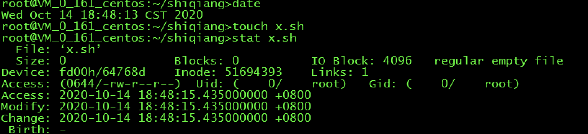
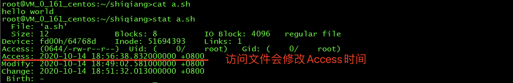
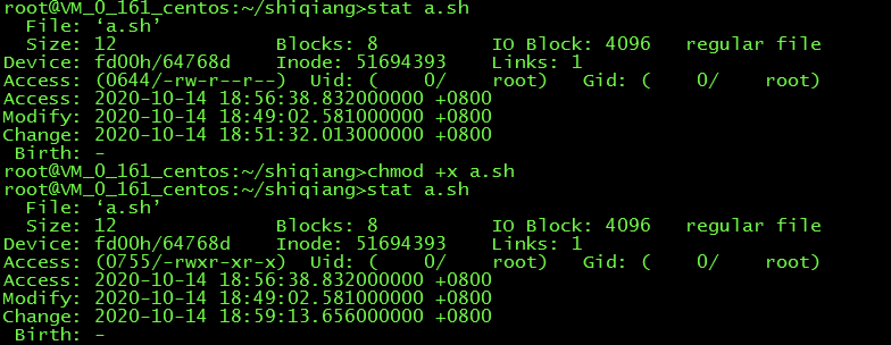
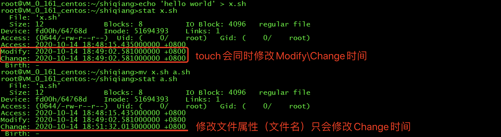
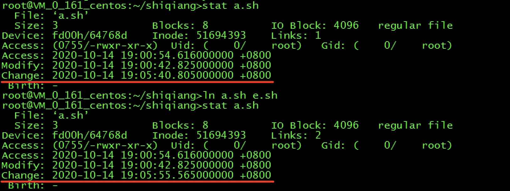
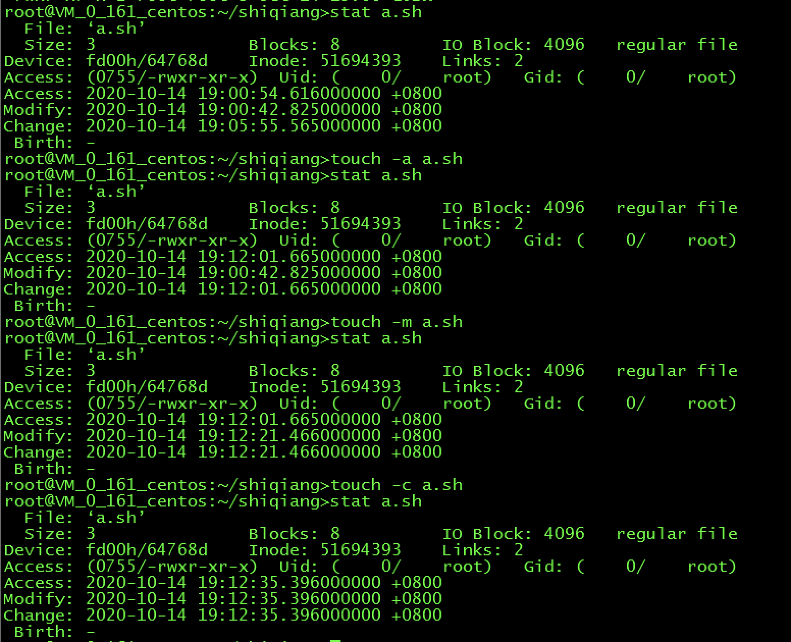

> 本文所有脚本及命令均在 Red Hat Enterprise Linux Server release 7.6 上验证通过。

Linux 下使用 `stat` 命令查看文件（目录）时，可以看到文件（目录）有三个时间属性，分别是：

* Access Time ：指最近一次的程序对文件（目录）的直接存取时间，通俗来讲是文件最近一次被访问的时间，但这里的访问是直接存取，而不是从缓存存取。对于目录来说，只进入目录不会更新其Access Time，但是通过 `ls` 查看目录内容时，Access Time就会更新。`ls` 命令默认看到的是 Access Time。
* Modify Time ：指最近一次文件（目录）的内容被改动的时间。用 `ls -lu` 命令看到的是 Modify Time。
* Change Time ：指最近一次文件（目录）的属性被修改的时间。用 `ls -lc` 命令看到的是Change Time。

可以看到当文件被初次创建的时候，三个时间是一样的。

## 修改Access Time的情形

对文件的直接读取会修改文件的Access Time。

文件如果具有可执行权限，文件执行时，Access Time 也会被修改。

## 修改Modify Time的情形

对文件内容进行编辑，会修改Modify Time，同时也会修改Change Time。

## 修改Change Time的情形

对文件的属性进行修改，包括文件名、软连接数量、读写属性等进行修改，会改变文件的Change Time，但不会改变Modify Time。

## 使用 `touch` 命令来修改时间

`touch` 命令可以创建文件，可以在创建文件的时候指定三个时间的具体值，也可以对现有的文件修改这三个时间的值，如下图所示。

`touch` 支持的三个参数含义如下：

* -a 文件名：将文件的 Access Time 修改为当前系统时间
* -m 文件名： 将文件的 Modify Time 修改为当前系统时间
* -c 文件名： 将文件的 Change Time 修改为当前系统时间

