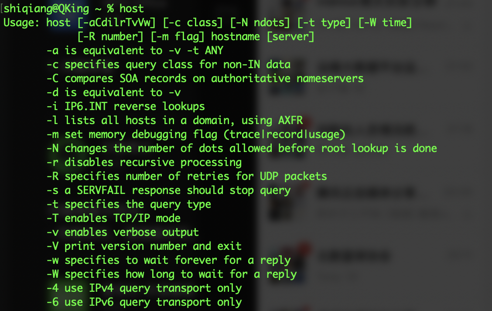

> 本文在 MacOS 10.15.6 环境下验证通过。

本文介绍与域名相关的几个命令，通过这几个命令，我们能够快速了解域名对应的IP地址、A记录、MX记录等各种与域名相关的信息，相信熟练使用这几个命令之后，在域名问题排查方面将会更加得心应手。

## host

> host is a simple utility for performing DNS lookups. It is normally used to convert names to IP addresses and vice versa. When no arguments or options are given, host prints a short summary of its command line arguments and options.

`host` 命令及主要参数如下图所示。



使用 `host` 命令查看下百度的域名

```sh
shiqiang@QKing ~ % host baidu.com
baidu.com has address 39.156.69.79
baidu.com has address 220.181.38.148
baidu.com mail is handled by 10 mx.maillb.baidu.com.
baidu.com mail is handled by 20 mx50.baidu.com.
baidu.com mail is handled by 20 jpmx.baidu.com.
baidu.com mail is handled by 20 mx1.baidu.com.
baidu.com mail is handled by 15 mx.n.shifen.com.
```

## nslookup

> Nslookup is a program to query Internet domain name servers. Nslookup has two modes: interactive and non-interactive. Interactive mode allows the user to query name servers for information about various hosts and domains or to print a list of hosts in a domain. Non-interactive mode is used to print just the name and requested information for a host or domain.

`nslookup` 用于查询DNS记录，看一下用它来查询百度域名返回的结果。

```sh
shiqiang@QKing ~ % nslookup baidu.com
Server:		192.168.31.1
Address:	192.168.31.1#53

Non-authoritative answer:
Name:	baidu.com
Address: 39.156.69.79
Name:	baidu.com
Address: 220.181.38.148

shiqiang@QKing ~ % nslookup baidu.com 8.8.8.8
Server:		8.8.8.8
Address:	8.8.8.8#53

Non-authoritative answer:
Name:	baidu.com
Address: 39.156.69.79
Name:	baidu.com
Address: 220.181.38.148
```

## dig

> dig (domain information groper) is a flexible tool for interrogating DNS name servers. It performs DNS lookups and displays the answers that are returned from the name server(s) that were queried. Most DNS administrators use dig to troubleshoot DNS problems because of its flexibility, ease of use and clarity of output. Other lookup tools tend to have less functionality than dig.

使用 `dig` 命令来查询百度域名。

```sh
shiqiang@QKing ~ % dig baidu.com

; <<>> DiG 9.10.6 <<>> baidu.com
;; global options: +cmd
;; Got answer:
;; ->>HEADER<<- opcode: QUERY, status: NOERROR, id: 18720
;; flags: qr rd ra; QUERY: 1, ANSWER: 2, AUTHORITY: 0, ADDITIONAL: 1

;; OPT PSEUDOSECTION:
; EDNS: version: 0, flags:; udp: 4096
;; QUESTION SECTION:
;baidu.com.			IN	A

;; ANSWER SECTION:
baidu.com.		69	IN	A	220.181.38.148
baidu.com.		69	IN	A	39.156.69.79

;; Query time: 8 msec
;; SERVER: 192.168.31.1#53(192.168.31.1)
;; WHEN: Wed Oct 21 22:31:40 CST 2020
;; MSG SIZE  rcvd: 70


```

## whois

在域名使用过程中，经常会需要查询域名的注册信息，如注册人人、注册时间，以及我们通常最关注的注册的DNS，这时可以使用 `whois` 命令来满足我们的需求。

> The whois utility looks up records in the databases maintained by several Network Information Centers (NICs). By default whois starts by querying the Internet Assigned Numbers Authority (IANA) whois server, and follows referrals to whois servers that have more specific details about the query name. The IANA whois server knows about IP address and AS numbers as well as domain names.  

使用 `whois` 命令查询百度的域名。

```shell
shiqiang@QKing ~ % whois www.baidu.com
% IANA WHOIS server
% for more information on IANA, visit http://www.iana.org
% This query returned 1 object

refer:        whois.verisign-grs.com

domain:       COM

organisation: VeriSign Global Registry Services
address:      12061 Bluemont Way
address:      Reston Virginia 20190
address:      United States

contact:      administrative
name:         Registry Customer Service
organisation: VeriSign Global Registry Services
address:      12061 Bluemont Way
address:      Reston Virginia 20190
address:      United States
phone:        +1 703 925-6999
fax-no:       +1 703 948 3978
e-mail:       info@verisign-grs.com

contact:      technical
name:         Registry Customer Service
organisation: VeriSign Global Registry Services
address:      12061 Bluemont Way
address:      Reston Virginia 20190
address:      United States
phone:        +1 703 925-6999
fax-no:       +1 703 948 3978
e-mail:       info@verisign-grs.com

nserver:      A.GTLD-SERVERS.NET 192.5.6.30 2001:503:a83e:0:0:0:2:30
nserver:      B.GTLD-SERVERS.NET 192.33.14.30 2001:503:231d:0:0:0:2:30
nserver:      C.GTLD-SERVERS.NET 192.26.92.30 2001:503:83eb:0:0:0:0:30
nserver:      D.GTLD-SERVERS.NET 192.31.80.30 2001:500:856e:0:0:0:0:30
nserver:      E.GTLD-SERVERS.NET 192.12.94.30 2001:502:1ca1:0:0:0:0:30
nserver:      F.GTLD-SERVERS.NET 192.35.51.30 2001:503:d414:0:0:0:0:30
nserver:      G.GTLD-SERVERS.NET 192.42.93.30 2001:503:eea3:0:0:0:0:30
nserver:      H.GTLD-SERVERS.NET 192.54.112.30 2001:502:8cc:0:0:0:0:30
nserver:      I.GTLD-SERVERS.NET 192.43.172.30 2001:503:39c1:0:0:0:0:30
nserver:      J.GTLD-SERVERS.NET 192.48.79.30 2001:502:7094:0:0:0:0:30
nserver:      K.GTLD-SERVERS.NET 192.52.178.30 2001:503:d2d:0:0:0:0:30
nserver:      L.GTLD-SERVERS.NET 192.41.162.30 2001:500:d937:0:0:0:0:30
nserver:      M.GTLD-SERVERS.NET 192.55.83.30 2001:501:b1f9:0:0:0:0:30
ds-rdata:     30909 8 2 E2D3C916F6DEEAC73294E8268FB5885044A833FC5459588F4A9184CFC41A5766

whois:        whois.verisign-grs.com

status:       ACTIVE
remarks:      Registration information: http://www.verisigninc.com

created:      1985-01-01
changed:      2017-10-05
source:       IANA

# whois.verisign-grs.com

No match for domain "WWW.BAIDU.COM".
>>> Last update of whois database: 2020-10-24T12:34:29Z <<<

```

本文仅对 `host` 、`nslookup` 、`dig` 、`whois` 四个命令做了简单的介绍，通过这四个命令能够让我们初步掌握一些域名相关的分析技术，但是仍有更多的域名相关的技术本文没有涉及，希望大家能够自己主动探索，加深对与域名的理解和认识。

## 参考资料

1. [我的Linux工具集](http://linux.cn/home-space-uid-3-do-blog-id-107.html)
2. [dig命令详解](https://www.cnblogs.com/machangwei-8/p/10353216.html)
3. [nslookup 命令详解](https://blog.csdn.net/xg_ren/article/details/80782338)
4. [whois百度百科](https://baike.baidu.com/item/whois/280037?fr=aladdin)

