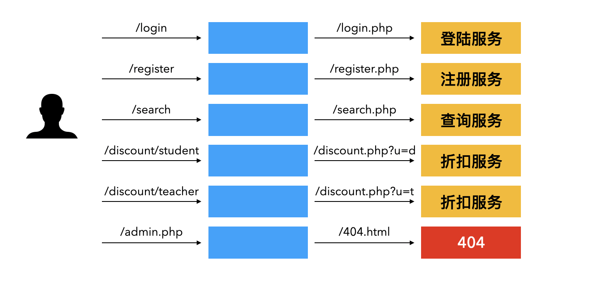
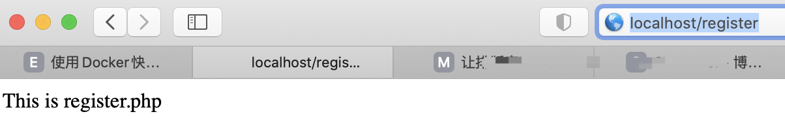
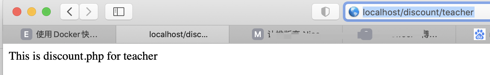

URL Rewrite是网站建设中经常用到的一项技巧，通过 rewrite 我们能够屏蔽服务器运行态的信息，包括服务的程序、参数等等，给用户呈现美化后的URL，同时对搜索引擎更加友好，方便我们网站的推广。

<!-- more -->

[TOC]

## rewrite 功能介绍

URL是互联网上指定信息的唯一标志，URL Rewrite 就是常说的地址重写，我们一般常说的地址重写主要是针对 HTTP 或 HTTPS 协议，具体的场景有下面几种。

* 美化URL。不管使用哪种后台语言，多多少少会有一些能够暴露技术特性的后缀，例如 `.php` 、`.do` 等等。URL重写后，去掉了这些对于普通用户难于理解的后缀，也有利于网站后台的安全。
* 提高安全性。可以对一个域名下的所有服务进行重写，只开放对外的服务。对于不开放服务的访问，重定向到404或者500页面，避免被人暴力猜解。
* 有利于搜索引擎收录。有些后台服务的功能很强大，但是为了按照业务拆分，我们可以设计一些后台并不存在的URL，利于搜索引擎的收录和业务的开展。
* 方便URL的重用一记后台服务的调整。如果我们后台进行了版本升级或者地址变更，都可以通过URL Rewrite对外部用户屏蔽这些变化，极大的方便了网站的维护。

这些场景可以用下图来概括说明。



有的朋友会发出疑问，在PC时代，大家首先面对的就是网站的地址，但是2020已经快要步入5G时代，大多数人都是通过手机APP来访问互联网上的各种内容。根据 CNNIC 《[第46次中国互联网络发展状况统计报告](http://www.cnnic.net.cn/hlwfzyj/hlwxzbg/hlwtjbg/202009/P020200929546215182514.pdf)》显示我国网民使用手机上网的比例达99.2%，而使用台式机和笔记本上网的网民比例分别是37.3%和31.8%。使用手机上网，很多情况下我们都是扫描一个二维码或者点击分享的链接就能打开页面，而无需再记忆复杂的URL，那么是否可以说在5G时代，URL Rewrite 就不重要了呢？

实际上，网站服务除了被用户访问外，每天都会被搜索引擎、黑产分子不停的访问，在5G时代即便用户不需要手工输入URL来访问，合理利用URL Rewrite这项技术仍是每个网站开发人员、网站维护人员不可缺少的技能。

URL Rewrite的方法有很多，可以利用Apache、Nginx等中间件，也可以使用支持单入口的程序框架（例如PHP的Codeigniter）等，本文介绍如何使用Nginx来实现URL Rewrite的需求，毕竟Nginx近年来的发展势头那真是势不可挡。

## nginx rewrite

Nginx提供了rewrite功能，结合正则表达式和标志位实现URL的重写与重定向,正则规则采用PCRE（PERL兼容的正则表达式语法规则）。

> 如果需要正则功能，在编译Nginx之前，需要编译安装PCRE库。

rewrite 规则只能放在`server{}`,`location{}`,`if{}`中，并且只能对域名后边除去传递的参数外的字符串起作用。。

### rewrite 语法

rewrite 是实现URL重写的关键，根据正则表达式的内容，重新定向到replacement指定的URL，根据末尾的flag参数不同，决定后续的处理动作。

| 指令语法 | rewrite regex replacement [flag] |
| -------- | -------------------------------- |
| 默认值   | none                             |
| 应用位置 | server、location、if             |

简单的示例：

```nginx
# URL实现伪静态，将动态参数变为URL中的字符串
rewrite ^/users/(.*)$ /show.php?user=$1? last;

# 实现不同语言网站的跳转
rewrite ^/cn/(.*)$ /cn/$1 break;
rewrite ^/jp/(.*)$ /jp/$1 break;

# 将所有的请求都定向到 baidu.com
rewrite ^/(.*) http://www.baidu.com/ permanent;
```

在Nginx的配置中，优先执行 server 块中的 rewrite 指令，然后再执行 location 块中的 rewrite 指令。最后再执行选定的 location 中的 rewrite 指令。

### flag标记

| flag标记符号 | 说明                                                         |
| ------------ | ------------------------------------------------------------ |
| last         | 本条规则匹配完成后，继续向下匹配新的 location URI 规则，浏览器地址栏URL地址显示原来的地址 |
| break        | 本条规则匹配完成即终止，不再匹配后面的任何规则，浏览器地址栏URL地址显示原来的地址 |
| redirect     | 返回302临时重定向，浏览器地址栏会显示跳转后的URL地址         |
| permanent    | 返回301永久重定向，浏览器地址栏会显示跳转后的URL地址         |

在flag标记中，`last` 和 `break` 实现功能类似，使用 `alias` 指令时必须用 `last` 标记，使用 `proxy_pass` 指令时要使用 `break` 标记。`last` 标记在本条 rewrite 规则执行完毕后，会对其所在的 `server{…}` 标签重新发起请求，而 `break` 标记则会在本条规则匹配完成后，终止匹配，不再匹配后面的规则。

### 实战案例

本文提供了一个基于 docker 的演示案例，将上文的场景一一演示出来。通过访问 [我的Github](https://github.com/cocowool/sh-valley/tree/master/docker-conf/lnmp) 可以获得全部的 docker 编排文件及代码。

> 不太熟悉 Docker 的同学可以参考 [使用 Docker 快速搭建LNMP开发环境](http://edulinks.cn/2020/04/17/20200415-qucik-lnmp-dev-environment/)，让你在安装了 Docker 的情况下，使用一条命令就快速搭建LNMP开发环境。





主要的语法如下

```nginx
rewrite ^/login$ /login.php last;
rewrite ^/register$ /register.php last;
rewrite ^/search$ /search.php last;
rewrite ^/discount/student$ /discount.php?u=d last;
rewrite ^/discount/teacher$ /discount.php?u=t last;
```

Nginx Rewrite 还有更多强大的功能，等待大家去探索，欢迎关注我的公众号与我进行交流探讨。

## 参考资料

1. [IETF RFC 1630](https://datatracker.ietf.org/doc/rfc1630/?include_text=1)
2. [Ngx_http_rewrite_module](http://nginx.org/en/docs/http/ngx_http_rewrite_module.html)
3. [nginx中try_files](https://www.cnblogs.com/boundless-sky/p/9459775.html)
4. [Nginx rewrite or internal redirection cycle while internally redirecting](https://stackoverflow.com/questions/37214921/nginx-rewrite-or-internal-redirection-cycle-while-internally-redirecting)
5. [Nginx rewrite](https://blog.csdn.net/qq_41475058/article/details/89516051)