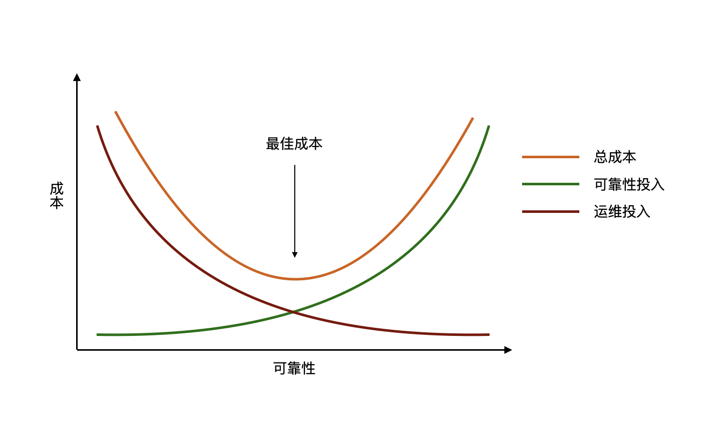

[TOC]

可靠性、可用性、可维护性（Reliability, Availability, Maintainability - RAM）是软件开发过程中的三个重要方面。本文与大家探讨下关于高可靠性的设计，首先来看下关于可靠性的定义。

> Reliability is the probability that a product will continue to work normally over a specified interval of time, under specified conditions. 

通俗点理解就是不管在多糙的环境下产品都能够持续工作的能力，体现出两个要求，一个是能正常工作，不会崩溃或报错，即用户能够得到期望的结果，另一个是可以持续工作，不会夯住，能够扛住压力。系统在面临压力的情况下出现问题是很正常的，如何在出现问题时快速恢复业务，是架构设计时要考虑的重要问题。

可靠性的投入与运维投入是两个互相影响的因子，当我们在可靠性上的投入越多时，就可以减少在运维方面的投入。相反地，如果在系统架构设计、开发时对于可靠性的投入过少，则在后期系统运行过程中要承担运维投入不断增长的后果。可靠性往往是系统的非功能性需求（Non-Functional Requirements, NFR），综上我们在架构设计时要对非功能性需求进行取舍（Trade-off），以期获得与业务发展相匹配的成本投入与可靠性效果。

## 可靠性的度量指标

传统上系统可靠性的度量指标有两个：平均无故障时间（MTTF, Mean time to failure）是系统无故障运行的平均时间 和 平均恢复时间（MTTR, Mean time to restoration）指系统从发生故障到恢复正常之间的平均时间。与之类似但更为主流的两个指标则是：RTO, Recovery time objective 和 RPO, Recovery point objective。从下面一张图可以直观的了解到两个指标的含义。

#### RTO

RTO(Recovery Time Objective)是恢复时间目标，是业务发展可容许的服务中断时间目标。如果故障恢复的时间超过了RTO目标，业务会受到很严重的冲击。例如说某一地方性商业银行，核心的转账业务RTO目标是30分钟，如果故障影响大家好几个小时都无法进行转账，对于该公司的声誉影响是非常重大的，必将导致严重的客户流失结果。制定RTO目标，是指导我们在日常运维中，无论遇到什么样的故障，所有的运维工作和应急措施都以在小于RTO的时间内恢复业务为目标。

从业务连续性角度考虑，肯定希望RTO数值越小越好，尤其是很多互联网，中断几分钟都会损失数百万的成交量，这些往往不惜一切代价要确保不中断运行。RTO数值越小，代表系统的业务恢复能力越强，同时也意味着投入大量资金。提升RTO的技术也随着时代的发展有过一些变化，个人印象中在互联网兴起之前常用技术主要是主备切换，各厂商之间拼的还是服务的稳定性。在互联网技术兴起之后，常用的技术往往是集群部署、负载均衡、故障自动切换。切换可以是设备之间的切换，也可能是集群之间的切换，还可能是异地切换，通过应用系统自动切换将业务转移到其它正常的系统中，然后再对故障设备进行排查。将故障原因找到并排除后，再将业务切回到原有系统中，应用系统切换做得好，这个过程不会引起业务的二次中断，让业务无感知切换。

#### RPO

RPO（Recovery Point Ojbective）是恢复点目标，指能容忍的最大数据丢失量。ROP反映不影响业务正常运行的数据完整性目标，常常用来指导数据备份的间隔。在互联网金融业务如此发达的现在，对于个人来讲实际上是无法承担数据丢失的。例如上一秒刚发生了一笔转账，银行告诉我数据丢失了，这笔钱对方没有收到，但是我的账户里却被扣款了。在实际开发过程中，这样高的数据一致性要求单纯依靠数据备份技术往往无法实现，再可靠的技术也可能还有失效的时候，互联网支付这种高并发的业务，只有一秒的数据丢失业务量也是非常大的。还要依赖冲正、对账等业务手段来保障。

## 可靠性设计流程

可靠性设计（Design for Reliability）流程是在给定环境与生命周期的条件下明确各项功能运行效果的设计过程，在软件开发和架构设计中加入可靠性设计流程有两个好处：

* 在开发周期中加入可靠性设计流程能够提高软件产品/系统的可靠性
* 通过提高可靠性来帮助公司控制预算，避免过多的后期运维投入、市场维护投入等

可靠性设计包括五个主要的步骤：

1. **定义** 根据业务和用户的需求，定义清晰明确的可靠性需求，综合考虑**成本**、**用户体验**、**非功能指标**、**同类产品竞争力**等因素。需求确定后再细化为**开发需求**、**监控需求**、**灾备需求**等。

2. **设计** 这个步骤主要目标是识别出可靠性实现过程中的风险因素，针对这些风险因素明确相应的设计决策。无论是新产品开发还是升级项目，此步的目的都是确定关键的可靠性风险因素，确定它们的优先级，并详细说明具体的控制手段和方案，以此来减轻这些风险。下面这个表格可以用来收集并分析项目中的风险，并且应该在项目存续期间始终更新这个表格。

   

3. **分析** 基于上一步分析调研的结果，来发现当前设计中存在的缺陷，通过变更设计方案来提高产品的可靠性。

4. **验证** 在这个步骤中，通过非功能测试、压力测试、灾备演练等手段来验证可靠性设计，不断的模拟故障场景和边界数据来进行测试，并将测试的结果反馈给开发人员不断改进可靠性。

5. **运维** 系统或产品上线后，通过监控系统定期进行性能分析，验证设定的RTO和RPO目标是否合适并不断改进。

## Design for failure

在复杂系统的运行中，不发生故障是不太可能的，问题是谁都无法预料故障何时发生。随着云计算技术和云原生应用开发越来越普及，在系统设计时充分考虑 Design for failure 变的越来越重要，需要我们根据RTO和RPO目标选择合适的技术手段应用在我们的项目上，下面列出了一些常用的技术手段或原则。

* **备份与灾备恢复**。这是应用故障的兜底手段，在没有发生故障的时候，你永远不会知道备份有多重要。根据RPO的要求设定合适的备份间隔。如果有多个可用区，你还要考虑在异地恢复应用时的数据传输时间。
* **主备切换**。传统的高可用方式，相比于异地恢复，RTO能够控制的比较好。这种方式最重要的地方在于数据的实时同步。
* **多活/负载均衡模式**。这种模式下，各个可用区的应用都能够独立的对外提供服务。这种模式能够提供最好的RTO和RPO指标，同时实现起来代价也是最高的。

## 参考资料

1. [灾备系统评价标准](http://www.talkwithtrend.com/Article/32186)
2. [灾备系统建设指标：RTO、RPO](https://blog.csdn.net/weixin_42330461/article/details/80743763)
3. [容错，高可用和灾备](http://www.ruanyifeng.com/blog/2019/11/fault-tolerance.html)
4. [灾备行业最全常用术语](https://www.sohu.com/a/161177892_737713)
5. [Design for Reliability](https://manishsharma.blog/2020/07/28/design-for-reliability-importance-of-rto-and-rpo/)