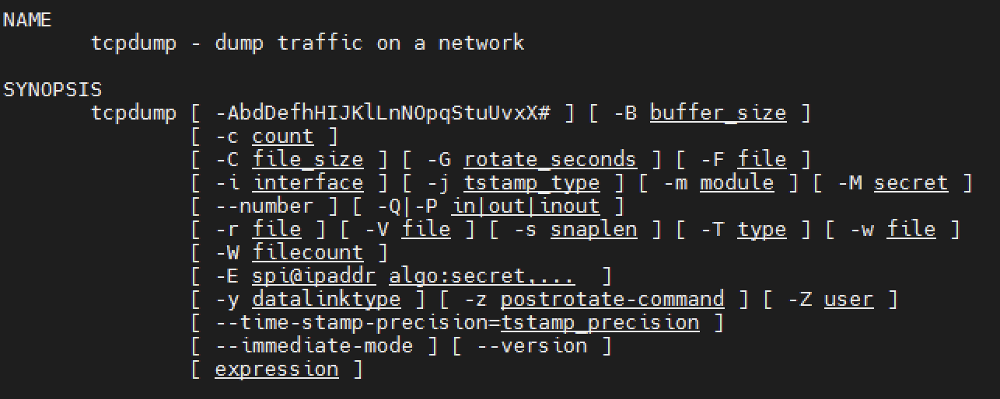

## 命令介绍
`tcpdump` 从字面上理解是 dump the traffic on a network，是命令行下对网络进行抓包分析的工具。不仅提供了根据网络层、协议、主机、网络或端口等多个条件进行过滤的能力，还能够通过 and、or、not逻辑语句，以及表达式来满足用户多种多样的网络抓包需求。

Linux 下的命令格式：



常用的参数：
* -D：列出可用于抓包的接口；
* -l ：使标准输出变为缓冲行形式；
* -n：不把网络地址转换成名字；
* -c：在收到指定的包的数目后，tcpdump就会停止；
* -i：指定监听的网络接口；(如果没有指定可能在默认网卡上监听，需要指定绑定了特定IP的网卡)；
* -s：指定记录package的大小，常见 -s 0 ，代表最大值65535，一般linux传输最小单元MTU为1500；
* -w：直接将包写入文件中，配合 `-G time` 选项可以按照固定的时间间隔切割输出的文件；
* -X：直接输出package data数据，默认不设置，只能通过-w指定文件进行输出；

> Unix、Mac下tcpdump命令的参数有所不同，在具体使用过程中要查阅文档进行相应的调整。如Mac下的命令格式：
>
> ```sh
> NAME
>        tcpdump - dump traffic on a network
> 
> SYNOPSIS
>        tcpdump [ -AbdDefhHIJKlLnNOpqStuUvxX# ] [ -B buffer_size ]
>                [ -c count ]
>                [ -C file_size ] [ -G rotate_seconds ] [ -F file ]
>                [ -i interface ] [ -j tstamp_type ] [ -k (metadata_arg) ]
>                [ -m module ] [ -M secret ]
>                [ --number ] [ -Q in|out|inout ]
>                [ -r file ] [ -V file ] [ -s snaplen ] [ -T type ] [ -w file ]
>                [ -W filecount ]
>                [ -E spi@ipaddr algo:secret,...  ]
>                [ -y datalinktype ] [ -z postrotate-command ] [ -Z user ]
>                [ -Q packet-metadata-filter ] [ -Q in|out|inout ]
>                [ --time-stamp-precision=tstamp_precision ]
>                [ --immediate-mode ] [ --version ]
>                [ expression ]
> ```

## 表达式

表达式的基本格式为：`proto dir type ID` 。表达式之间可以使用逻辑语句进行连接。分别介绍如下：

* 协议。包括：tcp、udp、icmp，如果为空则可以匹配所有协议。
* 目标。包括：src、dst、src or dst、src and dst。
* 类型。包括：host、net、port、portrange。


## 用法举例

1. 监听 eth1 网卡上的所有数据包

   ```shell
    tcpdump -i eth1
   ```

2. 监听某个IP上的所有数据包，适合有多个IP的设备的场景

   ```shell
   tcpdump host 10.208.0.10
   ```

3. 监听两个IP之间通信的数据包

   ```sh
   tcpdump host 10.208.0.10 and \( 10.208.1.10 \)
   ```

4. 监听主机与某个IP之外的所有IP数据包

   ```sh
   tcpdump ip host 10.208.0.10 and ! 10.208.1.10
   ```

5. 监听某个IP所有80端口的流量

   ```shell
   tcpdump tcp port 80 and host 10.208.0.10
   ```

本文无法列举所有的使用场景，还需要各位同学根据自己需求分析实践，如果愿意与楼主交流，欢迎通过关注公众号找到我。如果不习惯使用命令行下的抓包工具，也可以使用图形界面的抓包工具，通过 [Wireshark使用入门](http://www.edulinks.cn/2019/06/23/20190623-wireshark-tcp-http/) 可以了解更多信息。

## 参考资料

1. [TCPDump：Capture and Record Specific Protocols / Port](http://www.cyberciti.biz/faq/tcpdump-capture-record-protocols-port/)
2. [centos下使用tcpdump来抓包查看服务器上的get或post请求](https://www.cnblogs.com/sunlong88/articles/11834795.html)
3. [Linux tcpdump命令详解](https://www.cnblogs.com/ggjucheng/archive/2012/01/14/2322659.html)

