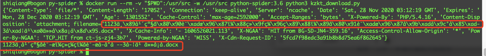
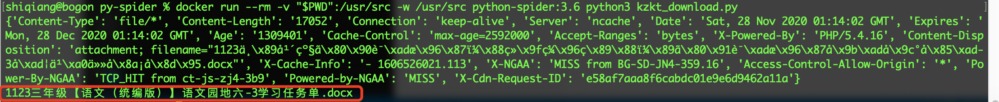

最近家里领导安排了一项任务，要从空中课堂网站上批量下载一些教学需要用的文件，做为一名比较懒惰的码农，当然想使用些省力的方法，既能满足领导的要求，又不用自己太费时费事，因此便想用 Python Requests 来实现。

整体的思路就是解析HTML代码并找到文件的路径，下载文件并保存到本地。开工后一切顺利，到保存文件这一步卡壳了，为什么下载的文件是乱码？效果如下：



而自己手动通过浏览器下载的文件名却是：**1123三年级【语文（统编版）】语文园地六-3学习任务单.docx**。代码其实很简单：

```python
import requests, cgi

file_url = "https://cache.bdschool.cn/index.php?app=interface&mod=Resource&act=download&id=872507"
response = requests.head(url=file_url)
print(response.headers)
value, params = cgi.parse_header( response.headers['Content-Disposition'] )
print(params['filename'])
```

因为我是用容器中的Python执行环境（这样做的好处就是我可以不用受困于管理本地多个Python版本，并且能够实现快速的迁移，可以参考 [利用 Docker 构建一个简单的 java 开发编译环境](http://edulinks.cn/2020/11/12/20201111-build-java-devlopment-env-with-docker/) 来实现）。刚开始以为是 Docker 内字符编码的问题，因为随便百度一下，都能看到很多反映容器环境下的应用输出中文日志乱码的问题。但是，通过在容器内创建中文名称的文件，以及 `curl` 命令请求文件header的方式，都验证出官方提供的 Python3.6 镜像实际上是支持中文的。

```shell
# ls
README.md  get_page.py	kzkt_download.py  post_page.py	videos	中文.txt
# curl -XGET -I 'https://cache.bdschool.cn/index.php?app=interface&mod=Resource&act=download&id=872507'
HTTP/1.1 200 OK
Content-Type: file/*
Content-Length: 17052
Connection: keep-alive
Server: ncache
Date: Sat, 28 Nov 2020 01:17:03 GMT
Expires: Mon, 28 Dec 2020 01:17:03 GMT
Age: 1299036
Cache-Control: max-age=2592000
Accept-Ranges: bytes
X-Powered-By: PHP/5.4.16
Content-Disposition: attachment; filename="1123三年级【语文（统编版）】语文园地六-3学习任务单.docx"
X-Cache-Info: - 1606526021.113
X-NGAA: HIT from BG-SD-JN4-359.16
Access-Control-Allow-Origin: *
Power-By-NGAA: TCP_HIT from ct-js-zj3-3b3
Powered-by-NGAA: MISS
X-Cdn-Request-ID: 409c16098f344d3c43eae7ee05dd3d26
# locale -a
C
C.UTF-8
POSIX
# env
HOSTNAME=9ce02effdee4
PYTHON_PIP_VERSION=20.2.4
HOME=/root
GPG_KEY=0D96DF4D4110E5C43FBFB17F2D347EA6AA65421D
PYTHON_GET_PIP_URL=https://github.com/pypa/get-pip/raw/fa7dc83944936bf09a0e4cb5d5ec852c0d256599/get-pip.py
TERM=xterm
PATH=/usr/local/bin:/usr/local/sbin:/usr/local/bin:/usr/sbin:/usr/bin:/sbin:/bin
LANG=C.UTF-8
PYTHON_VERSION=3.6.12
PWD=/usr/src
PYTHON_GET_PIP_SHA256=6e0bb0a2c2533361d7f297ed547237caf1b7507f197835974c0dd7eba998c53c
```

那问题一定出在自己的代码上了，尝试了 gbk\utf-8 多种编码互转，还是无法正确显示中文文件名，继续查询官方文档，终于发现了问题，修改代码如下。

```python3
import requests, cgi

file_url = "https://cache.bdschool.cn/index.php?app=interface&mod=Resource&act=download&id=872507"
response = requests.head(url=file_url)
print(response.headers)
value, params = cgi.parse_header( response.headers['Content-Disposition'] )
print(params['filename'].encode('ISO-8859-1').decode('utf8'))
```

看下执行效果



能够正常显示中文文件名了，不需要调整容器的编码设置。

## 问题原因

**问题在于不熟悉RFC的合规性要求**，Requests库收到一个响应时，Requests 会猜测响应的编码方式，用于在你调用 [`Response.text`](https://requests.readthedocs.io/zh_CN/latest/api.html#requests.Response.text) 方法时对响应进行解码。Requests 首先在 HTTP 头部检测是否存在指定的编码方式，如果不存在，则会使用 [charade](http://pypi.python.org/pypi/charade) 来尝试猜测编码方式。

只有当 HTTP 头部不存在明确指定的字符集，并且 `Content-Type` 头部字段包含 `text` 值之时， Requests 才不去猜测编码方式。在这种情况下， [RFC 2616](http://www.w3.org/Protocols/rfc2616/rfc2616-sec3.html#sec3.7.1) 指定默认字符集必须是 `ISO-8859-1` 。Requests 遵从这一规范。如果你需要一种不同的编码方式，你可以手动设置 [`Response.encoding`](https://requests.readthedocs.io/zh_CN/latest/api.html#requests.Response.encoding) 属性，或使用原始的[`Response.content`](https://requests.readthedocs.io/zh_CN/latest/api.html#requests.Response.content)。

我的案例正好符合这种情况，因为请求的是文件下载，返回的header中并没有指定编码方式，因此服务器默认以 ISO-8859-1 编码返回了数据，Python 在处理的时候，也必须将 ISO-8859-1 转换为环境中的 UTF8 格式才能在命令行中正确显示，这还是吃了不熟悉规范的亏呀。

## 参考资料

1. [Requests 高级用法](https://requests.readthedocs.io/zh_CN/latest/user/advanced.html?highlight=encoding#id16)
2. [Python encode()和decode()方法：字符串编码转换](http://c.biancheng.net/view/4305.html)

