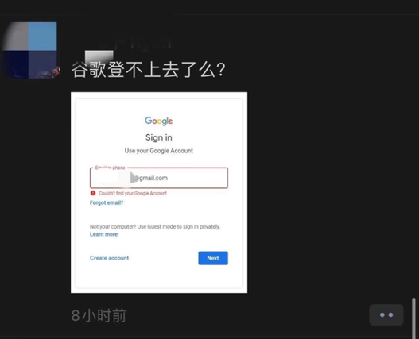
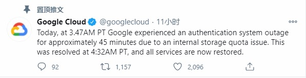
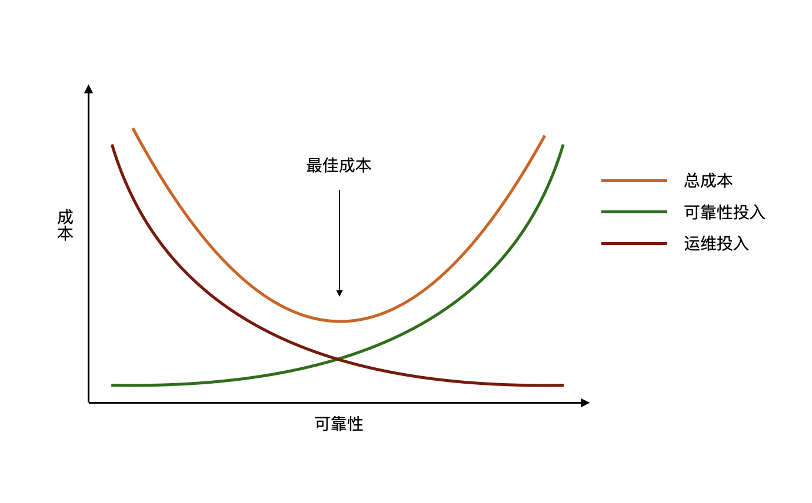

今天一早看到了各大科技媒体报道Google公司服务器中断的事情，受影响的服务包括 YouTube、Gmail、Google Drive、Google Search等，全球多个国家和地区的用户都受到影响。

当人们在社交网络上热切讨论Google宕机原因时，Google也在推特上发表了简要的说明：

从推特上的回应能看到，主要的故障点是认证系统，故障时间大约是45分钟，故障的原因则是因为内部的存储限额问题。简单点我们可以理解为磁盘满了，但是对于Google这样的大公司来说，单台服务器的磁盘故障肯定不会导致如此大规模的服务中断，官方回复的实际是内部配额问题。

其实对于任何网站来说，服务终端都是很常见的，国外公司包括 Apple、Amazon，国内包括 阿里云、微博 等都曾发生过服务中断的事件。实际上，要完全避免服务中断既是一件非常难的事情，也是一件投入非常大的事情，我在之前的文章《[RTO/RPO与架构设计](https://mp.weixin.qq.com/s?__biz=MjM5MTA1MDI2NA==&mid=2579533177&idx=1&sn=60fc18efe1e0ce10a723995e12da7c6e&chksm=ba8f520e8df8db18a1eeadc1a14fce1c1c1736f572f238c5871905ff65a09b7216e1f2ad2a0a&token=110902014&lang=zh_CN#rd)》曾经提到过，任何一个公司都应该找到自己合适的最佳成本点。

此次服务宕机后，可能Google运维相关人员要认真检讨下错误原因并制定整改措施，估计日志不会太好过。可是众多的网友却不受此次事件影响，聪明的网友甚至发现了此次宕机背后更深层次的原因，也许是为了庆祝世界猴子日，Google发动了此次服务中断事件。

众多网友纷纷吐槽Google服务中断给自己带来的影响，特别是使用了Google智能家居的朋友，家里的灯可能没办法关了、大门可能没办法锁上了，也有一部分网友表示服务中断嘛，与我无关。

这次Google服务中断事件影响你了吗，欢迎留言讨论。