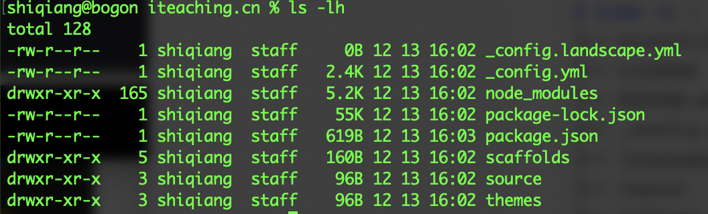

[TOC]

本文并不准备向大家介绍如何开发自己的 Hexo 主题，相关的文章百度一下能出来很多。本文整理了自己对于 Hexo 主题开发所需要的一些准备工作，后续考虑随着自己主题开发的进展，再补充1-2篇深入介绍的文章，目前我开发的两个主题为 [RoseFocus](https://github.com/cocowool/RoseFocus) 和 [Wave](https://github.com/cocowool/wave) 功能不是很完善，还需要继续努力补充。 

## 准备开发环境

* 确认安装了 `node`

* 确认安装了 hexo `hexo -version`

* 新建一个空目录 ，进入目录执行初始化 `hexo init` 。如果初始化速度比较慢，可以尝试改成国内的源 `npm config set registry https://registry.npm.taobao.org`。成功后可以看到如下的文件：

  

* 在本地浏览编辑博客 `hexo server` 或者 `hexo s` ，命令执行成功后可以看到通过 http://localhost:4000 端口访问的提示。 

## Hexo目录结构
hexo的目录结构及各自的作用如下。
```sh
$ tree -L 1
.
├── _config.yml         //总体配置文件
├── node_modules        //Node依赖的包
├── package-lock.json   //
├── package.json        //
├── scaffolds           //Hexo Markdown加载时的关键字
├── source              //Markdown源文件目录
└── themes              //主题文件夹目录，默认主题为landscape

```

## 主题目录结构
```sh
$ cd themes/landscape
$ tree -L 1
├── Gruntfile.js
├── LICENSE
├── README.md
├── _config.yml
├── languages						//主题的语言包，可以支持多语言切换
├── layout							//模板文件夹，存放主题所用到的模板文件
├── package.json
├── scripts							//可选的文件夹，用于存放一些第三方的脚本库
└── source							//静态资源文件，包括样式表、Javascript、图片等
    ├── css
    ├── fancybox
    └── js
```

Hexo支持多种模板语法和CSS语法，

## 模板文件结构

```sh
$ cd themes/landscape/layout
$ tree -L 2
.
├── _partial
│   ├── after-footer.ejs
│   ├── archive-post.ejs
│   ├── archive.ejs
│   ├── article.ejs
│   ├── footer.ejs
│   ├── gauges-analytics.ejs
│   ├── google-analytics.ejs
│   ├── head.ejs
│   ├── header.ejs
│   ├── mobile-nav.ejs
│   ├── post
│   └── sidebar.ejs
├── _widget
│   ├── archive.ejs
│   ├── category.ejs
│   ├── recent_posts.ejs
│   ├── tag.ejs
│   └── tagcloud.ejs
├── archive.ejs
├── category.ejs
├── index.ejs
├── layout.ejs
├── page.ejs
├── post.ejs
└── tag.ejs

```

以默认主题Landscape为例介绍下页面渲染策略：

* 所有页面，默认使用 layout/layout.ejs 做为所有页面的入口。
* 博客首页，默认使用 layout/index.ejs 渲染，该文件为必须的。
* 文章详情页，默认使用 layout/post.ejs 渲染，如果不存在就使用 index.ejs。
* 分类页，默认使用 layout/category.ejs 渲染，如果不存在则使用 archive.ejs。
* 归档页，默认使用 layout/archive.ejs 渲染，如果不存在则使用 index.ejs。
* 标签页，默认使用 layout/tag.ejs 渲染，如果不存在则使用 archive.ejs。

> _partial 文件夹下的文件是一些公共的部分，可以用在各个页面上，通过 `<%- partial('_partial/header') -%>` 方法调用。

## 开发的主要工作

介绍完Hexo主题目录的结构和各模板文件的作用后，我们大概就能明白开发一个主题主要的工作所在，我理解包括下面这几个主要部分：

* 了解一些 Hexo 变量和函数，变量如所有文章、文章标题、文章发布日期、配置文件等，函数包括引入外部文件 `url_for`、引入局部文件 `partial` 、CSS和JS的引入函数等等。
* 页面结构（模板）的设计开发。开发一个页面，首先是确定页面的布局和页面的元素，这些都在模板文件夹中进行编辑开发。Hexo 支持两种模板引擎，分别是 EJS（[EJS官方文档](https://ejs.bootcss.com)）和 Stylus。
* 页面样式的设计开发。页面所用的样式表文件可以放在 source 文件夹内。我们可以用原生的CSS语法来编写样式表，如果习惯 SCSS 等方式来编写，需要安装相应 render 插件。例如如果要使用 scss，则需要通过 `npm install --save hexo-renderer-sass` 安装sass插件。

> 如果使用 Typora 进行博客撰写的朋友遇到图片插入与发布相关的问题，建议阅读我的 [Hexo博客写作与图片处理的经验](http://ww.edulinks.cn/2020/03/14/20200314-write-hexo-with-typora/) 这篇文章，帮你搞定图片本地浏览与服务器端浏览都能够正常显示。


## 2022补充

2022-05-29 访问我的站点时，发现样式表失效了，检查了下网络访问，原来 bootstrap 提供的 CDN 文件在国内无法访问，因此我将 bootstrap 相关的生产文件放到了主题的 source 文件夹下，这样后续就不必再担心了。


## 参考资料

1. [制作第一个hexo主题](https://segmentfault.com/a/1190000013536171)
2. [Hexo主题开发](https://www.cnblogs.com/yyhh/p/11058985.html)
3. [开发hexo主题(一)](https://www.jianshu.com/p/c80de4bacdeb)
4. [从零开始制作 Hexo 主题](https://www.cnblogs.com/mmzuo-798/p/10451385.html)
5. [hexo教程之用bootstrap打造自己的hexo主题](https://blog.csdn.net/kinggozhang/article/details/96192344)