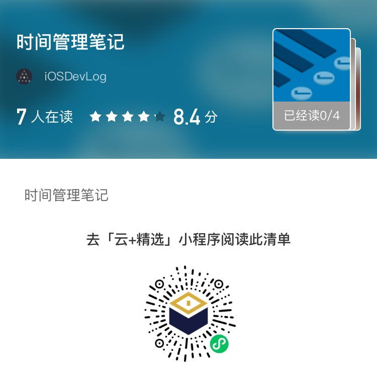

一般情况下我们可以从公共渠道诸如 [DockerHub](https://hub.docker.com) 获取镜像上获取镜像，但是在实际生产过程中，往往需要定制化的镜像，例如修改一些配置文件，增加一些特殊的命令或软件等需求，这时就需要通过编写 Dockerfile 来生成自定义的镜像文件。

## Dockerfile介绍

Dockerfile 是一个文本格式的配置文件，通过编写 Dockerfile 脚本来定义自己需要的镜像。Dockerfile 文件由一行行命令语句组成，文件中的注释信息以 # 开头。编辑好 Dcokerfile 文件之后，我们可以通过 `docker build -t .` 命令生成自己定义的镜像文件。

## Dockerfile基本结构

我们看一下 [alpine](https://github.com/alpinelinux/docker-alpine/blob/f3d17bcb7b1fa51cf9b011403cd58e00fbbcd000/x86_64/Dockerfile) 的 Dockerfile 文件：

```dockerfile
FROM scratch
ADD alpine-minirootfs-20201218-x86_64.tar.gz /
CMD ["/bin/sh"]
```

Dockerfile 文件主要由三部分组成：

* FROM 属于配置指令部分，表明基于的镜像名称。`scratch` 指从空白开始。
* ADD 属于操作指令部分，表示向镜像内加入内容。
* CMD 也属于操作指令部分，一般做为最后一行，表示运行容器时的操作命令。

## 指令说明

Dockerfile 中指令的一般格式为 `INSTRUCTION arguments` ，指令分两种 配置指令 和 操作指令，具体如下：

* 配置指令
  * ARG : 定义创建镜像过程中使用的变量，格式为 `ARG <name>[=<default value>]`
  * FROM : 指定所创建镜像的基础镜像。格式为 `FROM <image>:<tag>`
  * LABEL : 为生成的镜像添加元数据标签信息，辅助过滤特定镜像。格式为 `LABEL <key>=<value> <key>=<value>`
  * EXPOSE : 声明镜像内服务监听的端口。格式为 `EXPOSE <port>[/<protocol>]`
  * ENV : 指定环境变量，该变量在容器中存在，也可在容器启动时覆盖。格式为 `ENV <key> <value>`
  * ENTRYPOINT : 指定镜像的默认入口命令，做为容器启动时的根命令执行。格式为 `ENTRYPOINT ["executable", "param1", "param2"]` 或者 `ENTRYPOINT command param1 param2`
  * VOLUME : 创建一个数据卷挂载点。格式为 `VOLUME ["/data"]`
  * USER : 指定容器运行时的用户名或UID，后续的RUN指令也使用该用户身份。格式为 `USER daemon` 
  * WORKDIR : 配置RUN\CMD\ENTRYPOINT等指令的工作目录，推荐使用绝对路径。格式为：`WORKDIR /path/to/workdir`
  * ONBUILD : 指定当基于所生成镜像创建子镜像时，自动执行的操作指令。
  * STOPSIGNAL : 指定容器接收退出的信号值。格式为: `STOPSIGNAL signal`
  * HEALTHCHECK : 配置容器健康检查命令，自 Docker 1.12 开始支持。格式为: `HEALTHCHECK [OPTIONS] CMD command`
  * SHELL : 指定默认的shell类型。格式为: `SHELL ["executable", "parameters"]`
* 操作指令
  * RUN : 运行指定命令。格式为: `RUN <command>` 或 `RUN ["executable", "param1", "param2"]` 当命令较长时，可以用 \ 来换行。
  * CMD : 指定容器启动时默认执行的命令，每个Dockerfile只能有一条CMD命令。格式有三种，分别为：`CMD ["executable", "param1", "param2"]` 或 `CMD command param1 param2` 或 `CMD ["param1", "param2"]`
  * ADD : 添加内容到镜像中，将SRC内容复制到DEST中。格式为: `ADD <src> <dest>`
  * COPY : 复制内容到镜像中。格式为 : `COPY <src> <dest>`

## 创建镜像

创建镜像的命令格式为

```sh
$ docker build [OPTIONS] PATH | URL | -
```

docker build 命令读取指定路径下的 Dockerfile 文件，并将该路径下的所有数据作为上下文发送给 Docker 服务端。服务端完成 Dockerfile 格式校验后，按顺序执行指令命令，遇到ADD、COPY和RUN指令会生成新一层的镜像文件。镜像创建成功后，返回镜像ID。

docker build 还有很多选项，最常用的是通过 `-t` 增加标签。

```sh
$ docker build -t test:0.1 .
```

当 Dockerfile 所在的文件夹文件过多时，为避免向服务端上传上下文过大，可以通过 .dockerignore 文件来让 Docker 忽略无关的文件。

```sh
$ cat .dockerignore
*xls
*docx
README.md
```

## 实战案例

总的来说，通过编写 Dockerfile 生成自定义镜像的过程不复杂，但是能生成高效的镜像还需要不断的尝试和联系，一般来说用于生产的镜像都尽量保证用途单一，减少镜像的层数，选择合适的基础镜像减小镜像文件大小，形成自己的版本号和标签管理规则，这样能提高自己生成镜像的质量。

下面就以一个简单定义 python 基础镜像的例子，基础的 python 镜像缺少很多包例如爬虫常用的 requests ，自己定义一个包含 requests 包的镜像，编写的 Dockerfile 如下：

```dockerfile
FROM python:3.6

RUN pip3 install -i https://pypi.tuna.tsinghua.edu.cn/simple requests  
```

执行镜像的创建命令

```sh
$ docker build -t python-requests-3.6:0.1 .
$ docker images
REPOSITORY                                      TAG                 IMAGE ID            CREATED             SIZE
python-requests-3.6                             0.1                 3c2bb72b2066        2 minutes ago       884MB
python                                          3.6                 85146760634c        7 weeks ago         874MB
$ docker run --rm -it -v "$PWD":/usr/src -w /usr/src python-requests-3.6:0.1 python3
Python 3.6.12 (default, Nov 18 2020, 14:46:32) 
[GCC 8.3.0] on linux
Type "help", "copyright", "credits" or "license" for more information.
>>> import requests
>>> response = requests.get("http://baidu.com")
>>> print(response.text)
<html>
<meta http-equiv="refresh" content="0;url=http://www.baidu.com/">
</html>

```

可以看到镜像内的 python 环境已经支持 requests 包了。利用这种方式，我们不用在本地维护开发环境，特别是多个版本的开发环境，通过 Docker 生成不同版本的镜像能够快速的实现多版本的开发环境，大家可以参考 [利用 Docker 构建一个简单的 java 开发编译环境](http://edulinks.cn/2020/11/12/20201111-build-java-devlopment-env-with-docker/) 。自己定义的各种镜像，可以上传到 DockerHub，更换电脑后仅需要安装 Docker，之前的各种开发环境就回来了。

对于 Docker 有进一步兴趣的，可以参考我的其他文章：

* [Docker 入门介绍](http://edulinks.cn/2018/06/20/20180620-docker-overview/)
* [在Redhat 7.3中采用离线方式安装Docker](http://edulinks.cn/2018/07/11/20180711-install-docker-ce-in-redhat-73/)
* [创建自己的Docker基础镜像](http://edulinks.cn/2018/06/27/20180627-make-your-own-base-docker-image/)
* [Docker存出载入镜像](http://edulinks.cn/2018/07/16/20180716-docker-save-load-image/)
* [Docker Compose 使用介绍](http://edulinks.cn/2020/04/15/20200415-docker-compose/)
* [使用 Docker 快速搭建PHP开发环境](http://edulinks.cn/2020/04/17/20200415-qucik-lnmp-dev-environment/)
* [Docker Compose 建立ELK集群](http://edulinks.cn/2020/01/15/20200115-docker-compose-elk-cluster/)

最后说点杂事，2021年刚开始没几天，年前立下的雄心壮志马上被各种无计划的事打乱了，感觉总是被打断，感觉总是时间不够用，原来以为是自己能力不够用，最近在云+社区上读了一个时间管理系列文章，才发现原来是自己坚持不够，给了自己点信心，2021刚开始还要继续加油才是，附上这个系列文章的链接，感兴趣的朋友可以读一读。

