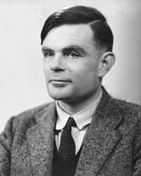

> 2021年，计划系统的整理下计算机科学中一些出名人物的材料并在每个周末分享给大家，立这个Flag，一方面想以人物为线索梳理下计算机发展的历史，让自己得到更为鲜活的认识。另一方面，也并不是单纯的历史分享，这样就和百科中的内容没什么区别，希望这个材料更回归到技术本身，能就某一点的技术问题进行一些讨论。

## 艾伦•麦席森•图灵（1912.6.23 - 1954.6.7）

英国数学家、逻辑学家，被称为计算机科学之父，人工智能之父。1931年图灵进入剑桥大学国王学院，毕业后到美国普林斯顿大学攻读博士学位，第二次世界大战爆发后回到剑桥，后曾协助军方破解德国的著名密码系统Enigma，帮助盟军取得了二战的胜利。图灵因此在1946年获得“**OBE**”，即“不列颠帝国勋章”，那是英国皇室给予位国家和人民做出巨大贡献人士的荣誉。但是因为图灵从事的保密工作，当时的授予活动也是保密进行的。

## 半只苹果

> “让苹果浸透这毒药，让死亡降临在我身旁。”

1952年，图灵的同性伴侣协同一名同谋一起闯进了图灵的房子实施盗窃，图灵为此而报警。但是警方的调查结果使得他被控以“明显的猥亵和性颠倒行为”（同性恋，当时同性恋还没有合法化，仍属于犯罪行为）。他没有申辩，并被定罪。在著名的公审后，他被给予了两个选择：坐牢或荷尔蒙疗法。他选择了荷尔蒙注射，并持续了一年。在这段时间里，药物产生了包括乳房不断发育的副作用。1954年6月7日，图灵被发现死于家中的床上，床头还放着一个被咬了一口的泡过氰化物的苹果。警方调查后认为是剧毒的氰化物中毒，调查结论为自杀，当时图灵41岁。

> 我们非常熟悉的苹果公司的Logo就是缺了一口的苹果，据说就是为了纪念这位英年早逝的科学家。

图灵去世之后一直没有得到平反，2009年，英国计算机科学家康明（John Graham-Cumming）发起了为图灵平反的在线请愿，截止到2009年9月10日请愿签名人数已经超过了3万，为此，当时的英国政府及首相戈登布朗不得不发表正式的道歉声明。2012年12月，霍金、纳斯（Paul Nurse，诺贝尔医学奖得主）、里斯（Martin Rees，英国皇家学会会长）等11位重要人士致函英国首相卡梅伦，要求为其平反。**2013年12月24日**，在英国司法大臣克里斯・格雷灵（Chris Grayling）的要求下，英国女王终于向图灵颁发了皇家赦免。

> 图灵的晚年生活因为其同性取向而被迫蒙上了一层阴影，我们认为当时的判决是不公的，这种歧视现象如今也已经遭到了废除。为此，女王决定为这位伟人送上赦免，以此向其致敬。

## 图灵测试

1950年，图灵发表了一篇论文《计算机器与智能》，讨论了“**机器能否拥有智能？**”的问题，并提出了著名的“**图灵测试**”。图灵肯定机器是可以思维的，他提出一个假想：一个人在不接触对方的情况下，通过一种特殊的方式，和对方进行一系列的回答，**如果在相当长时间内，他无法根据这些问题判断对方是人还是计算机，那么，就可以认为这个计算机具有同人相当的智力**，即这台计算机是能思维的。这就是著名的“**图灵测试**”（Turing Testing）。

他认为，通过键盘等装置，让参加测试的每一个人与另一个人和一台机器进行交流和提问，如果有超过30%的测试者误以为在和自己说话的是人而非计算机，那么这台机器就通过了测试，并被认为具有人类智能。虽然将30分作为及格线的标准不高，这一测试直到今天仍被作为检验人工智能的标准之一。

## 热爱跑步的计算机科学家

图灵从30岁之后开始跑步，参加跑步的原因是因为工作压力太大，只有跑步能让他暂时将所有的压力抛在一边。跑步确实如此，对很多人来说跑步显得过于无聊和枯燥，跑步过程中要全身协调不断重复跑步的动作，而正是这种高强度的简单重复，能够让我们的大脑获得充分的休息。

## 图灵奖

图灵奖全称 ACM 图灵奖（ACM A.M Turing Award），是由美国计算机协会（ACM）于1966年设计成立的计算机奖项，该奖项旨在奖励对计算机事业作出重要贡献的个人。图灵奖是计算机领域的国际最高奖项，被誉为**计算机界的诺贝尔奖**。

