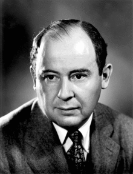
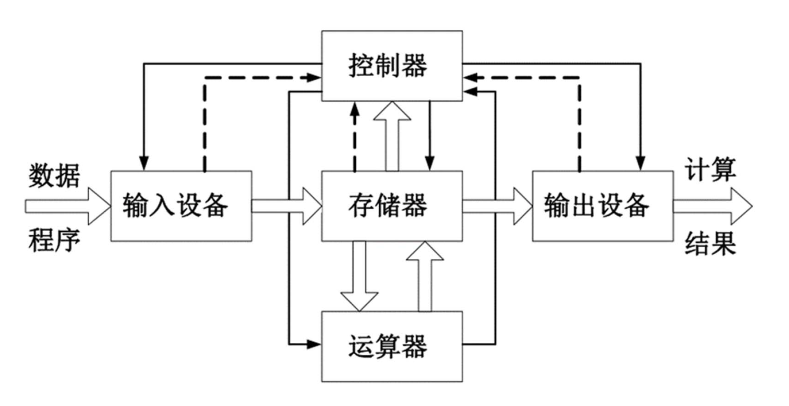

## 约翰·冯·诺依曼 

冯·诺依曼（John von Neumann，1903年12月28日 - 1957年2月8日），美籍匈牙利数学家、计算机科学家、物理学家，是20世纪最重要的数学家之一。 冯·诺依曼是布达佩斯大学数学博士，是现代计算机、博弈论、核武器和生化武器等领域内的科学全才之一，被后人称为“现代计算机之父”、“博弈论之父”。

冯·诺依曼先后执教于柏林大学和汉堡大学，1930年前往美国，后入美国籍。 历任普林斯顿大学教授、普林斯顿高等研究院教授，入选美国原子能委员会会员、美国国家科学院院士。早期以算子理论、共振论、量子理论、集合论等方面的研究闻名，开创了冯·诺依曼代数。 冯·诺依曼第二次世界大战期间曾参与曼哈顿计划，为第一颗原子弹的研制作出了贡献。

冯·诺依曼1944年与奥斯卡·摩根斯特恩合著《博弈论与经济行为》，是博弈论学科的奠基性著作，此书也使他成为使他成为数理经济学的奠基人之一。

冯·诺伊曼对世界上第一台电子计算机ENIAC（电子数字积分计算机）的设计提出过建议，1945年3月他在共同讨论的基础上起草了一个全新的“存储程序通用电子计算机方案”--EDVAC（Electronic Discrete Variable Automatic Computer的缩写）。诺伊曼以“**关于EDVAC的报告草案**”为题，起草了长达101页的总结报告。报告广泛而具体地介绍了制造电子计算机和程序设计的新思想。这份报告是计算机发展史上一个划时代的文献，它向世界宣告：**电子计算机的时代开始了**。这对后来计算机的设计有决定性的影响，特别是确定计算机的结构，采用存储程序以及二进制编码等，至今仍为电子计算机设计者所遵循。因此，冯·诺依曼也被誉为“现代计算机之父”。

## 冯诺依曼体系结构

从20世纪初，物理学和电子学科学家们就在争论制造可以进行数值计算的机器应该采用什么样的结构。人们被十进制这个人类习惯的计数方法所困扰。所以，那时以研制模拟计算机的呼声更为响亮和有力。20世纪30年代中期，美国科学家冯诺依曼大胆的提出，抛弃十进制，采用二进制作为数字计算机的数制基础。同时，他还说预先编制计算程序，然后由计算机来按照人们事前制定的计算顺序来执行数值计算工作。冯诺依曼理论的要点是：**数字计算机的数制采用二进制；计算机应该按照程序顺序执行**。人们把冯诺依曼的这个理论称为冯诺依曼体系结构。

**冯·诺依曼体系结构**定义如下：

* 以运算单元为中心
* 采用存储程序原理
* 存储器是按地址访问、线性编址的空间
* 控制流由指令流产生
* 指令由操作码和地址码组成
* 数据以二进制编码

冯·诺依曼体系结构第一次将存储器和运算器分开，指令和数据均放置于存储器中，为计算机的通用性奠定了基础。

诺伊曼1957年因患癌症去世，年仅53岁。他曾以观察员身份参加了比基尼岛环礁核试验，很多人认为，他得癌症就与这次试验有关。从确诊癌症到去世，他坚持了18个月，这一年半中，他一直在拼命工作，期间他接受了耶鲁大学西里曼讲座的邀请，但由于身体无法坚持他最终没能到场，在医院未完成的讲稿成为了他一生最后的作品——《计算机与人脑》（The Computer and the Brain,），在50年代，他就颇具前瞻性地将计算机和人脑进行了对比，为机器人研究指明了方向。

> “如果人们不相信数学简单，那是因为他们不知道真实世界有多复杂。”
>
> -- 约翰·冯·诺依曼