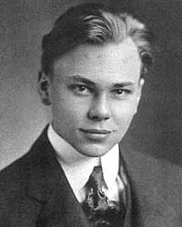
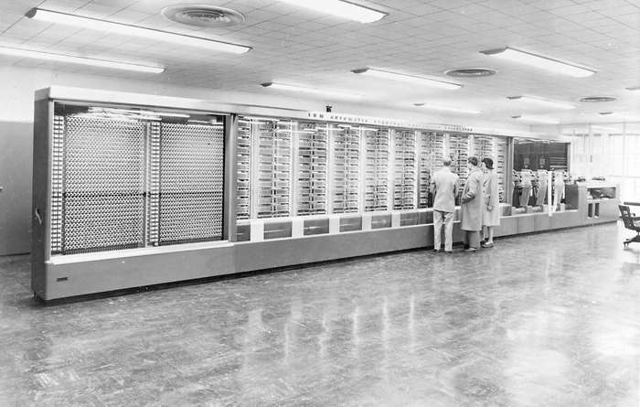
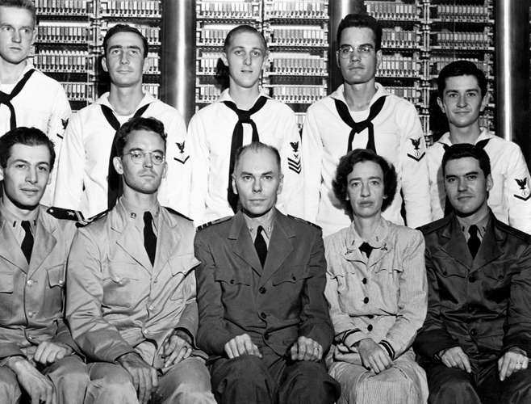

## 霍华德·艾肯

霍华德·艾肯（Howard Hathaway Aiken）(1900-1973)，因在20世纪四十年代成功地研制出世界上第一台大型自动数字计算机马克1号（Mark Ⅰ）获1970年IEEE计算机先驱奖。

## 马克1号（MARK I）

> Designed by Howard Aiken, this electromechanical computer, more than 50 feet (15 metres) long and containing some 750,000 components, was used to make ballistics calculations during World War II.

马克一号是早期的原型机，二战期间在美国建造。当时身为哈佛大学（Harvard University）教授的 霍华德·艾肯（Howard Aiken）正在研究用于计算的数字设备。当时他读过 巴贝奇 和 阿达 的论文，例如19世纪英国发明家查尔斯·巴贝奇的分析机器。从1937年开始，艾肯根据不同的技术，为一系列四台日益复杂的计算机制定了详细的计划，从主要是机械的 Mark I 到电子的 Mark IV。艾肯认真研究自蒸汽机以来的各种机械和技术进步，当时电磁继电器电路已经在商业机器中使用，真空管（一种比继电器更可靠的开关）也开始在实验机器中投入使用。

当时的商用机器使用插接板（类似于电话交换机）手动路由数据，而艾肯在设计时并没选择这种技术。这使得他的机器比更著名的 **ENIAC** （ENIAC是美国政府后来设计的，每个程序都需要手动重新布线） 更容易编程。他当时对于设计有一些自己的想法：

> whereas accounting machines handle only positive numbers, scientific machines must be able to handle negative ones as well; that scientific machines must be able to handle such functions as logarithms, sines, cosines and a whole lot of other functions; the computer would be most useful for scientists if, once it was set in motion, it would work through the problem frequently for numerous numerical values without intervention until the calculation was finished; and that the machine should compute lines instead of columns, which is more in keeping with the sequence of mathematical events.

从1939年到1944年，艾肯与IBM（1911年由 托马斯·沃森 创立于美国，创立初期叫做CTR公司，1924年2月14日改名为IBM）合作，开发了第一台全功能计算机，被称为「**马克1号（Mark I）**」。这台机器和巴贝奇的一样，体积庞大：51英尺（15.3米）长，8英尺（2.4米）高，重35吨（31500公斤），由大约75万个独立部件组成，大部分是机械式的。在输入和输出方面，它使用了三台纸带阅读器、两台读卡器、一台打卡机和两台打字机。加两个数字需要3到6秒钟，一次除法运算大约要12秒。马克1号借助电流进行运算，最关键的部件采用继电器组成，马克1号上安装了大约3000个继电器。继电器接通电路表示「1」，继电器断开则表示「0」，继电器能在大约1/100秒内接通或断开电路。在接下来的几年里，艾肯又开发了三台这样的机器（马克2号到马克四号），并被认为是开发了第一台全自动大型计算器。

1944年5月马克1号（Mark Ⅰ）完工并投入使用，成为世界上第一台实现顺序控制的自动数字计算机，IBM公司将它命名为ASCC即 Automatic Sequence Controlled Calculator并将它捐献给了哈佛大学。马克1号使用在纸带上打编码指令的方式编程，采用这种编程方式，计算机就可以由受过很少训练的人来操作了。马克1号被美国海军用于枪械、弹道和设计工作（马克1号设计制造期间，艾肯在海军服役）。

>  为马克1号编制计算程序的也是一位女数学家格雷斯·霍波（Grace Murray Hopper）。有一天，她在调试程序时出现了故障，拆开继电器后，发现有只飞蛾被夹扁在触点中间，从而“卡”住了机器的运行。于是，霍波恢谐地把程序故障统称为“臭虫”（BUG，现在表示电脑系统或程序中的一些缺陷或问题）

继Mark Ⅰ之后，艾肯又先后研制成Mark Ⅱ（1946年）、Mark Ⅲ（1950年）、Mark Ⅳ（1952年），但IBM并没有继续支持这些项目的开发。据说是由于在庆祝Mark Ⅰ落成的典礼上，沃森收到冷遇，而艾肯在致辞中几乎把马克1号成功的一切功劳都归于自己，这使沃森万分恼怒，并终止了对艾肯和哈佛大学的一切支持。

## 参考资料

1. [Harvard Mark I](https://www.britannica.com/technology/Harvard-Mark-I)
2. [Howard Aiken](https://www.britannica.com/biography/Howard-Aiken)

