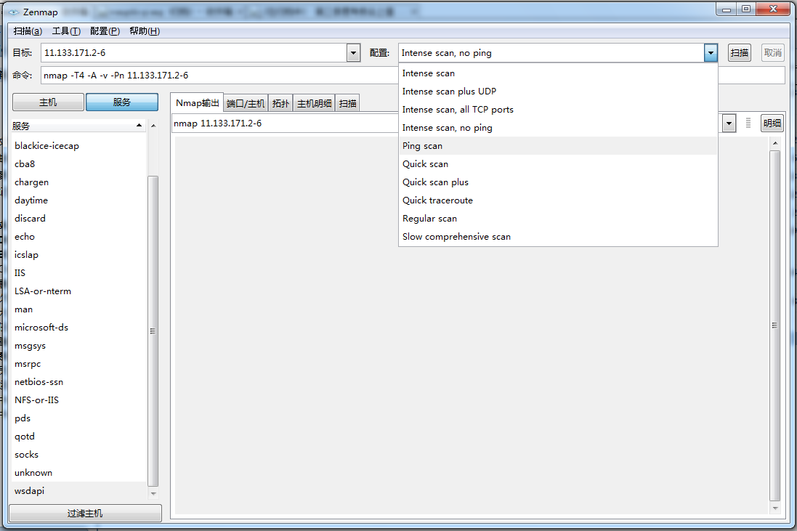

nmap(Network Mapper)是一款用于网络扫描和安全审计软件开源软件，支持Windows、Mac、Linux等多个平台。同时，很多网络管理员也用它来进行网络设备管理、服务升级和主机监控。NMAP使用原始的IP包来探测网络上存活的主机、服务、操作系统等各种信息。NMAP被设计用来进行大型网络的扫描，但也可以用来对单个目标进行扫描。Nmap还曾在20部电影大屏幕上出现过。

## 一、下载安装。

Windows下有exe安装包以及图形界面，我感觉使用起来最方便。Linux和Mac下也都有RPM和DMG安装包，安装相对简单，使用上可能命令行的场景比较多，具体使用哪个版本就看各人喜好了。

## 二、主机发现

### 2.1 常规扫描

简单的在命令后加ip地址，可以进行常规扫描，查看主机是否存活以及开放的端口。

`nmap 11.133.171.200`

### 2.2 Ping 扫描

类似于Ping命令，仅执行Ping扫描，可以快速发现主机是否存活。

`nmap -sn 11.133.171.1-254`

如果想看具体的过程，可以加上 `--packet-trace` 参数，这样在返回结果之前，可以看到每一步的交互过程。

### 2.3 TCP SYN Ping 扫描

通常情况下，Nmap默认Ping扫描是使用TCP ACK和ICMP Echo请求对目标进行是否存活的响应，当目标主机的防火墙阻止这些请求时，可以使用TCP Syn Ping扫描。

> TCP协议是TCP/IP协议族中的面向连接的、可靠的传输层协议，允许发送和接收字节流形式的数据。为了使服务器和客户端以不同的速度产生和消费数据，TCP提供了发送和接收两个缓冲区。TCP提供全双工服务，数据同时能双向流动。通信的每一方都有发送和接收两个缓冲区，可以双向发送数据。

`nmap -PS -v 11.133.171.1-254`

### 2.4 TCP ACK Ping 扫描

`nmap -PA -v 11.133.171.1-254`

使用 `-PA` 选项可以进行 TCP ACK Ping 扫描，它与 TCP Syn Ping 是非常类似的，唯一的区别是设置TCP的标志位是ACK而不是SYN，使用这种方式扫描可以探测组织SYN包或ICMP Echo请求的主机。

### 2.5 UDP Ping 扫描

`nmap -PU -v 11.133.171.1-254`

`-PU` 选项是发送一个空的UDP报文到指定端口，如果目标主机响应则返回一个ICMP端口不可达错误，如果目标主机不是存活状态则会返回各种ICMP报错信息。

### 2.6 ICMP Ping Types 扫描

> ICMP (Internet Control Message Protocol)是Internet控制报文协议。它是TCP/IP协议族的一个子协议用于在IP主机、路由器之间传递控制消息。控制消息是指网络通不通、主机是否可达、路由是否可用等网络本身的消息。这些消息虽然并不传输用户数据，但是对于用户数据的传递起着重要作用。

ICMP Echo 方式扫描

`nmap -PE -v 11.133.171.1-254`

使用ICMP时间戳Ping扫描

`nmap -PP -v 163.com`

使用ICMP地址掩码Ping扫描

`nmap -PM -v 11.133.171.1-254`

### 2.7 ARP Ping 扫描

`nmap -PR 11.133.171.1-254`

这个选项通常用在扫描局域网时，在本地局域网中防火墙不会禁止ARP请求，这就使它的扫描更加高效。

> 地址解析协议，即ARP（Address Resolution Protocol），是根据IP地址获取物理地址的一个TCP/IP协议，其功能：主机将ARP请求广播到网络上的所有主机，并接收返回消息，确定目标IP地址的物理地址，同时将IP地址和硬件地址存入本机ARP缓存中，下次请求时直接查询ARP缓存。

## 三、端口扫描

端口是指接口电路中的一些寄存器，这些寄存器分别用来存放数据信息、控制信息和状态信息，相应的端口分别称为数据端口、控制端口和状态端口。

端口状态。NMAP提供了6个端口状态，分别是Open、Closed、Filtered、Unfiltered、Open|Filtered、Closed|Filtered。

时序选项。NMAP提供了T0-T5几个时序选项，分别是从慢到快的扫描方式。

### 3.1 常用扫描方式

`nmap -p 445 11.133.171.1-254`
`-p`用来指定端口或端口范围。`-F`选项可以快速的扫描端口，但并不是所有的端口都扫描。NMAP默认是使用随机的顺序对端口进行扫描，使用 `-r`选项则可以使用排序顺序进行扫描。

## 四、服务识别与探测

Nmap通过Nmap-service可以探测主机的端口，以及该端口对应的服务，甚至可以进一步探索版本号、主机名、设备类型等信息。

### 4.1 版本探测

使用 `nmap -sV 11.133.171.141` 可以启用版本探测，这并不仅仅是端口探测，而是通过相应的端口对应相应的服务，根据服务指纹识别出相应的版本。

使用 `nmap -sV -A 11.133.171.141` 可以看到更加详细的信息和更加直观的方式。

### 4.2 操作系统探测

在网络扫描过程中，对操作系统版本的探测非常重要。最常见的操作系统探测方法是利用TTL也就是数据包的存活时间，不同的操作系统的TTL也是不同的，可以根据这些TTL进行操作系统探测。

使用 `nmap -O 11.133.171.141` 可以启用操作系统探测。Nmap在扫描过程中，经常会发送一系列报文，`--version-intensity` 选项可以为每个报文赋予1-9之间的值，表示扫描时的强度，强度越高准确度越高速度相应就慢，强度越低准确度越低速度就快。

## 五、定时扫描

这里的定时扫描区别于Linux系统的Crontab定时任务，是一系列Nmap提供的可配置的定时选项，通过这些选项我们可加快或者减慢扫描速度，也可以延时、定时扫描，其提供的这些选项更多的是用来逃逸防火墙、IDS（入侵检测系统）。

> 并行扫描组。

放弃缓慢的目标主机。可以通过`--host-timeout`参数指定对主机的扫描时间。

`nmap --host-timeout 100ms 11.133.171.122`

## 六、防火墙与IDS

> 网络防火墙就是一个位于计算机和它所连接的网络之间的软件（或硬件）。防火墙可以关闭不使用的端口，而且还能禁止特定端口的流出通信。 

> IDS是英文“Intrusion Detection Systems”的缩写，意思是入侵检测系统。主要是依照一定的安全策略，通过软件、硬件，对网络、系统的运行状况进行监视，尽可能发现各种攻击企图、攻击行为或攻击结果，以保证网络系统资源的机密性、完整性和可用性。

### 6.1 报文分段

选项 | 解释
--- | ---
-f | 报文分段
--mtu number | 指定偏移大小
-D ip,ip,ip|RND:number | IP欺骗
-sI  | 源地址欺骗
--source-port port-number | 源端口欺骗
--data-length number | 指定发包长度
--randomize-hosts | 目标主机随机排序
--spoof-mac 0 | MAC地址欺骗

## 七、使用NSE脚本进行信息收集

NMAP使用`--script`参数可以调用NSE脚本。

> NMAP的NSE脚本是用Lua程序创作，提供强大的信息搜集功能。

搜集的信息主要包括：IP信息（地理位置、开放端口）、WHOIS信息、EMAIL信息、IP反查、DNS信息搜集（A记录、CNAME记录等）、系统信息、后台打印机服务漏洞、系统漏洞扫描、WEB漏洞扫描等。

参考资料：
1. [NMAP](https://nmap.org)
2. [NAMP TCP Scanning](http://www.linux.org/threads/nmap-tcp-scanning.8465/)
3. [NAMP Download](https://nmap.org/download.html#windows)
