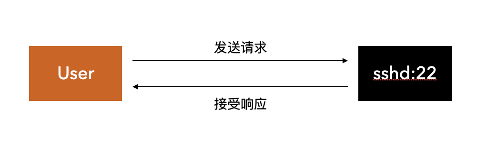

如果我们需要到服务器上执行 Shell 命令，但是因为防火墙等原因，无法由客户端主动发起连接的情况，就可以使用反弹 Shell 来满足登陆和操作的需求。

## 什么是反弹Shell

正常情况下，我们登陆服务器获取 Shell 会话是下面的步骤，用户在终端软件（Terminal）中输入 `ssh root@ip` 登陆目标机器，登陆成功后即可以开始Shell操作。

反弹Shell（Reverse Shell），顾名思义是指与正常的 sshd 服务相反，由控制端监听，被控制端发起请求到监听端口，并将其命令行的输入输出转到控制端。

