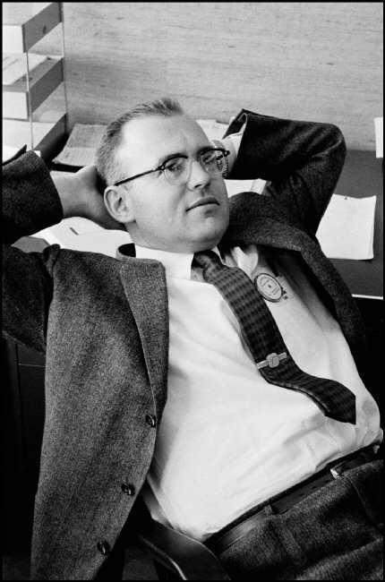
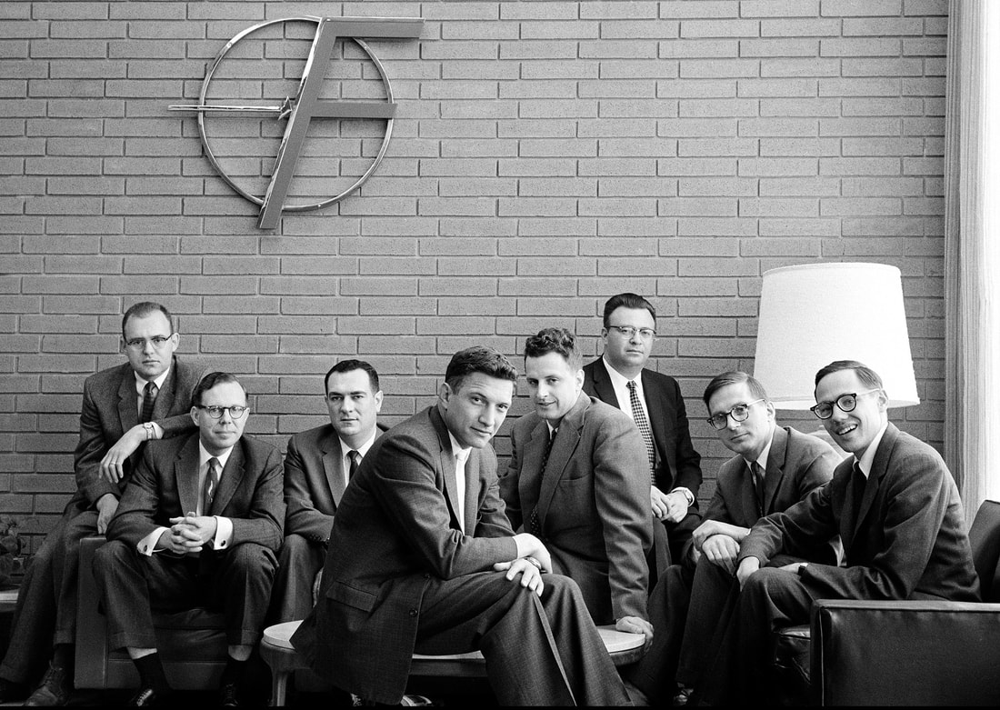
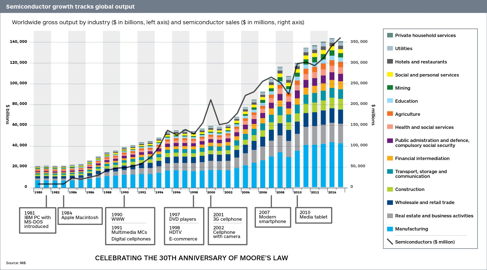

> 集成电路上可以容纳的晶体管数目在大约每经过18个月便会增加一倍。换言之，处理器的性能每隔两年翻一倍。
>
> -- 戈登·摩尔《摩尔定律》

相信即便不是技术行业的人也都听说过「摩尔定律」这个词，他是由我们今天要介绍的主人公 **戈登·摩尔** 首先提出的。

## 戈登·摩尔

戈登·摩尔（Gordon Moore）1929年1月3日出生于美国旧金山，是著名的科学家和企业家。他是英特尔（Intel）公司创始人之一，1965年提出「摩尔定律」，1968年创立英特尔（Intel）公司。

戈登·摩尔 在校期间读的是化学专业，1954年他在加州大学伯克利分校取得博士学位，在约翰·霍普金斯大学度过两年短暂的研究工作后，他受诺贝尔奖得主，晶体管的合作发明者威廉·肖克利（William Shockley）的邀请，于1956年以化学专家的身份加入了肖克利半导体公司。

在肖克利半导体公司，戈登·摩尔 遇到了他后来的好友 罗伯特·诺伊斯（Robert Norton Noyce）。他们在1957年联合公司的 布兰克、拉斯特 等6个人，一同向公司递交辞呈，并成立了著名的仙童半导体公司（Fairchild Semiconductor）。

1968年，戈登·摩尔 和 罗伯特·诺伊斯（Robert Norton Noyce）离开仙童半导体公司，成立了著名英特尔（Intel）公司，并在1969年推出第一批双极处理64位存储芯片。

## 摩尔定律

1965年，戈登·摩尔 在为《电子学》杂志35周年准备评论报告《让集成电路填满更多的元件》时发现：每个新芯片大体上包含其前任两倍的容量，每个芯片的产生都是在前一个芯片产生后的18-24个月内。此时 戈登·摩尔 的观察也就是后来著名的「摩尔定律」

1975年，戈登·摩尔 在国际电信联盟IEEE的学术年会上提交了一篇论文，根据当时的实际情况，对「摩尔定律」进行了重新审定和修正。按照摩尔本人1997年9月接受《科学的美国人》采访时的说法，他当年是把「每年翻一番」改为「每两年翻一番」。实际上，后来更准确的时间是两者的平均：18个月。

最近几十年，相信很多人都见证了「摩尔定律」的神奇之处。

虽然「摩尔定律」在半导体发展方面不会一直持续，但是在越来越多的新兴行业，例如新能源汽车、量子计算等，人们期望着「摩尔定律」能够不断上演，助推人类的发展不断迈向前进。