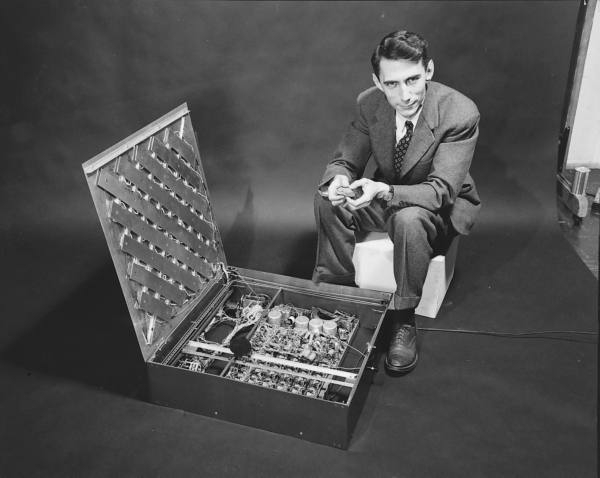
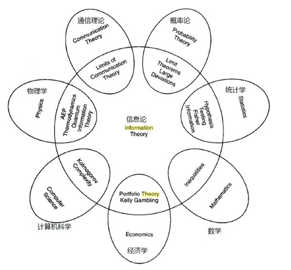

## 克劳德·艾尔伍德·香农

克劳德·艾尔伍德·香农（Claude Elwood Shannon ，1916年4月30日 - 2001年2月24日）是美国数学家、信息论的创始人，是世界上第一个使用 `bit` 这个词的人。克劳德·艾尔伍德·香农 和 [约翰·冯·诺依曼](http://www.edulinks.cn/2021/01/17/20210117-john-von-neumann/)、[霍华德·艾肯](http://www.edulinks.cn/2021/01/23/20210124-howard-aiken/)、[艾伦·麦席森·图灵](http://www.edulinks.cn/2021/01/09/20210109-turing/) 等计算机鼻祖是同时代人。

> The best is yet to come. We've only scratched the surface. Computers can only do what we tell them now, but it will be different in the future.
>
> --- **Claude Elwood Shannon**

劳德·艾尔伍德·香农 1916年4月30日出生于美国密歇根州的 Petoskey，是爱迪生的远亲。1936年毕业于密歇根大学并获得数学和电子工程学士学位，毕业后去麻省理工学院（MIT）**范内瓦·布什**（Vannevar Bush）名下从事模拟计算机方面的研究。香农的麻省理工学院硕士论文《继电器与开关电路的符号分析》（A Symbolic Analysis of Relay and Switching Circuits），被称为20世纪最重要的论文。在这篇论文中，22岁的香农展示了如何利用继电器和开关的电子电路来实现19世纪数学家乔治布尔的逻辑代数。将布尔代数的「真」和「假」和电路系统的「开」和「关」对应起来，用「0」和「1」表示。

1940年获得麻省理工学院（MIT）数学博士学位和电子工程硕士学位。1941年他加入贝尔实验室数学部，他的大部分职业生涯都在这里度过。1956年到退休，一直在麻省理工学院（MIT）做教授。

香农还是世界上首个提出「计算机能够和人类下棋」的人，在1950年，他为《科学美国人》撰写过一篇文章，阐述了「实现人机博弈的方法」（A Chess-Playing Machine），他设计的国际象棋程序，也发表在当年的论文中，1956年，在洛斯阿拉莫斯的MANIAC计算机上，他展示了人类首个国际象棋的下棋程序。

## 信息论

> 投身信息产业的怀抱快三十年了，我有时也在想：信息何以会具备如此强大的力量？它的力量来自哪里？我们又该如何驾驭这一力量？在这三十年间，信息极大地释放了人类的能量，它所创造的价值超过了之前五千年的财富总和，但“信息”依然是个大家耳熟能详却又含义模糊的词。
>
> 信息是人的镜子，它在技术更新与模式兴替中展现出变化万端的色彩。但我们回视人的心灵，却发现它在千百年来并没有太多的变化。“科技的互联网”不能描述信息的全部，信息只有作用于思维，才能显示出强大的力量。
>
> --- 雷军

1948年，香农在《贝尔系统技术杂志》上连载发表了《通讯的数学原理》（A Mathematical Theory of Communication），香农在这篇论文中把通信的数学理论建立在概率论的基础上，把通信的基本问题归结为通信的一方能以一定的概率复现另一方发出的消息，并针对这一基本问题对信息作了定量描述。

香农用一个公式定义一个信息源产生的信息量，这个公式类似于物理学中定义热力学熵的公式。从最基本的角度来看，香农的信息熵是编码一条消息所需的二进制数。如今我们看到这个定义会觉得非常自然，但是在1948年，在信息时代的黎明，他这种将信息数字化的方法却是革命性的一步。他在论文首次使用了「bit」这个词，即二进制数字的缩写。

香农在这篇论文中还精确地定义了信源信道信宿编码、译码等概念,建立了通信系统的数学模型，并得出了信源编码定理和信道编码定理等重要结果。这篇论文的发表标志一门新的学科 --- **信息论** 的诞生。

除了定义信息，香农还分析了通过通信信道发送信息的能力。他发现一个信道有一个不能超过的最大传输速率，今天我们称之为通道的带宽。香农在数学上证明，即使在低带宽的噪声信道中，通过将传输速率保持在信道带宽内并使用纠错方案，基本上可以实现无差错通信。可以说我们今天如此众多的通信手段，一切高质量通信的基础都依赖于通信过程中的纠错，都离不开香农创造的信息论的理论基础。

