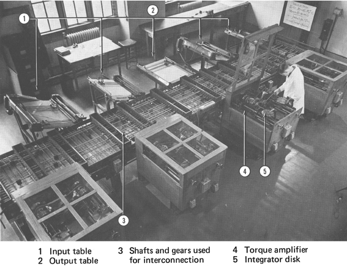

## 范内瓦·布什

范内瓦·布什（Vannevar Bush，1890.3.11~1974.6.26）美国工程师，发明家和科学领域的管理者，他在第二次世界大战期间领导了美国科学研究局（Office of Scientific Research and Development），几乎所有的战时军事研发都是通过该办公室进行的，包括雷达方面的重要发展以及著名的「曼哈顿计划」的启动和早期管理。他还主导创建了美国国家科学基金会（National Science Foundation）和美国国防部高级研究计划署（Advanced Research Projects Agency，现在称为 **DARPA**：Defense Advanced Research Projects Agency ）

范内瓦·布什于1913年毕业于塔夫茨大学（[Tufs University](https://www.tufts.edu) 是波士顿五大名校之一），同时获得了数学专业的本科和硕士学位。随后在1916年，获得了麻省理工学院和哈佛大学联合授予的电气工程博士学位。

1916年秋天，范内瓦·布什回到塔夫茨大学担任教员并投身于反潜水艇的研究，第一次世界大战期间他发明的潜水艇探测装置并没有被美国海军采用。

1919年，范内瓦·布什加入麻省理工学院电气工程系。在随后的20年间，他的实验室在模拟计算机设计和建造方面建立了领先地位。1931年，他制造的微分分析仪（Differential Analyzer）已经投入使用。利用由钢轴驱动的齿轮和凸轮的复杂排列，微分分析仪可以人工计算起来非常困难问题的解决方案（尽管是近似的）。微分分析仪是一个巨大的成功，很快被用于解决各种工程和物理问题。1935年，一台更为成功的机器，即所谓的洛克菲勒微分分析仪（洛克菲勒基金会提供部分资金），建于1935年，在1945年左右数字计算机出现之前，它被证明是最强大的计算机。它在第二次世界大战中被军方征召制作弹道表。

> 模拟计算机用一些连续的物理量表示数据，如电压。相比之下，数字计算机用离散的量来表示数据，通常是用两个电压电平，来表示二进制的数字「0」和「1」。

二次世界大战发生后，布什一直关注局势发展并希望结合科学家的力量制造更好的武器。1940年，德国入侵法国后，布什有机会向当时的美国总统罗斯福建议国家的军事研究计划（写在一张纸上），15分钟内罗斯福总统就批准了他的计划，随后不久就成立了National Defense Research Committee。

二次世界大战之后，布什在NACA（National Advisory Committee for Aeronautics，现在改为NASA 美国国家航空航天局）一直工作到1948年，在CIW（Carnegie Institution of Washington 美国华盛顿卡内基研究所）工作到1955年。

布什制造了模拟计算机，并且预见了计算机技术的持续发展，但是因为战争的影响并没有在计算机领域持续发展并发明出电子计算机，但是他在《As we may think》中的种种预测为后来电子计算机科学家提供了相当的灵感。

## As we may think

这篇文章非常长，在网上找到一个翻译的版本[As We May think--中文翻译版](http://blog.sina.com.cn/s/blog_4c683f990100bq59.html) 。文章中的一些结论和预测，在现在仍然适用，下面是我摘录的一些片段，希望了解全文的可以通过分享的链接详细查看。

> 如果花在撰写学术著作和阅读它们的时间可以被估算的话，这些大量的时间之间的比率可能是惊人的。那些不遗余力试图获取最新思想成果的人，即使他们针对一些范围狭窄的领域进行密切关注、持续阅读，仍难以说清他们在数月以前努力阅读的所得。

在1945年时，如果密切关注某个领域，想要完成所有消息的阅读已经成本好高了。在信息膨胀的当下，不仅有很多的文字材料，还有视频、音频、图片等更丰富的媒体形式，因此我们想要了解某一领域的最新消息和最新进展，想要全部都阅读已是不可能，这就要求我们要有去粗取精、众中选优的能力，提高自己获取信息和知识的效率，避免将时间花费在知识的搜索及重复阅读上。

> 事实上，一个可生产具有可靠性、廉价的、复杂的仪器的时代已经到来，我们一定会从中获得一些新的事物。

作者在讲述了莱布尼茨设计、巴贝奇设计的计算设备后，说明了随着时代的进步，原来需要耗费巨大投入仍不能建造稳定、可靠的复杂仪器的时代已经过去，事实上在1945年之后电子计算机等各种高精度、高复杂度，但却非常可靠的设备迅速的被制造出来。我们现在也不断能够感受到各种精密智能家居设备、运动手表等设备的更新换代速度也是越来越快。

> 未来的摄影爱好者们会在他们的前额上戴上一个比核桃稍大的物体。

实际上，现在的镜头已经可以小到只有小拇指大小了。

> 在最近的一次国际展销会上展示了一台仪器，被称作语控防鸣器。一个女孩按了仪器的按键，它就发出了可识别的语音。没有人的声音进入到程序当中，按键只是连接着一些电感振动器并传感到一部扬声器上。在贝尔实验室有一台功能相反的仪器，他们叫它声音合成机。扬声器被话筒取代，话筒用以收集声音。对着话筒讲话，对应的按键就会移动。这可能是该实验设备的一个构成要素。

可见在1945年，TTS和声控技术已经有了初步的应用，现在小鹏汽车几乎所有操作都可以使用语音进行控制，Siri的出现也大大方便了我们与手机的交互，TTS技术发出的声音更是达到了以假乱真的程度。未来，我们完全通过语音与机器人进行交互的场景应该不会太远了。

> 让我们看一看在大型百货商店通常会遇到的问题。每一次完成一笔赊销，就会有很多的事情要做。要校验存货清单，要奖励销售人员的销售业绩，要记入总账，而最重要是要送货给顾客。目前已经开发了一种中央记录设备，这么大量的工作可以很方便地在这台设备上完成。销售人员只要将顾客的身份证，其本人的身份证，以及商品销售单——所有穿孔卡片规整好，拉动机器操纵杆，通过孔眼进行连接，机械的中心点就会进行一些做必要的计算和记录，然后会为销售员打印出规范的收据并提供给顾客。 

不仅仅在商店，现在快递员利用一个小小的终端，都能完成这些复杂的记录工作。

> 人类有自己的思维模式。大脑通过联结来运转。头脑攫取一项信息后，沿着大脑细胞运行轨迹所形成的极为复杂网络，头脑会立即联想到另外一条信息。当然它还有其他特征; 常常不被追踪到的轨迹就易于淡忘，头脑中的信息不是永久保存的，记忆是暂时的。而人类行为的速度，头脑轨迹的复杂性，想象的细致入微，是自然界所有其他的生灵所不及的，这真是令人惊叹。

年前听了张小龙的微信公开课，上面总结了两个词「**简单**」与「**连接**」，结合布什的描述，「**连接**」真的是无处不在，微观上在人类大脑中通过神经突起的相互连接构成神经网络，社会中我们通过家庭、单位、社团等各种形式形成的组织的连接，连接越多，信息交换越充分就能够越发展。给我的启示就是在工作、生活中一定要多加强沟通，在学习上一定要学会触类旁通。

> 当然用户在这里还可以通过通常的检索方法对记录进行查询，如果用户想要查询某一本书，他可以在键盘上轻敲代码，该书的书名页即刻就会出现在眼前，并且可以投射出他想浏览的内容。频繁使用的代码是能够被记忆下来的，因此他也很少查阅他的代码簿; 但当他查阅时，只需轻轻一按代码就会被投射出来用于使用。再者，他还有一个辅助操纵杆。向右偏转其中的一个操纵杆他就能阅览整本书籍，根据扫视每一行的速度读完一页之后会轮次投放下一页内容，向右进一步偏转一次可以跳读10页的内容; 大幅度向右偏转一次可跳读100页的内容。向左偏转则为反向浏览。 

这里的很多交互设想到目前都已经实现了。

> 假如人类能够反思灰暗的过去，同时更为完整地客观地分析他目前的问题，那么他的精神境界能得到升华。人类建造了一个如此复杂的社会，所以他需要更完整地机械化他的纪录以便将他的经验变成一个有逻辑的结果，而不仅仅是被他有限的记忆能力遗忘掉大半。如果人类能再次获得特权，可以忘记许多不必立即着手去做的事情，他们的生活将会更加愉快，但可以确定的是当这些事情变得更为重要的时候，他们就会找到这些记忆。 

过去，我们想要记录人类经验的方式主要依赖「**写作**」这一手段，而写作对于很多人来说是非常困难的。现在，我们可以利用「**视频**」将许多普通人的生活经验和智慧记录下来，也许在未来，我们还能复制我们在大脑中存储的信息，这样后代在需要借鉴前人智慧时，通过简单的检索就能实现了。

## 参考资料

1. [The Rise and Fall of Vannevar Bush](https://www.sciencehistory.org/distillations/the-rise-and-fall-of-vannevar-bush)