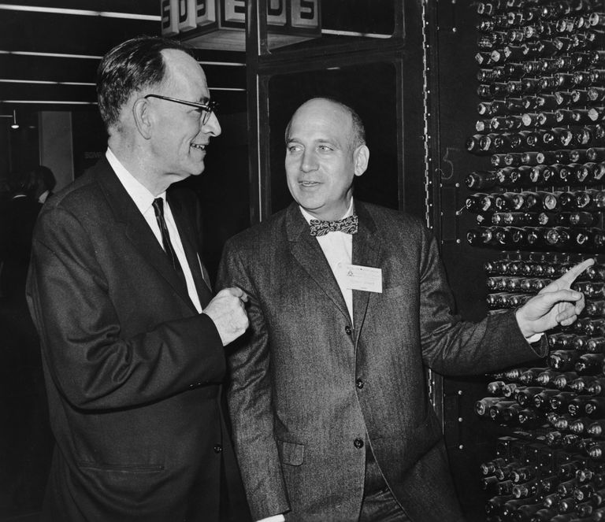
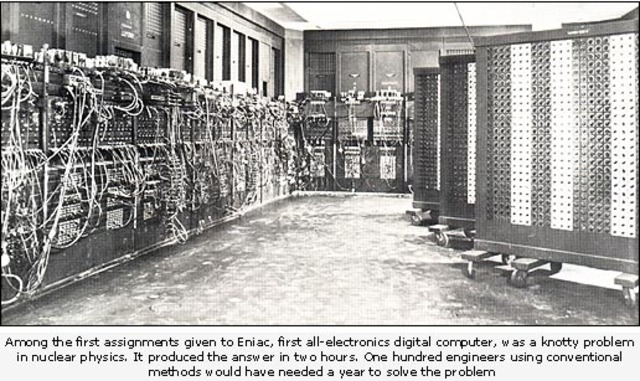

## 约翰·埃克特

约翰·埃克特（**John Presper Eckert，Jr.** ，1919年4月9日 - 1995年6月3日）

约翰·埃克特是一名计算机科学领域的工程师，其最著名的成就在于作为第一台真正意义上的电子计算机 **ENIAC** 的合作发明者。

约翰·埃克特就读于宾夕法尼亚大学电子工程系，1941年获得本科学位，1943年获得研究生学位。在校期间，他就与他的导师 John W. Mauchly 一起在计算设备方面取得了很多重要的成就。

1946年，他们与政府签订了一份合同来建造一个电子计算机，即「**ENIAC** Electronic Numerical Integrator and Computer」，建造这台计算机的目的是用来计算弹道方程和编制射击表。

1948年，约翰·埃克特与John W. Mauchly一起成立了一家电脑制造公司，一年后推出了 **BINAC** （Binary Automatic Computer），能够将数据存储在磁带上，而不再使用纸带。为了能够处理商业数据，约翰·埃克特和John W.Mauchly发明了第三代产品，即 **UNIVAC** (Universal Automatic Computer)，可以说他们的产品带动了电脑产业的兴起。UNIVAC共生产了46台，第一台UNIVAC在使用了73000小时后于1963年退役。最后一台一直运行到1969年退役。在1948年到1966年间，约翰·埃克特共提交了85项专利，多数与电子技术方面有关。

约翰·埃克特的公司在1950年被 Remington Rand Inc 收购，在1955年与 Sperry Rand Corp合并，随后改名为 [Unisys Corp]()。

约翰·埃克特在1967年被选为美国工程院院士，1968年获得美国国家科学奖章。

## ENIAC

ENIAC是第一台电子数字计算机，开启了计算机时代。ENIAC是个占地200平米的庞然大物，使用了18000多只电子管、7200只晶体二极管、10000多只电容、7000多只电阻，功率为174KW，重约30吨。ENIAC的结构包括了「控制部分」、「高速存储部分」、「运算部分」和「输入输出部分」，采用十进制，运算组件能够通过直接计数而不是用逻辑电路进行加、减、乘、除等四则运算和开平方运算，其累加器具有加法运算和存储能力。

除了没有存储程序的功能以外，ENIAC几乎包括了现代计算机的一切主要概念和成分。

1947年8月，ENIAC交付给阿伯丁试验基地使用，用于弹道计算问题，也曾用于天气预报等其他任务。1955年退役后保存在华盛顿特区的史密逊安学会。

## 参考资料

1. [约翰·埃克特](https://baike.baidu.com/item/约翰·埃克特/9200490?fr=aladdin)
2. [John Presper Eckert](https://mathshistory.st-andrews.ac.uk/Biographies/Eckert_John/)