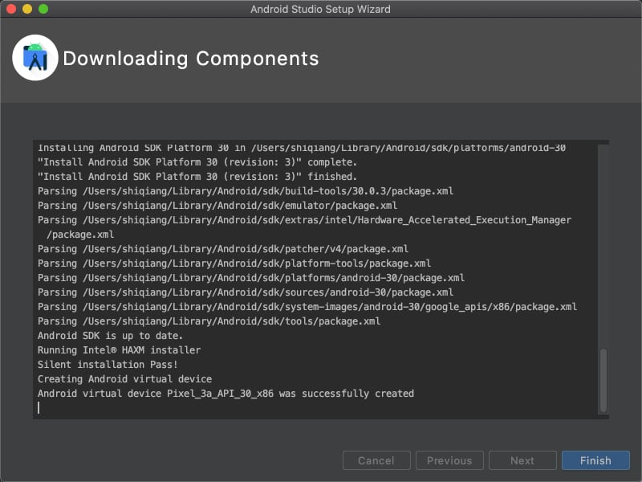
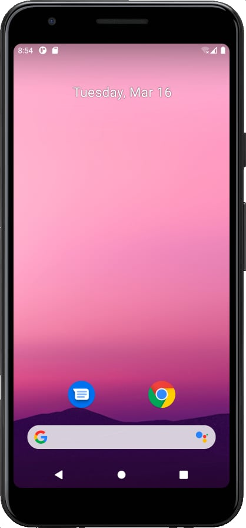
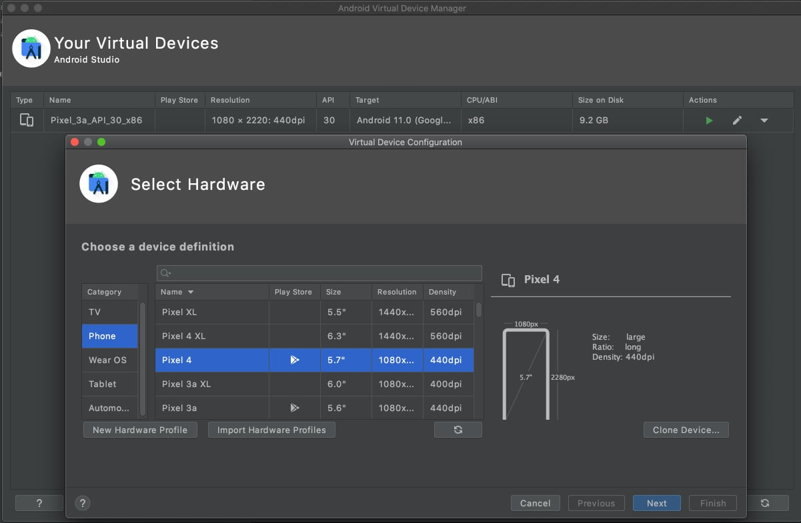

像iPhone的iOS或者其他的手机操作系统一样，Android的开发者非常需要一个模拟器，以在设备上实地测试前对自己开发的应用进行测试。这需要借住SDK来实现（Software Development Kit）。与iPhone的iOS SDK和Microsoft的SDK不同，Android的SDK支持PC和Mac系统。

下面介绍如何下载并安装Mac下的模拟器。

1. 首先从Android的中文站点上找到安装文件下载，[点击下载](https://developer.android.google.cn/studio)

2. 下载下来的是 DMG 文件，点击安装拖入到 Application 文件夹即可。

3. 用你喜欢的方式打开 Android Studio，从Dashboard或者Spotlight都可以。

4. 第一次打开的时候会提示设置 Proxy ，搜了一下网上的文章，多数是说因为要下载包的问题必须要科学上网，这偏偏是我不擅长的领域，因此选择了直接跳过，没想到到后面的 "Downloading Components" 环节依然可以自动下载模拟器等相关的文件，顿时觉得现在 Android 的编辑器做的越来越符合中国国情了。

   

5. 打开成功后，我们可以创建一个空白的工程，然后选择 "Run" 这时也会下载一些必要的组件，下载完成后，我们就能够看到模拟器运行的情况了。

6. 我们还可以通过 Tools -> AVD Manager 来创建自己需要的模拟器。

   

   

