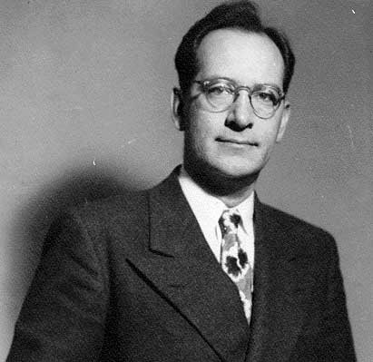

## 约翰·莫奇利

约翰·莫奇利（John William Mauchly 1907年8月30日 - 1980年1月8日）

莫奇利是美国著名工程师，1980年的美国时报将他形容为一名世界首台电子计算机（ENIAC）的合作发明者。

莫奇利于1907年8月30日出生于俄亥俄州周的辛辛那提。1929年毕业于约翰霍普金斯大学物理学专业，1932年获得约翰霍普金斯大学物理学博士。1933年年轻的莫奇利在宾夕法尼亚洲 Collegeville 市的 Ursinus College 教授物理学。在 Ursinus 任教期间教学工作非常出色，并且在气象学方面也有深入的研究。因为在气象学研究中需要大量的计算工作，他开始试验代替机械制表设备的方法，期望减少求解气象学方程所需要的时间。在实验过程中，他初步形成了一种利用真空管构建电子制表设备的设想。

莫奇利当时并不精通电子领域，因此他于1941年到宾夕法尼亚大学摩尔电气工程学院参加暑期课程，以增强对电子设备的了解。他给工作人员留下了很好的印象，被要求留下来当教员。

应邀在摩尔学校工作后几个月，他了解到学校与军方弹道研究实验室（Ballistics Research Laboratory ，**BRL**）的合同中涉及一些弹道问题计算设备的需求。在第二次世界大战期间 **BRL** 负责为新型火炮制作射程表，而制作这些射程表需要非常庞大的计算量，并且迫切的需要新设备来加速整个计算过程。了解到这些背景之后，莫奇利向**BRL**摩尔学院项目联系人 J.Grist Brainerd 以及摩尔学院**BRL**项目联系人 Herman Golstine 建议，利用他关于真空管计算机的方案可以解决当前计算中的一些问题。1942年，他写了一份备忘录，概述了「使用高速真空管设备进行计算」的特点。由此可见，莫奇利不仅有使用真空管构建计算机的想法，还了解如何将其应用于弹道计算和气象学领域。 

随后，莫奇利成为了**ENIAC** 项目的首席顾问，[约翰·埃克特](http://edulinks.cn/2021/03/12/20210314-john-eckert/) 则是该项目的首席工程师，他们的密切合作是ENIAC项目能够成功的关键。

> ENIAC项目开始于1943年4月，于1946年完成。它有18000个真空管，70000个电阻器，6000个开关和10000个电容器。该运算单元由20个累加器组成，可以对20个数字进行运算，可以作为高速寄存器、高速乘法器和除法器平方根。政府总共花费了40万美元。

在研制**ENIAC**的过程中，莫奇利和[约翰·埃克特](http://edulinks.cn/2021/03/12/20210314-john-eckert/) 认识到，由于战时的紧急情况，这种装置还有很多不足之处，例如它非常大，占据了整个房间，只能存储20个10位数的数字。最关键的是，它只能通过外部设置开关来接收指令。

1944年10月，摩尔学院获得了 **ENIAC** 的一份补充合同，用于开发EDVAC（Electronic Discrete Variable Automatic Computer, 电子离散变量自动计算机），它将是一台具有存储程序功能的计算机，容量为1000个字符，将使用水银延迟线来存储数据。由于学校的新专利政策引发的争议，莫奇利和埃克特于1946年离开了莫尔学院，他们的离开使 EDVAC 的研制一直到1951年才完成。

1946年，莫奇利和 [约翰·埃克特](http://edulinks.cn/2021/03/12/20210314-john-eckert/) 开始研制 UNIVAC （Universal Automatic Computer），将用于各种各样的商业用途，国家标准局下的人口调查局是第一个使用 UNIVAC 的机构。

1948年12月，莫奇利和 [约翰·埃克特](http://edulinks.cn/2021/03/12/20210314-john-eckert/) 成立了**埃克特-莫奇利计算机公司**。埃克特成为了副总裁，更愿意留在幕后担任总工程师。莫奇利成为公司总裁，负责为电脑逻辑设计，传播有关公司进展的信息，与A.C.尼尔森公司和保诚保险公司签订合同，并从美国极光仪公司获得额外的资金支持。

总的来说，莫奇利主要精力用在证明电子数字计算机对各种问题的适用性。他还希望提供一个论坛，让计算机领域的人们可以讨论各自的项目。为此，他于1947年积极创办和组织了东方计算机协会（Eastern Association for Computing Machinery），后来成为国际计算机协会（Association for Computing Machinery），莫奇利是这个组织的第一任副主席，1948年是第二任主席。

由于企业发展需要资金，为了缓解公司的财务问题，莫奇利和 [约翰·埃克特](http://edulinks.cn/2021/03/12/20210314-john-eckert/) 在1947年开始为 Northrop Aircraft Company 设计制造了一台二进制计算机 BINAC （Binary Automatic Computer），并于1949年制造完成，这成为美国第一台可操作的存储程序电子计算机。

莫奇利和[约翰·埃克特](http://edulinks.cn/2021/03/12/20210314-john-eckert/)在计算机领域创造了四个重要的第一：ENIAC、EDVAC、BINAC、UNIVAC。