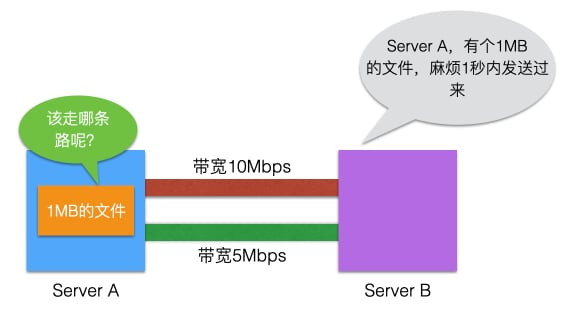

实际开发项目中带宽占用的评估是经常遇到的一个问题，一部分同学在这个知识点上可能会遇到问题，本文详细介绍了带宽估算的方法和度量单位，帮助大家熟悉这个知识点。

**带宽** 是网络链路的最大数据传输能力，单位为 **bps** （也就是我们常说的小b），表示链路每秒钟最多能传输多少数据。

我们平时做开发，两个系统间网络数据交互，往往考虑的是文件的大小，如要从A系统给B系统一个1MB的文件，我们习惯描述的是1秒钟内把这个文件传输完毕，即 **1MB/s**（也就是常说的大B）。

**MB** 使用 Byte 作为单位，即字节大小。**bps** 以 Bit 作为单位，1Byte = 8bit。因此在计算带宽时，需要将**MB/s** 乘以8。或者在带宽换算为每秒传输文件大小时，需要除以8。以刚才的场景为例，所需的带宽是 8Mbps，也就是如果线路带宽是10Mbps的，那肯定可以满足需求。如果线路带宽是5Mbps或2Mbps的，那就不能满足需求了。

上述举的例子文件比较小，实际在生产环境中，服务器网卡一般是千兆网卡（1Gbps），交换节一般都是万兆（10Gbps），内部传输这些文件往往不在话下。但也有会把服务器网卡流量打满的情况，我们运维的一台 Kafka 机器，曾经出现过瞬时速率超过 125MB/s 的监测点，因为要上报的数据太多，基本上就把网卡撑爆了。

随着硬件的升级，越来越多的服务器开始采用万兆的光纤接口，但是我们在做容量规划时仍要考虑到极限的情况，因为视频类应用越来越多，说不定哪天又爆了。

文中举的这个例子只为了说明带宽的计算方式，在涉及到跨数据中心的数据传输时，还会有 **RTT** 、线路质量等多方面因素的影响，这种情况下要评估线路的最大传输速率要考虑的因素就更多，本文就不再赘述了。