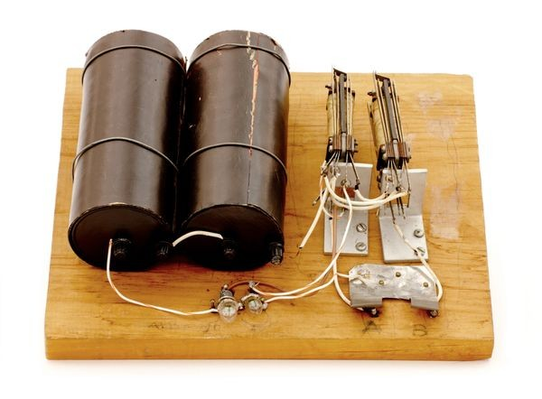

## 乔治·斯蒂比兹

乔治·斯蒂比兹（**George Robert Stibitz**，1904年4月20日 - 1995年1月31日）

乔治·斯蒂比兹被誉为「数字计算机之父」，是美国数学家与发明家。他1904年出生于宾夕法尼亚州的约克市，在康奈尔大学获得博士学位，专业为数学物理。

**Model-K** 1937年11月，乔治·斯蒂比兹当时在贝尔实验室（为纪念电话发明人贝尔而创立）从事研究工作，主要课题是电话继电器的磁路问题。一天晚上在厨房里喝茶时，受到继电器的启发，他以继电器为主要核心部件制作了一台电磁式计算机模型，能够完成两位二进制的加法运算。这台「计算机」以铁皮片作为输入，以灯泡作为输出。他的夫人把这个发明称为 Kitchen table，即 Model-K。后续他不断完善机器的设计，并获得了正式项目继续他的想法的机会。

**M-1 电磁式数字计算机** 1938年9月，乔治·斯蒂比兹 与他的搭档 威廉姆斯（S.Williams）启动了 M-1 计算机的研制工程。1940年1月8日，M-1（也叫Complex Number Calculator）开始运行，标志着美国的第一台数字计算机诞生。M-1电磁式数字计算机使用了450个继电器和10个闸刀开关，就完全解决了复数的加、减、乘、除四则运算，一次复数乘法约需30 ～ 45秒钟。同样的题目，人工手摇计算机需要15分钟。

乔治·斯蒂比兹还制作了一台小型遥控器，通过电话线远程遥控M-1。1940年9月在达特茅斯学院举办的美国数学学会学术会议期间，乔治·斯蒂比兹派人向包括冯·诺伊曼在内的多名数学大师，公开演示了如何遥控操作M-1计算机，这标志着历史上首次实现了计算机远程控制。

二次世界大战期间，贝尔实验室允许乔治·斯蒂比兹加入国防研究委员会。在那里，现代军事炮兵的需求使斯蒂比茨更加确信需要改进计算机硬件，他把战争的大部分时间都花在了改进版的CNC上。

第二次世界大战结束后，乔治·斯蒂比兹搬到了 Vermont，成为了一名用应用数学顾问。后来，他还将计算机的应用扩展到生物领域。

乔治·斯蒂比兹一生获得了38项专利，因此在1983年进入了 Inventors Hall of Fame。

