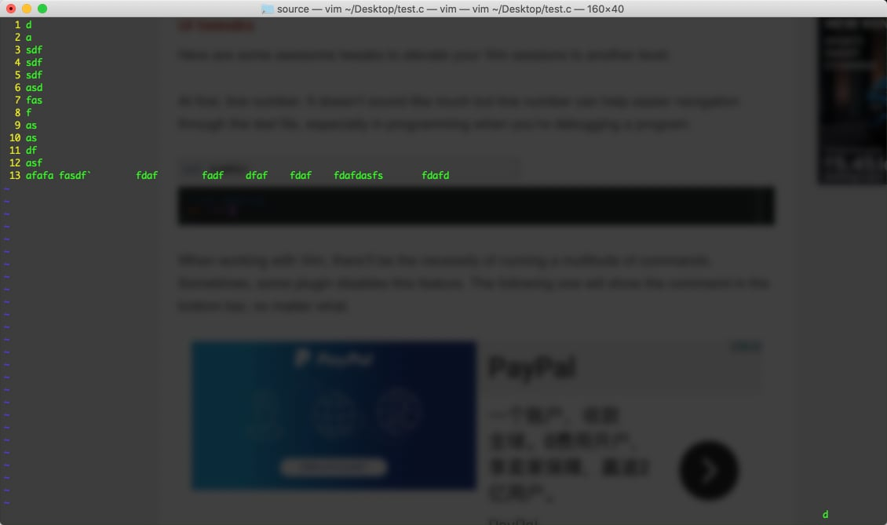
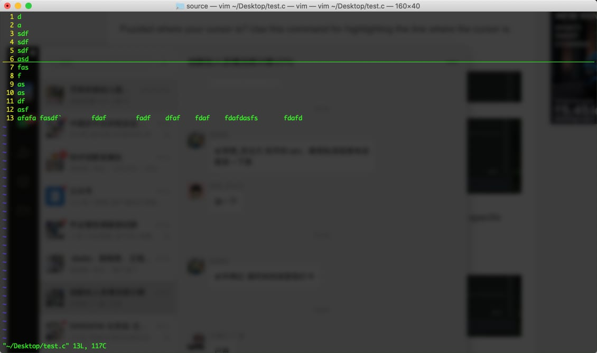

VIM是一款 Linux 命令行下的文本编辑器，虽然现代编辑器及IDE越来越多，但仍敌不过VIM的简单与方便，特别是在生产环境进行运维操作或代码调试过程中，因此熟悉一下VIM的使用和配置也是大有益处的。

## VIM的历史

喝水不忘打井人。Vim是由 Bram Moolenaar 基于 Bill Joy 开发的 Vi 开发的编辑器。

## VIM的配置

VIM在Linux系统上，有两个配置文件，一个是放在 `/etc/vimrc` 下的全局配置文件，一个是放在用户目录下的 `~/.vimrc` 文件，一般我们都是通过修改用户目录下的配置文件来实现自定义配置。

下面整理了一些常用的配置，帮助我们获得更好的 vim 体验。

* 显示行号。`set humber` 可以默认显示行号 `set nonu` 可以默认不显示行号。

* 语法高亮。`syntax on` 打开语法高亮，在使用 vim 编辑时，一些关键字会高亮显示，类似于 IDE 环境。

* 配色方案。` colorscheme delek` 。

* 设置TAB显示的宽度。`set tabstop=4`。在脚本编辑时缩进非常重要，不光是美观问题，Python对于缩进严重依赖，bash脚本也要求精确的的缩进。

* 设置TAB键的行为。`set softtabstop=4` 该命令不修改tab的显示宽度，影响vim在插入模式下按 Tab 键所实际得到的字符，建议和上一个选项保持一致。

* 将TAB替换为空格。`set expandtab` 这个选项默认为off，打开这个选项后，当我们按 Tab 时，会把 tab 字符转换为 tabstop 对应数值的空格。如果确实需要插入 tab 字符，则按下CTRL-V\<Tab\>。

* 显示未完成的命令。`set showcmd` 这个选项打开时，将在vim窗口的右下角看到当前输入的未完成的命令。如下图右下角有个 d 即我还没输入完成的命令。

  

* 显示光标所在行。`set cursorline` 这个选项打开后，光标所在的行将显示一条明显的直线，方便我们快速找到光标所在的行。

  

* 显示匹配的括号。`set showmatch` 这个选项打开后，如果光标移动到括号或者大括号，则会显示与它相匹配的另外一个括号或者大括号，对于使用 vim 来做编程的朋友会很方便。

* 更好的搜索体验。`set incsearch` 和 `set hlsearch` 。第一个命令增强了 vim 自带的搜索功能，能够找到所有匹配的字符。第二个命令会对搜索到的结果进行高亮显示。

我用到的全部的 vim 配置

```sh
set number
syntax on
set autoindent
set smartindent
set tabstop=4
set softtabstop=4
set expandtab
set showcmd
set cursorline
filetype indent on
set wildmenu
set lazyredraw
set showmatch
set incsearch
set hlsearch
```

vim 还有很多很多丰富的配置和插件，例如自动代码折叠、显示文件夹等等，如果熟练合理的使用，vim将会比IDE环境功能还要强大，后续有机会整理更多内容后再和大家分享。

## 参考资料

1. [vim技巧：详解tabstop、softtabstop、expandtab三个选项的区别](https://segmentfault.com/a/1190000021133524)
2. [vim插件之incsearch](https://mounui.com/314.html)
