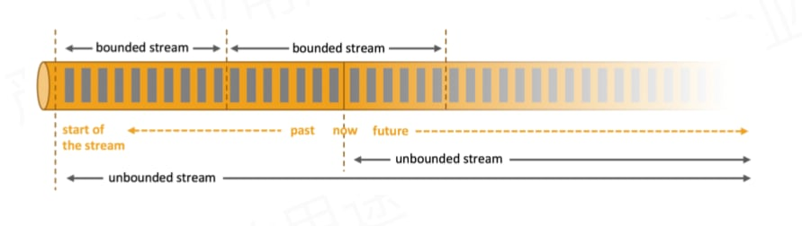
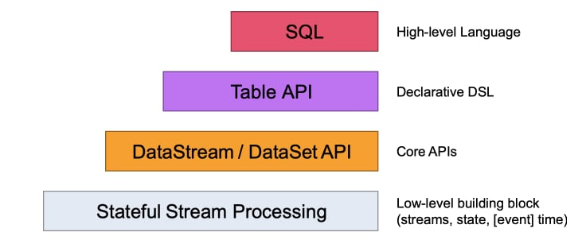
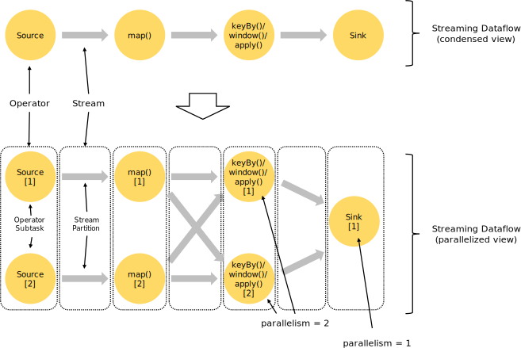

## Flink是什么
> Apache Flink is a framework and distributed processing engine for stateful computations over unbounded and bounded data streams.

Flink首先是一个框架，为我们提供了处理有状态数据流的分布式计算能力。

## 有界流和无界流
我们使用程序来处理的数据，根据是否有明确的起点和终点可以分为两种：
* 有界流: 这种数据有明确的起点和终点，例如报表类应用日报、月报、年报，所要分析的数据有明确的时间范围，另外有一个特点，所有的数据分析处理动作都是数据产生以后开始的。
* 无界流: 这种数据流有起点，但是没有终点，我们需要按照一定的规则来不断的分析上送过来的数据，并按照一定的规则产出结果。数据的流动可能是稳定的，也可能会有波峰和波谷，这就对处理框架提出了很高的适应性要求。

## 数据状态
拿一个常见的统计场景来说，当我们要统计城市中各个路口的车辆流量情况，不仅仅是完成统计时段（例如五分钟）通过路口的车辆数量（汇总），还希望掌握与之前一个时段相比变化的情况，以及每个行政区、每条路、整个城区等多种纬度的统计数据。

## 基本架构
* JobManager 协调分布式计算、任务调度，协调checkpoints，错误调度等，相当于一个指挥官吧(实际部署时，至少需要一个 JobManager，实际生产环境部署时都会做HA，部署多个JobManager；这个时候，只有一个leader，其他都是standby模式)
* TaskManager 真正执行dataflow的，并对streams进行缓存和交换

## 抽象的层次
为了方便开发，Flink提供了四个层次的调用方式。

* Stateful Streaming Processiong 是最底层的抽象，允许人们自由的处理一个或多个流，在保证一致性的前提下，还提供了根据event time或者processing time回调的能力。
* DataStream / DataSet API 这是Flink的核心API，允许人民通过聚合、窗口等等方式对数据进行处理。
* Table API 将流抽象为Table，通过Table API来用我们熟悉的关系模型的方式处理流数据。每个Table都有一个Schema，通过API可以进行搜索、分组、聚合等等操作。可以与DataStream ／ DataSet API混合使用。
* SQL Flink编程的最高抽象，类似于Table API，但允许我们将程序直接用SQL表示。

## 编程与数据流
Flink程序的基本单元就是流和转换算子（DataSet在内部实际上也是流）。所谓流就是一系列持续不断生成的记录，比如时间，任何人都无法阻止时间的流逝，随着时间流逝可以定格很多属性比如当时的温度、人的寿命等等。转换算子（Transformation）则是将输入的流数据转换为另一种形式继续输出。

Flink程序运行的时候，会映射到数据流和转换算子上。数据流包括一个或多个源称为source，还包括一个或多个输出称为sink。数据流类似于DAG（directed acyclic graphs）

## 并行数据流
Flink程序是分布式并行运行的，一个流将会分为一个或多个流分区，每一个操作 operator拥有一个或多个子任务。这些子任务都是相互独立的运行在不同的机器或容器上。每个操作 operator都可以设置并发度参数，一个程序中的每个操作 operator可以拥有不同的并发度。

流在处理数据时有两种方式，一种是一对一的模式，例如source和map。一种是重分配的模式，例如keyBy算子，会根据key的hash值将数据重新分配。

### 窗口
与传统的批处理方式不同，Flink在流数据中通过windows来作为数据聚合的依据，例如统计过去五分钟的数据，或者统计最近100条记录，其中一种是时间驱动，另外一种是数据驱动。

窗口又分为三种模式，滚动窗口（各个窗口的数据之间没有重合）、滑动窗口、会话窗口。

### 时间
在流式计算程序中，有三种不同的时间处理方式
* 事件时间，采用数据产生的时间，用事件时间表示 Event Time。例如传感器采集到数据的时间，交易发生的时间。
* 消费时间 Ingestion Time，是Flink Source Operator首次消费到数据的时间
* 处理时间 Processing Time，是对数据进行运算是的服务器时间

## 参考资料
1. [Flink入门教程](https://blog.csdn.net/u010862794/article/details/90025104)
2. [AKKA Actor](https://doc.akka.io/docs/akka/current/actors.html)
3. [Flink 入门教程](https://blog.csdn.net/u010862794/article/details/90025104)
4. [Programming Model](https://ci.apache.org/projects/flink/flink-docs-release-1.9/concepts/programming-model.html)
5. [Apache FLink 入门](https://files.alicdn.com/tpsservice/53de65050b468fc6d338fbaff799828a.pdf)