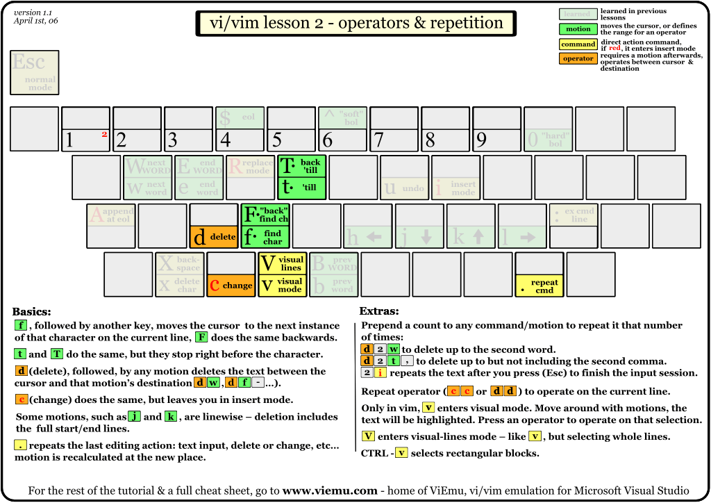

## 基础快捷键

* 移动光标：除了使用方向键之外，还可以使用 `h、j、k、l` 四个按键操作光标。熟练使用后能提升一倍的效率，毕竟手不用离开字母区找方向键了。
* 行内移动光标：使用 `0` 快速跳转到行首，`$` 快速跳转到行尾，`^` 快速跳转到第一个非空字符。
* 单词间移动光标：使用 `w` 向后跳转一个单词到下一个单词的开始，使用 `e` 向后跳转一个单词到单词的末尾，使用 `b` 向前跳转一个单词到单词的开头。
* 插入模式：vim 打开文件后默认是只读模式，使用 `i` 能够进入插入模式，这时就可以向文件中写入内容。写入完成后，按 Esc 键即可退回到只读模式。
* 替换模式：使用 `R` 进入替换模式，所有的内容都会被新输入的内容原地替换。
* 删除字符：只读模式下我们想要删除某个字符，不需要转换到插入模式 + Delete。只需要使用 `x` / `X` 就能够快速的删除光标后一个字符或光标前一个字符，避免在两种模式间频繁切换。
* 在行尾插入内容：`A` 可以将光标移动到行尾并且进入插入模式，方便快速的在行尾插入内容。
* 撤销和重做：使用 `u` 能够快速撤销上一步操作，使用 `Ctrl + R` 能够重做刚才的动作。
* 保存和推出：`:w` 保存对文件的修改，`:q` 退出文件。 

## 操作进阶

* 行内查找：`f` 在只读模式下，输入f后再加上要查找的内容，回车在行内进行查找，并将光标移动到行内内容上。`F` 是按照反方向在行内进行查找。`t` 和 `T` 也是做行内查找，只不过光标停留在查找内容的前面。
* 删除内容：`d` 是删除的快捷键。`d + w` 表示向后删除一个单词，`d + fs` 表示向后删除到下一个字母s。`c` 与 `d` 的作用相同，只是完成删除操作后停留在插入模式。删除快捷键可以和很多移动光标的快捷键结合使用，来达到快速删除的目的，还可以加上数字来提高删除速度，这个操作真的需要大家自己认真体会一下。
* 重复动作：`.` 键可以重复上一个编辑动作，包括删除内容、新建行等。

## 复制粘贴

* 复制内容：`y` 快捷键+移动操作表示复制相关的内容，例如 `yw` 表示复制光标后面一个单词，`y$` 表示复制从光标到行尾的内容，`yy` 表示复制光标所在行的全部内容。
* 粘贴内容：`p` 粘贴刚刚复制的内容，如果为一段文字则向光标后插入，如果是一行文字则向下插入。`P` 与 `p` 的粘贴方向相反。
* 插入空行：`o` 可以向下插入空行，`O` 可以向上插入空行。

## 查找功能

* 查找：`/` 是查找的快捷键，输入 `/` 后再输入需要查找的内容然后回车，匹配到的内容会高亮显示。使用 `n` 和 `N` 可以向前或向后移动匹配的内容。`?` 与 `/` 功能相同，只是查找的方向默认为向前查找。

## 标记与宏

* 标记：使用 `m` 加字母，可以将光标所在的位置进行标记。
* 录制宏：使用 `q` 开启和停止一段录制，使用 `@` 重放一段录制的动作。

## 移动进阶

* 在配对的括号间跳转。`%` 可以在配对的括号、大括号、方括号间跳转。
* 在屏幕上快速移动。使用 `H` 可以快速移动到屏幕顶端、使用 `M` 可以快速移动到屏幕中间，使用 `L` 可以快速移动到屏幕底部。
* 指定位置跳转：使用 `G` 默认跳转到行尾，也可以指定需要跳转到的行号，即 `#15G` 就会跳转到第15行。
* 跳转到帮助文档：`K` 可以跳转到光标当前所在命令的帮助文档。

## 其他技巧

