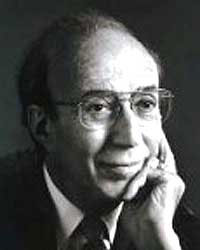
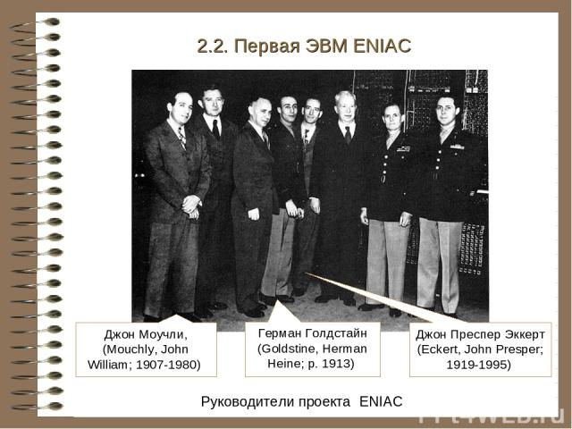

## 赫曼·哥尔斯廷

赫曼·哥尔斯廷（Herman Goldstine，1913年9月13日 - 2004年6月16日）美国数学家及计算机科学家，参与 **ENIAC** 的研发与早期数字计算机方面的研究。

赫曼·哥尔斯廷 出生在芝加哥，1933年在芝加哥大学获得数学学士学位，后续继续在芝加哥大学学习，1936年发表论文《Conditions for Minimum of a Functional》并获得博士学位。

珍珠港事件爆发后，美国参加第二次世界大战，赫曼·哥尔斯廷于1942年加入军队并被分配到弹道研究实验室（Ballistics Research Laboratory，BRL）。进入弹道研究实验室后，因为与宾夕法尼亚大学摩尔电气工程学院合作进行弹道研究相关的计算，赫曼·哥尔斯廷被派到摩尔学校与学校的数学家联络。

当 赫曼·哥尔斯廷 看到当时约翰·莫奇利 和 约翰·埃克特 已经有了建造新型计算机的想法和方案时，立刻意识到这个方案的巨大潜力。赫曼·哥尔斯廷 了解到 约翰·莫奇利的想法之后，认为具备可行性。于是两人一同向学院的管理层建议，管理层最终接受了建议开启了 ENIAC 项目。

赫曼·哥尔斯廷 与[约翰·莫奇利](http://edulinks.cn/2021/03/21/20210321-john-mauchly/) 以及 [约翰·埃克特](http://edulinks.cn/2021/03/12/20210314-john-eckert/) 共同参与了 ENIAC 的研制，可以说虽然 约翰·莫奇利 和 约翰·埃克特 是设计制造 ENIAC 的核心，但是如果没有 赫曼·哥尔斯廷 ，他们两人的想法可能永远不会成为现实。

1944年夏天，在 ENIAC还没有完全竣工时，赫曼·哥尔斯廷 在马里兰州阿伯丁的一个车站与 冯·诺依曼 偶然相遇，赫曼·哥尔斯廷 向 冯·诺依曼 介绍了正在进行的ENIAC项目，特别说明了ENIAC每秒可以执行333次乘法。

正是这次相遇促成了一个生产改进型计算机项目，赫曼·哥尔斯廷、冯·诺依曼、莫奇利、埃克特都参加了这个项目。然而，因为某些原因莫奇利、埃克特于1946年10月离开学校成立了自己的公司，后续制造了二进制自动计算机BINAC。赫曼·哥尔斯廷则继续与冯·诺依曼一同继续项目，他们发表了一系列关于 EDVAC（电子微分变量计算机，Electronic Differential Variable Computer）的报告，改变了计算机的整体概念。

赫曼·哥尔斯廷与冯·诺依曼一起工作了很多年，直到冯·诺依曼于1957年去世后，赫曼·哥尔斯廷离开普林斯顿，并于1958年被任命为IBM的研究主管。

赫曼·哥尔斯廷写了很多书，其中包括《The computer from Pascal to von Neumann（1972）》

## 参考资料

1. [Herman Goldstine](https://mathshistory.st-andrews.ac.uk/Biographies/Goldstine/)
2. [Презентация на тему](https://ppt4web.ru/informatika/istorija-sozdanija-ehvm0.html)

