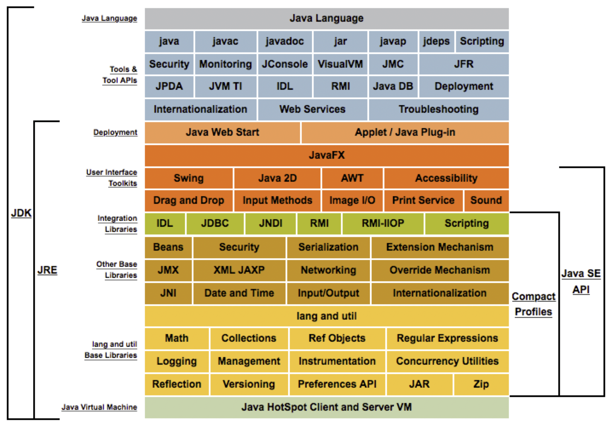
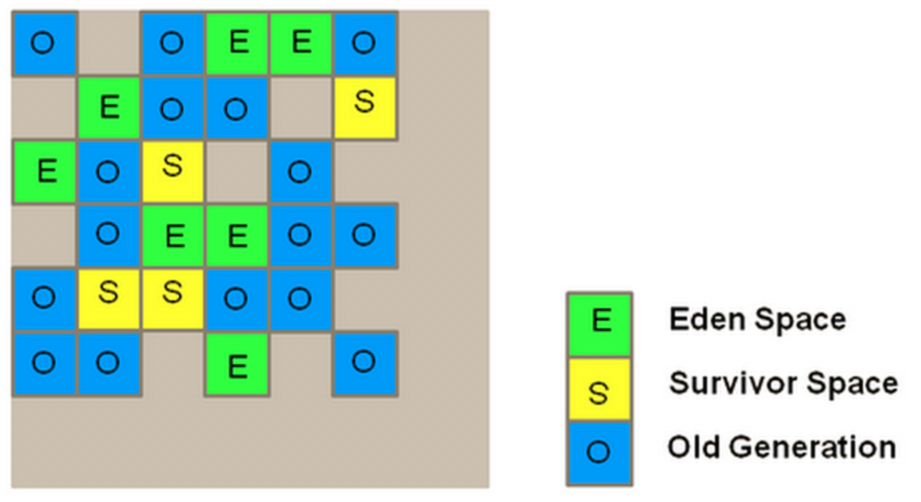

> 本文基于Java 1.8。

## 介绍
开始之前，有必要了解一些Java的基础知识。

### JRE 和 JDK
* JRE Java Runtime Edition 包括JVM、Java核心类、必要的依赖包，为用户提供一个Java程序运行环境。
* JDK Java Development Kit 是开发Java应用所必需的一系列工具组合，与JRE共用了一套Java API。

### JVM
JVM是Java Virtual Machine的缩写，JVM是一种用于计算设备的规范，是一个虚构出来的计算机，JVM是Java实现了各平台独立运行的关键。

### GC Garbage Collector
在Java中，Garbage Collector 是JVM提供的内存管理工具（以下称GC）。GC是定期扫描内存的使用情况，判断哪些对象在使用、哪些没有在使用，然后通过删除不再使用的对象，保证内存的使用效率。对于C语言，这个过程一般都是手工管理的。

CMS GC过程一般分为以下几个步骤：
* Marking 过程，GC标记哪些内存对象不再使用
* Normal Deletion 将不被使用的对象删除
* Deletion with Compacting 将剩余仍在使用的对象整理的更紧凑

## 性能指标
* Latency 也叫做 Responsiveness。表示应用处理的响迟时间。
* Throughput 中文翻译是吞吐量，可能是单位时间内处理的数据量，或者应用花在非GC时间上的百分比。

这两个指标是一个相互影响的关系，吞吐量大，可能延时就会提高。要求低延时，可能就得降低吞吐量。在考虑应用架构时，我们总要在这两个指标间取得一个平衡点。

## SerialGC
Serial GC是Java SE5和6的默认GC，使用Mark-Compact收集方法。是一个单线程的收集器，在进行垃圾收集的时候，必须暂停其他所有的工作线程直到它的收集结束。

Heap区分为Young和Old区。Young区又分为Eden和两个Survivor区域（S0和S1），新创建的对象都分配到Eden区。


当Young区逐渐填满会引发Minor GC，Young区的清理很快，一些对象被移动到Old区。*Stop The World Event* 是GC中发生的事件，发生 *STW* 意味着所有的线程停止了工作。Minor GC会触发 *STW* 事件。

OLD区保存的对象通常是生命周期较长的对象，OLD区的GC称为 Major GC。Major GC也会触发 *STW* ,Major GC的时间通常会比较长，因此对于要求低延时的应用，应当尽量减少Major GC。

`Permanent Generation`包含了描述类和方法的元数据，另外Java SE的类核方法也保存在这里，这里的对象在发生Full GC的时候会被回收。

```sh
$ java -Xmx12m -Xms3m -Xmn1m -XX:PermSize=20m -XX:MaxPermSize=20m -XX:+UseSerialGC -jar c:\javademos\demo\jfc\Java2D\Java2demo.jar
```

### 相关参数
* -Xms 设置初始HEAP大小
* -Xmx 设置最大的HEAP大小
* -Xmn 设置Young区的大小
* -XX:PermSize 设置Perm区的开始大小
* -XX:MaxPermSize 设置Perm区的最大大小

## Parallel GC
Parallel GC使用多线程进行Young区的内存回收，对于有N个CPU的设备，则会使用N个线程。它的特点是停顿时间段，回收效率高，对吞吐量要求高。

### 参数
* -XX:+UseParallelGC 使用多个线程进行Young区回收，一个线程进行OLD区回收
* -XX:+UseParallelOldGC 同时使用多个线程对Young区、Old区进行回收
* -XX:ParallelGCThreads=<desire

## CMS (Concurrent Mark Sweep)
采用“标记－清除”算法的内存收集器，使用多线程的算法去扫描堆，对发现未使用的对象进行回收。

它的特点是响应时间优先，减少了垃圾收集停顿的时间。

### 参数
* -XX:UseConcMarkSweepGC
* -XX:ParallelCMSThread
* -XX:CMSScheduleRemarkEdenSizeThreshold
* -XX:CMSScheduleRemarkEdenPenetration 该参数与上一个参数一起，默认值分别是2M、50%。两个参数组合起来的意思是预清理后，eden空间使用超过2M时启动可中断的并发预清理（CMS-concurrent-abortable-preclean），直到eden空间使用率达到50%时中断，进入remark阶段。
* -XX:CMSMaxAbortablePrecleanTime 默认为5S
* -XX:CMSScavengeBeforeRemark 使remark前强制进行一次Minor GC。
* -XX:CMSInitiatingOccupancyFraction 设置老年代空间使用百分比,达到百分比就进行垃圾回收。这个参数默认是92%。
* 

## G1 GC （Garbage-First）

> G1GC是Java 7引入的内存回收器。

**适用场景**
* HEAP空间上10GB，一半左右保存活动数据
* 对象的移动和提升持续不断的发生
* HEAP中存在大量的碎片
* 应用暂停时间小于500毫秒，避免长时间的GC暂停

> 500毫秒对于交易量大的系统来说已经是非常可观的暂停了，如何实现几乎没有GC暂停时间，感觉应该作为Java的终极目标。

**性能目标**
* 延时 real time
* 吞吐量 The throughput goal for the G1 GC is 90 percent application time and 10 percent garbage collection time. 

The Garbage-First (G1) garbage collector is a server-style garbage collector, targeted for multiprocessor machines with large memories. It attempts to meet garbage collection (GC) pause time goals with high probability while achieving high throughput. Whole-heap operations, such as global marking, are performed concurrently with the application threads. This prevents interruptions proportional to heap or live-data size.

G1GC通过以下几个方式来实现内存管理：
* 持续收集Young区对象，并将它们适时的移动到OLD区
* 支持多线程对OLD区的对象进行标注
* 通过并行的操作压缩 Compact 对象来释放内存空间

与之前GC管理器划分内存的方式不同，G1GC将内存划分为一系列大小相同的区域。JVM启动的时候设置区域的大小，根据HEAP的情况每个内存区域可以在1MB到32MB之间，整体划分为2048个区域。过去的Eden、Survivor、Old区只是逻辑上的区分，不像以前是连续的分区。



`CSet`和`RSet`。

G1 copies objects from one or more regions of the heap to a single region on the heap, and in the process both compacts and frees up memory. This evacuation is performed in parallel on multiprocessors to decrease pause times and increase throughput. Thus, with each garbage collection, G1 continuously works to reduce fragmentation. This is beyond the capability of both of the previous methods. CMS (Concurrent Mark Sweep) garbage collection does not do compaction. Parallel compaction performs only whole-heap compaction, which results in considerable pause times.

G1不是实时执行内存回收，因为采用预测模型，并且在设定的目标内完成工作。

As with CMS, G1 is designed for applications that require shorter GC pauses.

G1 GC将内存空间划分为一系列相同尺寸的区域，分给Eden、Survivor、Old的内存区域相对固定，但是尺寸却不是固定的，这就为内存管理提供了很大的灵活性。当一个区域填满时，JVM创建新的空间用于存储对象。只有当所有的区域都被填满时，才可能发生Full GC。G1使用Remembered Sets概念来标注活动的对象。

G1 GC适用于较大的内存空间。

### 阶段划分
* Young Garbage Collection
* Mixed Garbage Collection，Young和Old都可以被回收
* Marking Cycle
    * Initial marking phase (partly STW)
    * Root Region scanning phase
    * Concurrent marking phase
    * Remark phase (STW)
    * Cleanup phase (STW)

### 大对象 Humongous Object
G1GC中，任何大于Region Size一半的对象都被认为是大对象，大对象会被直接放入OLD代的`Humongous Region`。

```sh
-XX:UseG1GC -XX:ResizePLAB -XX:+PrintFlagsFinal -XX:PrintGCDetails
```

### 与问题排查相关的参数
* -Xloggc:/path/to/gc.log GC文件的保存位置。每次应用重启后，gc文件会被覆盖，为避免这种情况可以使用 `gc-%t.log` 的方式通过时间戳区分不同的文件。
* -XX:+UseGCLogFileRotation
* -XX:NumberOfGCLogFiles=<value> 建议保留GC日志文件的个数
* -XX:GCLogFileSize=<size>
* -XX:+PrintGCDetails
* -XX:+PrintGCDateStamps
* -XX:+PrintGCApplicationStoppedTime
* -XX:+PrintGCApplicationConcurrentTime
* -XX:+PrintCommandLineFlags

### 其他参数
* -XX:+UseG1GC
* -XX:G1HeapRegionSize=n G1 Region的大小，范围1MB到32MB。JVM会根据HEAP的大小分为1024个区域。
* -XX:MaxGCPauseMills=200 目标的最大GC Pause时间，默认为200毫秒。
* -XX:GCPauseTimeInterval=<ergo> 默认为空，允许G1 GC连续发生
* -XX:ParallelGCThreads=n 执行STW线程的数量，一般设置为逻辑CPU的个数，一般不超过8.对于多于8个处理器的系统，可以设置为处理器个数的5/8.
* -XX:ConcGCThreads=n 设置并行标记线程的个数，一般设置为 `ParallelGCThreads` 的1/4.
* -XX:+G1UseAdaptiveIHOP 
* -XX:InitiatingHeapOccupancyPercent=45 启动Marking Cycle的阈值，默认为百分之45.
* -XX:G1NewSizePercent=5 分给Young区的最小空间，默认为百分之5。
* -XX:G1MaxNewSizePercent=60 分给Young区的最大空间，默认为百分之60.
* -XX:G1MixedGCLiveThresholdPercent=85 
* -XX:G1HeapWastePercent=10 容忍的HEAP空间浪费比例，默认为百分之10.
* -XX:G1MixedGCCountTarget=8 
* -XX:G1OldCSetRegionThresholdPercent=10
* -XX:G1ReservePercent=10
* -XX:G1ReservePercent
* -XX:+UnlockDiagnosticVMOptions
* -XX:G1PrintRegionLivenessInfo
* -XX:-G1EagerReclaimHumongousObjects
* -XX:+G1EnableStringDeduplication 默认禁止
* -XX:+UnlockExperimentalVMOptions

## Heap Dump
为了分析应用程序的内存情况，可以通过以下命令获取内存的快照，再用MAT等相关的工具进行分析。
```sh
$ jmap -dump:format=b,file=filename.dmp pid
```

## 参考资料
1. [Java 8 Java Platform, Standard Edition HotSpot Virtual Machine Garbage Collection Tuning Guide](https://docs.oracle.com/javase/8/docs/technotes/guides/vm/gctuning/)
2. [Java 7 Java Garbage Collection Basics](https://www.oracle.com/webfolder/technetwork/tutorials/obe/java/gc01/index.html)
3. [Tuning Java Garbage Collection for Apache Spark Applications](https://databricks.com/blog/2015/05/28/tuning-java-garbage-collection-for-spark-applications.html)
4. [Garbage First Garbage Collector Tuning](https://www.oracle.com/technetwork/articles/java/g1gc-1984535.html)
5. [Java 8 Document](https://docs.oracle.com/javase/8/docs/)
6. [CMS垃圾回收机制](https://www.cnblogs.com/littleLord/p/5380624.html)
7. [【译】深入理解G1的GC日志（一）](https://www.cnblogs.com/javaadu/p/11220234.html)
8. [ROTATING GC LOG FILES](https://blog.gceasy.io/2016/11/15/rotating-gc-log-files/)
9. [9 Garbage-First Garbage Collector](https://docs.oracle.com/javase/9/gctuning/garbage-first-garbage-collector.htm#JSGCT-GUID-CE6F94B6-71AF-45D5-829E-DEADD9BA929D)
10. [9 Garbage-First Garbage Collector](https://docs.oracle.com/javase/8/docs/technotes/guides/vm/gctuning/g1_gc.html)
11. [10 Garbage-First Garbage Collector Tuning](https://docs.oracle.com/javase/8/docs/technotes/guides/vm/gctuning/g1_gc_tuning.html)