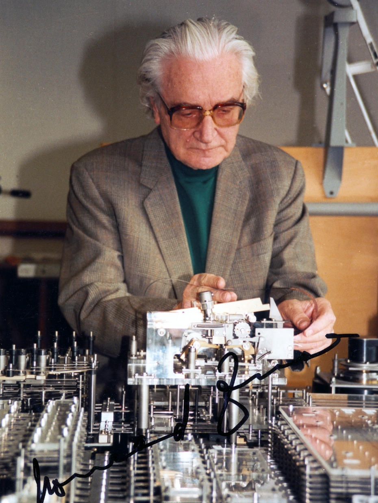

> 这是计算机名人录系列介绍的第一位德国工程师。

康拉德·楚泽（Konrad Zuse 1910年6月22日 - 1995年12月19日）

康拉德·楚泽于1910年6月22日生于德国维尔梅斯多夫，在东普鲁士接受的早期教育。1935年，楚泽在柏林夏洛滕堡技术学院（Technischen Hochschule）获得土木工程学位。他从小爱好绘画，具有非常好的美术功底。楚泽兴趣广泛，修理机器的活也很拿手，时常动手制作出一些稀奇古怪的玩艺，让班上的同学大吃一惊。

求学期间，楚泽需要完成许多力学计算的功课，诸如桥梁、材料强度设计等等，必须自己动手根据公式算出结果，往往一整天都算不完一道强度核算题目。一天，在疲惫不堪完成老师布置的作业后，楚泽突然发现，写在教科书里的力学公式是固定不变的，他们要做的只是向这些公式中填充数据，这种单调的工作，应该可以交给机器做。

1935毕业后，楚泽在柏林一家飞机制造厂找到了工作，主要任务恰好是他最挠头的飞机强度分析，繁琐的计算现在变成了他的主要职业，而辅助工具只有计算尺可用。

使用滑尺或机械加法器进行大型计算最困难的一个方面是跟踪所有中间结果，并在计算的后续步骤中将其用于适当的位置。楚泽想克服这个困难，他意识到计算机需要三个基本要素：一个控制器、一个内存和一个算术计算器。

楚泽想制造一台计算机的愿望愈来愈强烈，他在这家工厂里只呆了短短的几个月，便辞职回家做他的「发明梦」。

> 在父母的帮助下，他把家中的起居室隔出一间，改造成「实验室」兼「制造厂」，孤身一人开始了漫长的研制生涯。楚泽生活在法西斯统治下的德国，无从得知美国科学家研制计算机的消息，甚至没有听说巴贝奇和霍列瑞斯的名字。在这一点上，他远没有美国发明家幸运，无法得到大学或政府机构的任何资助，只有几个朋友「赞助」了很少的一点钱。

几乎用了两年时间在黑暗中摸索，楚泽凭着顽强的毅力独自奋斗。他认为，计算机最重要的部分不一定是计算本身，而是过程和计算结果的传送和储存。因此，他把研究的重点放在存储器上，设计了一种可以存储64位数的机械装置**数千片薄钢板用螺栓拧在一起的笨重部件**，体积约1立方米，然后与机械运算机构连接起来。朋友们都不太懂他想干什么，只能提供有限的帮助，例如，帮他用切割设备加工了数以百计的金属片。其它的薄钢板，只好靠手锯在圆钢上一片一片锯下来。以这种简陋的条件，1938年，楚泽居然完成了一台可编程数字计算机 **Z-1**。他花光了仅有的几千马克，还是无法买到更合适的零件。因此，**Z-1** 计算机实际上是一台实验模型，虽然可以完成3×3矩阵运算过程，但始终未能投入实际使用。

**Z-1**计算机最大的贡献是楚泽第一次采用了二进制数，在薄钢板组装的存储器中，楚泽用一个在细孔中移动的针，指明数字「0」或「1」。他的这种选择，明显地受到莱布尼茨著作的启发，他后来发表的研究报告，副题就是「向莱布尼茨致敬」。这台机器也采用了「穿孔带」输入程序，不过不是纸带，而是35毫米电影胶片；数据则由一个数字键盘敲入，计算结果用小电灯泡显示。由于纯机械式 **Z-1**计算机性能不理想，第二年，楚泽的朋友给了他一些电话公司废弃的继电器，楚泽用它们组装了第二台电磁式计算机 **Z-2**， 这台机器已经可以正常工作。这时，他的工作引起德国飞机实验研究所的关注，使他得到了一笔资助。 1941年，第三台电磁式计算机 **Z-3** 完成，Z3使用了大学教职员工和学生捐赠的回收材料，包括2600个继电器，用穿孔纸带输入，实现了二进制数程序控制。程序控制的想法虽然过去也有人提倡，但楚泽是把它付诸实施的第一人。**Z-3** 是世界上第一台基于二进制浮点数和交换系统的全可编程电子数字计算机，**Z-3** 能达到每秒3～4次加法的运算速度，或者在3～5秒内完成一次乘法运算。1942年，在紧张研究的间隙里，他写作了世界上第一个下国际象棋的计算机程序。

> 1941年，**Z-3** 包含了约翰·冯·诺依曼和他的同事在1946年定义的现代计算机的几乎所有功能。唯一的例外是能够将程序和数据一起存储在内存中。楚泽没有在 **Z-3** 中实现这个功能，因为他的64字内存太小，无法支持这种操作模式。由于他想按有意义的顺序计算数千条指令，所以他只使用内存来存储值或数字。**Z-3** 的块结构与现代计算机非常相似。**Z-3** 由单独的单元组成，如穿孔磁带读取器、控制单元、浮点运算单元和输入/输出设备。

**Z-3** 计算机正常工作了3年。1944年，美国空军对柏林实施空袭，楚泽的住宅连同 **Z-3** 计算机一起被炸得支离破碎。在德国法西斯即将毁灭前夕，楚泽于1945年又建造了一台比 **Z-3** 更先进的电磁式 **Z-4** 计算机，存储器单元也从64位扩展到1024位，继电器几乎占满了一个房间。为了使机器的效率更高，楚泽甚至设计了一种编程语言Plankalkuel ，这一成果使楚泽也跻身于计算机语言先驱者行列。

希特勒战败后，楚泽辗转流落到瑞士一个荒凉的村庄，一度转向研究计算机软件理论，最早提出了「程序设计」的概念。1949年，楚泽把他的 **Z-4** 计算机安装在瑞士苏黎士技术学院，并且一直稳定地运行到1958年。这时，美、英计算机界才相信德国有位建筑工程师，比他们更早地研制出程序控制数字计算机的事实。目前，在慕尼黑一家博物馆里，仍然存放着一台 **Z-3** 原型机，只是它已经无法正常运作。

随后，楚泽创办了「楚泽计算机公司」，1958年研制出电子管通用计算机 **Z-22R** ，距离第一台电子管通用计算机ENIAC诞生已经过去了12年之久。电脑史学家认为，如果楚泽不是生活在法西斯统治下的德国，他可能早就把Z型计算机系列升级为电子计算机，世界计算机的历史将会改写。事实上，早在1938年，楚泽和他的朋友已经在考虑用2000个电子管和其他电子元件组装新的计算机。当他在战后听说美国宾夕法尼亚大学早已研制出电子管计算机的消息，不禁感叹地说：「我所能做的，仅仅是摇摇头而已。」

早在1938年就发明了计算机的楚泽，几乎被人遗忘了几十年。他在1941年为 **Z-3** 计算机提出的专利申请，到了1967年，法官仍然拒绝受理，理由是「缺乏创造性」。直到1962年，他才被确认为计算机发明人之一，得到了8个荣誉博士头衔以及德国大十字勋章。后来，柏林博物馆还重新建造了**Z-1**计算机。

20世纪60年代初，楚泽计算机公司已发展为数千员工的企业，销售了近300台各类计算机。1966年，他的公司被著名的西门子公司收购，楚泽担任了西门子公司的顾问。