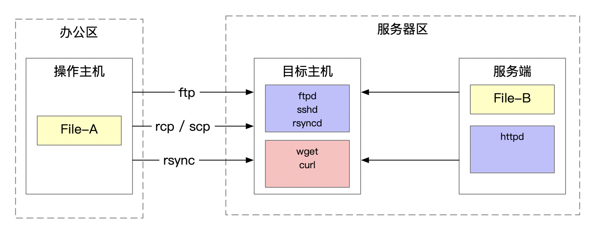

在开发和运维过程中，相信每个同学都遇到过这样的问题：

> 我想往服务器 serverA 上传一个文件 FileA，谁能帮帮我。

对于运维工作管理比较严格的单位，一般只有相关系统的运维人员才具备向服务器上传文件的权限。上传文件是否合规、合乎审计的要求不是本文讨论的重点，本文主要讨论集中常见的向服务器上传输文件的方法，不管流程或界面包装的如何花哨，万变不离其宗，基本的方法相信不外乎这么几种。



## FTP

FTP是File Transfer Protocol的缩写，是一种文件传输协议。FTP是一种C/S架构的服务，这种方式需要服务端启动ftpd服务。

ftp 的具体使用方法本文就不多说了，ftp 的优点是使用简单，管理规范（如区分用户、文件只能存放到指定目录），也支持脚本自动化的方式上传文件。

## rcp

rcp 是 rsh 包提供的命令，另外还提供了rsh、rlogin两个命令。rsh 工具允许用户在远程计算机上执行单条命令，而无需在该远程计算机上进行登录。

rsh 工具是一套比较古老的工具，在写这篇文章时，百度上搜索相关介绍文章已经很少，因为还需要单独配置服务，使用起来也不如下面的 scp 命令方便。因此它的缺点就很明显了。

## scp

scp 是 secure copy的缩写，是Linux系统下基于ssh协议进行安全远程文件拷贝的命令，也是非常常用的远程文件复制命令。

其基本的语法为

```sh
$ scp -r local_folder remote_sername@remote_ip:remote_folder
```

scp 命令使用起来非常方便，还可以通过配置主机互信做成免密码的方式。支持通过脚本内的命令实现文件拷贝。

scp有个比较明显的缺点，即对于链接文件不能正常识别，会将链接文件作为目录对待。

> Note that scp follows symbolic links encountered in the tree traversal.

另外，一般位于服务器区的设备，不会对办公区开放22的访问关系，因此适用于生产服务区内部服务器之间的文件传输。

每种文件传输方法基于其自身的特点与优势均有其典型的适用场景：

## rsync

rsync （remote synchroniz）是一个远程数据同步工具，rsync在文件传输过程中不会每次发送全量文件，而只是发送文件不同的部分，因此速度非常快。它有以下几个特点：

* 可以镜像保存整个目录树和文件系统
* 可以保持原来文件的权限、时间、软硬链接等
* 安装不需要特殊权限
* 文件传输效率非常高
* 可以基于ssh协议，也可以通过socket连接

rsync 的基本命令如下：

```sh
rsync [OPTION]... SRC DEST 
rsync [OPTION]... SRC [USER@]host:DEST 
rsync [OPTION]... [USER@]HOST:SRC DEST 
rsync [OPTION]... [USER@]HOST::SRC DEST 
rsync [OPTION]... SRC [USER@]HOST::DEST 
rsync [OPTION]... 
rsync://[USER@]HOST[:PORT]/SRC [DEST]
```

使用 rsync 工具也需要安装服务端和客户端，总体上来讲这个工具非常优秀，可以满足我们大多数的文件传输需求。

## wget

使用 wget 或者 curl 向目标服务器传输文件，其基本原理都是通过HTTP服务将目标文件下载到目标机器上。

wget命令可以实现递归下载，可跟踪 HTML 页面上的链接依次下载来创建远程服务器的本地版本，完全重建原始站点的目录结构，适合实现远程网站的镜像。

wget 还有下面几个特点：

* 支持断点下载功能
* 支持HTTP、HTTPS、FTP多种协议
* 支持代理服务器

## curl

curl 适合用来进行自动的文件传输或操作序列，是一个很好的模拟用户在网页浏览器上的行为的工具。curl 的长处在于模拟提交HTTP请求数据，curl 支持在URL中加入变量，因此可以实现批量下载。

curl 的缺点在于不支持多线程，在下载速度上可能无法与 wget 相比。


