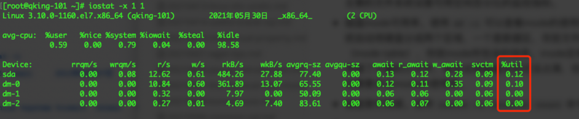

作为运维人员，生产故障一般都是从系统的监控指标中发现的，这就需要管理员对于操作系统的指标具有比较全面的了解，什么样的故障一般是什么类型的问题引起的，对应的处理措施有哪些。

但是Linux操作系统监控指标，不同类型的监控软件都提供了非常多的指标选项。本文不针对具体的监控产品，而是从CPU、内存、磁盘、网络、进程五个方面介绍一些比较重要的指标，熟悉这些指标，除了增深对于操作系统的认识，对于排查应用程序的非功能性问题也有很大帮助。

## CPU

除了存储类的服务（如文件存储、影像存储），我们多数的业务应用都体现在对计算资源的消耗上，如业务应用要计算一个排班规则，如数据库服务查询Top10的某些数据，因此CPU是服务器中最主要的资源，我们先来看看CPU的主要指标。

* Uptime：使用 `uptime` 命令可以看到服务器运行的时长，以及最近1分钟、5分钟、15分钟的平均负载。从这个结果我们可以推断系统最近有没有重启过（不管是计划内还是计划外），如果是计划外重启则需要进一步查看系统日志。
* CPU利用率：CPU利用率一般分两个部分，用户态利用率和系统态利用率。使用 `Top` 命令查看系统状况时，us 表示用户态利用率，sy 表示系统态利用率。一般来说，应当尽量提高用户态利用率，降低系统态利用率。

查看CPU使用率，我们常用 `top、uptime、vmstat、sar` 命令，特别是后面两个命令，不光能给出CPU的使用情况，还能给出内存、磁盘相关的信息，是日常问题分析中常用的工具。

## 内存

* 内存使用率：使用 `free` 命令看到操作系统的内存总量以及使用的情况，使用 `free -m` 或 `free -g` 将分别以MB或GB作为单位显示内存的大小。
* SWAP分区：SWAP分区是交换分区，Linux操作系统通过虚拟内存技术，有时可以超过操作系统本身的性能瓶颈，提高系统资源的利用率。SWAP的初衷是为了缓解物理内存不足情况下，避免发生直接的OOM问题，但这样会降低应用的响应效率。对于生产系统，交易的响应时间是保障用户体验的重要指标，因此我们在生产系统中，要尽量避免发生SWAP交换现象。

## 磁盘

磁盘大家都比较熟悉，运维中关注的重点主要在空间可繁忙程度两个方面。

* 磁盘可用空间（百分比）：使用 `df` 命令或 `df -h` 命令可以看到磁盘使用情况，如果发现可用空间不足的文件系统应当及时进行处理，避免影响程序正常运行。一般应针对主要的文件系统设置可用空间百分比的监控指标。
* 磁盘inode可用率。使用 `df -i` 可以查看inode的使用率。硬盘格式化的时候，操作系统自动将硬盘分成两个区域，一个是数据区，存放文件数据；另一个是inode区（inode table），存放inode所包含的信息。inode区域也有大小的限制，如果磁盘上存储了大量的小文件，就会出现磁盘空间还没占满，但是inode空间占满的情况，因此也需要关注inode的使用率。
* 磁盘繁忙程度。使用 `iostat -x interval count` 命令能够看到这个指标。人民银行清算总中心的杨建旭经理有一篇文章对这个指标做了详细的解释，总的来说虽然这个指标不能真实的反映磁盘繁忙的真正原因，但仍是重要的性能指标，有助于我们发现潜在的性能问题。

## 进程

进程监控一般都属于自定义监控的范围，根据部署的应用类型，指定进程关键字，通过监控代理程序定时 `ps -ef` 查看进程列表，一旦发现进程丢失则触发告警。

* 用户打开进程数
* 僵尸进程数量

## 参考资料

1. [Linux-操作系统常见性能监控指标](https://blog.csdn.net/zhangtikang134/article/details/104740709/)
2. [磁盘使用率大于90% 磁盘inode使用率大于90%](https://blog.csdn.net/xinguan1267/article/details/103119233)
3. [Linux的inode的理解](https://blog.csdn.net/xuz0917/article/details/79473562)
4. [磁盘繁忙程度这个指标到底有多少指示意义](https://www.talkwithtrend.com/Article/253329)
5. [服务器负载检测、IO性能及磁盘繁忙监控-iostat命令使用](https://blog.csdn.net/zhujq_icode/article/details/78864270)
6. [CPU、Load、内存及网络等系统指标异常的排查](https://blog.csdn.net/fuzhongmin05/article/details/100051291)
7. [Linux Swap详解](https://www.cnblogs.com/zhongguiyao/p/13963998.html)

