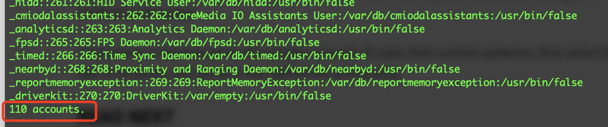

## awk 介绍

awk 是Linux下常用的文本处理命令，它名字取自1977年最初三个开发人员的首字母，他们是： [Alfred Aho](https://en.wikipedia.org/wiki/Alfred_Aho)、[Peter Weinberger](https://en.wikipedia.org/wiki/Peter_J._Weinberger)、[Brian Kernighan](https://en.wikipedia.org/wiki/Brian_Kernighan)，他们三人是AT&T贝尔实验室的Unix开发人员。

## 使用方法

先看一下官方的描述

>  awk - pattern-directed scanning and processing language

awk 是一种基于样式的文本扫描和处理工具，它的使用方法如下：

```sh
$ awk [ -F fs ] [ -v var=value ] [ 'prog' | -f progfile ] [ file ...  ]
$ awk '[ pattern ] {action}' [ filename ... ]
```

用单引号引起来的部分称为 programs，包括样式和动作两个部分。看下面一个简单的例子，这个例子将 `who` 命令输出的内容第一列打印出来。

```sh
$ who
shiqiang console  May 29 08:26 
shiqiang ttys000  May 30 12:05
$ who | awk '{print $1}'
shiqiang
shiqiang
$ who | awk '{print $2}'
console
ttys000
$ who | awk '{print $1 , $4}'
shiqiang 29
shiqiang 30
```

awk 处理文本以行为单位，默认情况下处理所有行的文本，上面例子中有两行文本，全部进行了处理。默认情况下，awk 采用空格来分割单词，`$1` 表示按照空格分割后的第1个单词。`$NF` 表示最后一个单词。根据需要，我们可以打印一个或多个单词。

```sh
$ cat dennis-ritchie.txt 
Unix is basically a simple operating system, but you have to be genius to understand the simplicity.
$ awk '{print $1,$5,$NF}' dennis-ritchie.txt
Unix simple simplicity.
```

如果想将输入的内容用连接字符接起来，可以使用 `OFS` 参数（Output Field Separator）。

```sh
$ date               
2021年 6月 8日 星期二 10时41分51秒 CST
$ date | awk 'OFS="-" {print $2,$3,$1}'
6月-8日-2021年
$ date | awk 'OFS="/" {print $2,$3,$1}'
6月/8日/2021年
```

### BEGIN 和 END

我们常有一些在文本出来开始之前的准备工作，或者文本处理完成之后的总结工作，利用 `BEGIN\END` 这两个规则可以快速的满足需求。awk 支持多个BEGIN或END，并按照他们的顺序依次执行。

```sh
$ who
shiqiang console  May 29 08:26 
shiqiang ttys000  May 30 12:05
$ who | awk 'BEGIN {print "Active Sessions"} {print $1,$5}'
Active Sessions
shiqiang 08:26
shiqiang 12:05
$ who | awk 'BEGIN {print "Active Sessions"} {print $1,$5} END {print "The End"}'
Active Sessions
shiqiang 08:26
shiqiang 12:05
The End
```

### 单词分隔符

有些文件中的单词或数据并不以空格分割，例如 `/etc/passwd` 文件或者一些 csv 文件。我们可以使用 `-F` 参数指定分割字符串。

```sh
$ awk -F: '{print $1,$5}' /etc/passwd
```

### 增加Pattern

```sh
$ awk '[ pattern ] {action}' [ filename ... ]
```

如果需要对 action 的内容做过滤，可以添加 pattern。如下例，在 /etc/passwd 文件中，将UID大于1000的用户打印出来。

```sh
$ awk -F: '$3 >= 1000 {print $1,$6}' /etc/passwd
```

还可以利用 BEGIN 命令，打印一个简单的表头。

```sh
$ awk -F: 'BEGIN {print "User Accounts\n-------------"} $3 >= 1000 {print $1,$6}' /etc/passwd
```

Pattern 支持正则的全部功能，因此可以用正则表达式来设置过滤规则。如下例为过滤包含key的单词，并把整行文本打印出来。

```sh
$ awk '/key/ {print $0}' /tmp/1.plist 
```

### 内置函数

awk 提供了很多[内置函数](https://www.gnu.org/software/gawk/manual/gawk.html#Built_002din)，包括数学运算、字符串处理、时间计算、类型转换等丰富的功能。如下示例展示了数学运算的函数。

```sh
$ awk 'BEGIN { print sqrt(625)}'
$ awk 'BEGIN {print atan2(0, -1)}'
$ awk 'BEGIN { print sqrt((2+3)*5)}'
```

## awk 脚本

如果要处理的任务非常复杂，单靠写命令行命令就不太适用，这时可采用 awk 脚本来提高效率。

先看下面一个例子

```sh
#!/usr/bin/awk -f

BEGIN {
	# 设置分隔符和输出连接符
	FS=":"
	OFS=":"
	# 初始化变量
	accounts=0
}
{
	$2=""
	print $0
	accounts++
}
END {
	print accounts " accounts.\n"
}
```

将内容保存为 awk.sh 文件，看一下执行效果

```sh
$ chmod +x awk.sh
$ ./awk.sh /etc/passwd
```

	

## 常用命令

本文总结了AWK的一些常见用法。

1、打印文件的前两列（空格为分隔符）   

   awk ‘{print $1,$2}’ awkfile

   grep "fangdudu" * | cut -d " " -f3-

2、逗号为分隔符，打印指定的列

   awk -F , '{print $1,$2,$20,$21,$22}' n_epm_user.sql

3、逗号为分隔符，打印符合条件的记录

   awk -F , '{if ($20==1) print $1,$2,$20,$21,$22}' n_epm_user.sql

4、取文件的第五列，并且将部分内容替换为空

   awk '{print gensub(/\/data1\/static\.house\.sina\.com\.cn\/cricfs\//,"","g",$5) }' /data1/logs

## 参考资料

1. [How to Use the awk Command on Linux](https://www.howtogeek.com/562941/how-to-use-the-awk-command-on-linux/)
2. [awk使用手册](http://fanqiang.chinaunix.net/program/other/2005-09-07/3621.shtml)
