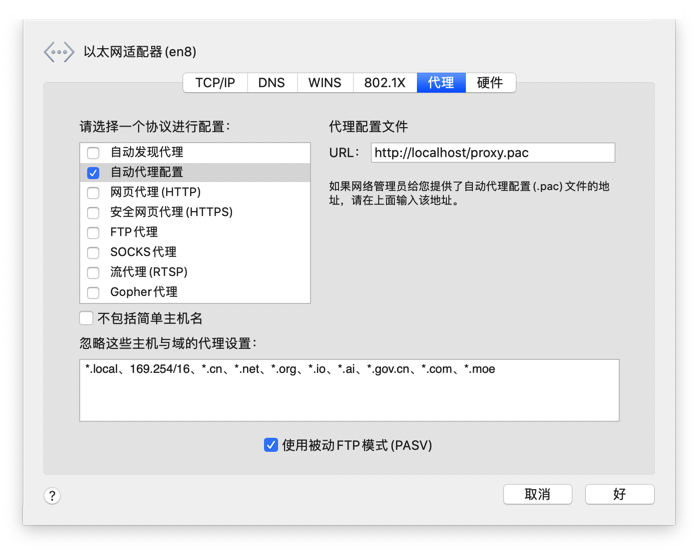

macOS系统代理设置在「系统偏好设置」「网络」「高级」中，一般在「网页代理（HTTP）」中指定代理的地址和端口。虽然提供了「忽略这些主机与域的代理设置」这个选项，但是在一些需要根据目标IP或者域名来动态选择代理时就无法满足我们的需求。

与此同时，macOS提供了一个「自动代理配置」选项，支持自动代理配置（PAC）的方式，本文介绍PAC如何使用。



## PAC

Proxy Auto-Configuration（PAC）是一种通过URL来选择代理地址的技术，目前主流的浏览器都支持这种技术，macOS系统级别的代理设置也支持这种方式。

PAC是一个JavaScript文件，提供了一个返回代理的方法。这个文件可以放在本地，也可以放在某台服务器上被更多的人访问。

> 这项技术由微软发明，现已被Safari、Chrome、macOS等多个浏览器和系统支持。

## PAC示例

```javascript
function FindProxyForURL(url, host) {

	//根据协议选择代理
  if (url.substring(0,6)=="https:") {
  	return "DIRECT"; 
  }else{
  	//返回两个代理地址，依次访问
  	return "PROXY proxy1.my.com:8080; PROXY proxy2.my.com:8080; DIRECT";
  }
  
  //根据目标IP选择代理
  if ( isInNet(host, "11.33.0.0", "255.255.0.0") ){
  	return "PROXY proxy1.my.com:8080; PROXY proxy2.my.com:8080; DIRECT";
  }else{
    return "DIRECT";
  }
  
	//根据域名选择代理
  if ( host == "my.com") {
  	return "DIRECT"; 
  }else{
  	//返回两个代理地址，依次访问
  	return "PROXY proxy1.my.com:8080; PROXY proxy2.my.com:8080; DIRECT";
  }  
}
```

通过这个例子我们就能体会到，通过不同函数和条件的组合，我们能定制灵活的代理使用策略，从而提高日常的办公效率。

## 参考资料

1. [PAC格式校验工具](https://app.thorsen.pm/proxyforurl)
2. [PAC (proxy auto-config) 自动代理](https://blog.csdn.net/iteye_20954/article/details/81882748?utm_medium=distribute.pc_relevant.none-task-blog-2%7Edefault%7EBlogCommendFromMachineLearnPai2%7Edefault-1.control&depth_1-utm_source=distribute.pc_relevant.none-task-blog-2%7Edefault%7EBlogCommendFromMachineLearnPai2%7Edefault-1.control)
3. [Mac电脑设置本地pac文件及问题解决](https://blog.csdn.net/jwkfreedom/article/details/53196549)
4. [mac 自动代理](https://blog.csdn.net/weixin_43475661/article/details/117171032)
5. [Proxy Auto-Configuration file](https://developer.mozilla.org/en-US/docs/Web/HTTP/Proxy_servers_and_tunneling/Proxy_Auto-Configuration_PAC_file)
6. [Proxy Auto-Config Files](https://www.cisco.com/c/en/us/td/docs/security/web_security/connector/connector2972/PACAP.html)


