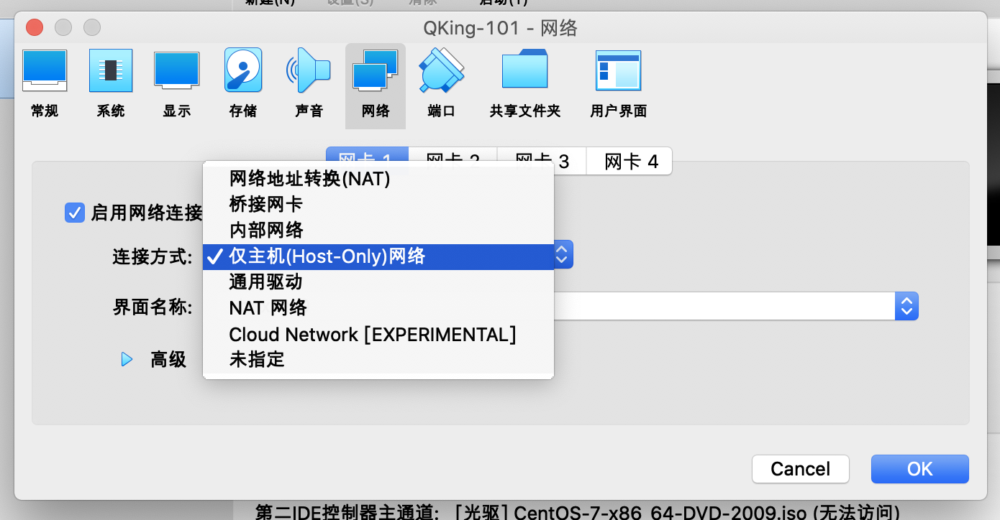
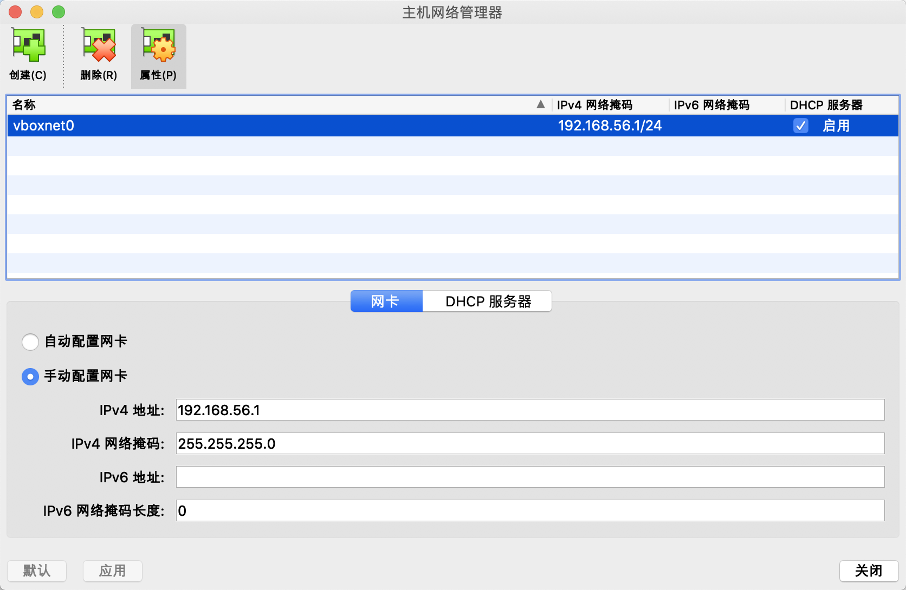

Virtualbox 是我最常用的虚拟机管理软件，虽然自从 docker 出来之后虚拟机的使用频率变得越来越少（因为太占用资源了，docker 能够更轻量的在本地构建所需要的环境，想要了解 docker 可以参考我的介绍文章 [Docker入门介绍](http://www.edulinks.cn/2018/06/20/20180620-docker-overview/)），但有些时候还不得不用虚拟机，例如想要测试不同发行版本的特性和一些配置的场景。

通常情况下，利用 Virtualbox 创建的虚拟机我都会分配两块网卡，一块用 host-only 模式用于虚拟机之间的通信，另外一块用NAT模式提供连接外网的能力。在我们的生产环境中，也使用了分配两个IP地址的形式（网卡是4块，做了双网卡绑定提供高可用保证）。

这就涉及到 Virtuabox 提供的网络设置能力的知识点，本文就总结下 Virtualbox 提供的网络能力。

> 本文基于 Virtualbox 6.1.18。

## 网络地址转换（NAT）/ NAT网络

> NAT的英文全称是 Network Address Translation ，中文意思是网络地址转换，是一个IETF标准，允许一个整体机构以一个公用IP出现在Internet上。顾名思义，就是一种把内部私有网络地址翻译成合法网络地址的技术。更多的NAT的介绍超出了本文的范畴，大家可以自己看看参考资料中的网址来进一步了解。

Virtualbox中提供的两个选项「网络地址转换（NAT）」和「NAT网络」实际上都是NAT方式，区别在于第一种使用的Virtualbox内已经建好的NAT网络，其网段为10.0.2.0/24，该网络不允许用户管理。

NAT网络是用户自己创建的网络，通过主机网络管理器可以创建自己的NAT网络，并指定地址范围。Virtualbox默认会将192.168.56.1设置为网关。

## 仅主机（Host-Only）网络

Host-only模式是指虚拟机的网卡只有宿主机可以访问，在搭建只需要内部通信的网络环境时，可以选择这种模式。可以在全局配置中设置Host-only可以分配的地址范围。

## 桥接网卡

从字面上看就容易理解，这种模式不会创建用户自己的网络，这种方式共享宿主机的网络，具备与宿主机一样的网络连通性。但因此也带来对网络的访问控制能力比较弱，个人觉得仅适用于需求比较简单的场景。

## 内部网络

VirtualBox的内部网络，本质上是提供一个构建网络所需要的基础设置（并没有创建网络），功能上相当于提供了一个干净的交换机，不与宿主机的网络栈交互，不用宿主机中的某个服务进程提供DHCP服务，内部网络上的流量，在宿主机中是不可见的，只有连接其上的虚拟机才可见。如果需要额外的网络功能，可通过配置连接其上的虚拟机来提供。

## 通用驱动

这是平时很少使用的模式，共享相同的通用网络接口，允许用户选择能被VirtualBox包含或者分布在一个扩展包里的驱动。个人理解适用于需要自己写网络驱动的场景。

## 参考资料

1. [VirtualBox网络之nat网络](https://blog.csdn.net/dkfajsldfsdfsd/article/details/79403343)
2. [VirtualBox网络之桥接网卡](https://blog.csdn.net/dkfajsldfsdfsd/article/details/79409799)
3. [VirtualBox网络之内部网络](https://blog.csdn.net/dkfajsldfsdfsd/article/details/79436716)

