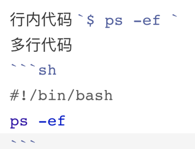

我从2008年开始在博客园写技术类文档，最早的时候不知道Markdown，而且博客园也没有提供Markdown编辑器，当时都采用富文本编辑器来写，每次调整格式都需要挺长时间。当时笔记软件还用微软的OneNote，因为也不支持Markdown，因此用的也还算平稳。

2014年以后博客园开始支持Markdown，突然发现Markdown真的非常适合用来写技术文档，只因为一个突出的优点：**让作者能够专注到写作本身，格式也能够通过书写的方式来实现，再也不用先写文字再做格式调整的事情，这样写作流程连贯、一气呵成，给人的感觉非常爽**。

再到后来笔记记录软件也切换成了「印象笔记」，也是一款支持Markdown编辑器的笔记软件，但是它们家的Markdown编辑器效率不太好，比不上「有道笔记」。目前技术类的文章主要以Markdown的形式进行写作，写作软件使用了「Typora」，博客的管理使用了Hexo，经过一段时间的使用，我还整理了自己的写作流程，具体内容在 [为自己构建写作的敏捷发布流程](http://www.edulinks.cn/2020/06/04/20200604-build-my-writing-devops/) 和 [Hexo博客写作与图片处理的经验](http://www.edulinks.cn/2020/03/14/20200314-write-hexo-with-typora/) 这两篇文章中，今天只讨论Markdown写作的相关内容。

## Markdown 历史

Markdown 是一种轻量级标记语言，由约翰·格鲁伯（John Gruber）在2004年创建。它允许人们使用易读易写的纯文本格式编写文档，然后转换成有效的HTML文档或其他格式。由于Markdown的轻量化、易读易写特性，并且对于图片、图表、数学公式都有支持，使用的网站越来越多，目前Github、博客网站等都支持使用Markdown语法来编写文档和评论。

## Markdown基本语法

### 1. 标题

在Markdown中，只要在文本前面加上 *#* 就可以定制标题。*#* 的数量代表了标题的级别，一个 # 号表示一级标题，级别越高，相应的字号越小。*#* 与标题文字之间，保留一个空格，这是标准的 Markdown 写法。

### 2. 段落

Markdown中的段落和常规的文本编辑器一样，使用空白行就能另起一个段落。注意在Markdown中编辑文字时，我们不需要考虑缩进，这些工作都应该交给输出格式的转换器。

### 3. 换行

使用Markdown格式编写文档时，如果直接回车「Enter」会创建一个新的段落，如果只是想创建一个换行，则可以输入「Shift + Enter」或使用HTML标记语言`<br >`。

### 4. 粗体

使用两个 * 或两个 _ 将文字包围起来表示对文字进行加粗。

### 5. 斜体

使用一个 * 或一个 _ 将文字包围起来表示用斜体显示文字。如果要同时应用粗体和斜体，则使用三个 * 或三个 _ 包围文字即可。

### 6. 区块引用

有时候需要对一段文字进行重点突出，可以使用区块引用功能。在文字前加上 > 号就可以对一句话进行引用，如果是多行，则在每行前都加上 > 是最简单的办法。区块中可以使用其他Markdown语法的元素，但不是全部支持。

### 7. 列表

列表有两种，一种为无序列表，在文字前加 *-* 号或者 * 号或者 + 号即可；另一种为有序列表，使用 1. 的形式。注意所有的字符后面都要加上空格。

### 8. 代码引用

代码引用所使用的字符是引号，分为行内代码和多行代码，具体如下图所示。 



### 9. 链接和图片

如果需要给文本加上链接，不需要点击图标，需要将文本写在方括号中，然后链接地址用括号包含起来放在方括号后面，效果展示如 *[显示文本](链接地址)* 。如果需要加入图片，把图片考虑为一个特殊的链接，前面加上叹号，则比较容易记住这种方式，**。

### 10. 删除线

使用两个波浪线将文字包围起来，~~表示对文字应用波浪线~~。

### 11. 表格

添加表格，可以使用管道符分隔每列，并在标题和内容之间增加一行，用三个或多个连字符分隔。
```markdown
| Syntax | Description |
| --- | ----------- |
| Header | Title |
| Paragraph | Text |
```

## 参考资料：
1. [献给写作者的 Markdown 新手指南](http://www.jianshu.com/p/q81RER)
2. [Markdown语法说明-简体中文版](http://www.appinn.com/markdown/)
3. [Markdown 中文网](http://markdown.p2hp.com)
4. [在线Markdown编辑器](https://dillinger.io)

